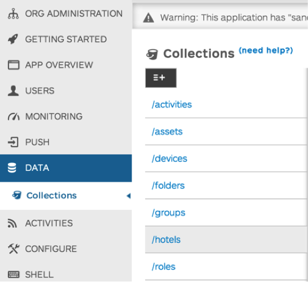
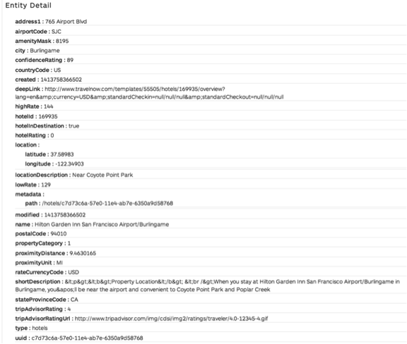
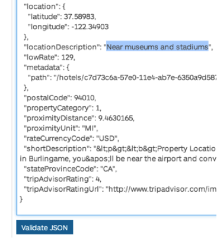
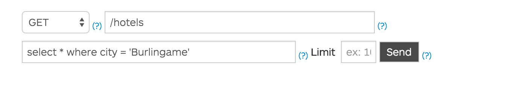

#API Services: Lesson 1 - Backend-as-a-Service


##Overview

Edge API Services includes a backend-as-a-service (BaaS) solution that provides developers with access to a flexible data store and enables you to quickly integrate valuable features into your app, including social graphs, user management, data storage, push notifications, performance monitoring, and more.
Using API BaaS, you can set up your own cloud-based data platform in minutes instead of months – no server-side coding or back-end development needed. This allows your team to focus on developing the rich features and user experience that truly differentiate your app, rather than on the time-consuming details of implementing core back-end services and infrastructure.
API Baas provides the following features:

###Data storage & management
####Application data 
At the core of the BaaS is a flexible platform that can store any type of application data, from simple records like a catalog of books to complex associations like user relationships. No matter what type of data drives your app, you can store it as collections of data entities and immediately perform complex queries or full-text searches on any field. You can also create custom entities with custom properties, giving you the ability to store data and context in a way that makes sense for your app.
To learn more about entities and collections, see [API BaaS Data model](http://apigee.com/docs/app-services/content/app-services-data-model-1).
For a complete list of the default data entities available, see Default [Data Entities](http://apigee.com/docs/app-services/content/default-data-entities).
####Files & assets
Images, video, and audio are key components of a great app experience. With the BaaS, you can upload and retrieve binary objects from the same data store as the rest of your application data, eliminating the need to set up content delivery networks (CDNs) and easing implementation. We handle all the back-end details that keep your content quickly accessible.
To learn more about files and asset storage, see [Uploading files and assets](http://apigee.com/docs/app-services/content/uploading-files-and-assets).
####Flexible data querying
One of the BaaS' most powerful features is the ability to perform SQL-style queries and full-text searches on data entities, as well as their properties. This lets you quickly retrieve specific data entities based on multiple criteria, then utilize that data to power social features, target push notifications, perform user analysis, and more.
Learn more about querying app data, see [Data query overview](http://apigee.com/docs/app-services/content/app-services-data-query-overview).

###Social
####Entity relationships
You can create relationships between data entities to help build features, improve user experience, and contextualize data. For example, you might associate a user with their devices to capture valuable geolocation data, create relationships between users to build social graphs, or implement popular features such as activity streams.
To learn more about entity relationships, see [Entity connections](http://apigee.com/docs/app-services/content/entity-relationships).
####Activity streams
A key aspect of social networking apps is the ability to provide and publish data streams of user actions, such as ongoing lists of comments, activities, and tweets. API Services simplifies management and routing of these data streams by providing an activity entity that is specifically designed to automatically create a relationship between activities and the user who created them.
To learn more about activities and activity feeds, see [Activity feeds](http://apigee.com/docs/app-services/content/activity).

###User management
####Registration and login
You can easily add and manage users by providing the core services necessary to handle secure registration and log in, including OAuth 2.0-compliant client authentication. In addition, any number of default or custom data entities and properties can be associated with a user entity to create complete user profiles.
To learn more about user management, see [User](http://apigee.com/docs/app-services/content/user).
To learn more about authentication, see [Authenticating users and application clients](Authenticating users and application clients).
####Roles & permissions
Applications often require the ability to configure fine-grain control of user access to data, features and functionality. API Services solves the implementation details of user access with roles and permissions. Simply create roles that represent user types or access levels, such as Administrator, then assign the necessary permissions to that role. With a single API call, you can then associate your roles with any user or group of users.
To learn more about user roles and permissions, see [Managing access by defining permission rules](http://apigee.com/docs/app-services/content/managing-access-defining-permission-rules).
####Groups
Groups are a flexible way to organize your users based on any number of criteria. For example, you might group users based on interests or location to more effectively deliver relevant content, target offers, or customize campaigns. You can also take advantage of the groups entity to enable group-based social networking activities, such as allowing your users to create private information feeds or circles of friends.
To learn more about groups, see [Working with group data](http://apigee.com/docs/app-services/content/group).
####Third-party authentication
In addition to supporting user management and OAuth-based login for your app, API Services also makes it easy to integrate third-party authentication through such popular services as Facebook, Twitter and other OAuth-enabled accounts. Providing third-party sign-in can improve user experience, while increasing adoption, giving you access to valuable information from social networks and services.
To learn more about using third-party sign-in, see [Facebook sign in](http://apigee.com/docs/app-services/content/facebook-sign).
###Geolocation
The device entity allows you to capture geolocation data from your users' GPS-enabled devices to more effectively target campaigns, push notifications, offers and more. Geolocation also gives you an important data point for contextualizing and analyzing trends and user behavior.
To learn more about geolocation, see [Geolocation](http://apigee.com/docs/app-services/content/geolocation).
###Push notifications
Push notifications are the most effective way to engage your users with relevant content, and thanks to API Services, implementing them can be done in minutes. Simply register your app and your user's devices with a notification provider, such as Apple Push Notification Service or Google Cloud Messaging, then use the API Services notification entity to send millions of push notifications a month at no cost. When used in conjunction with queries of user and application data, push notifications become a powerful tool for leveraging user data, ensuring relevancy and driving engagement.
To learn more about push notifications, see [Push notifications overview](http://apigee.com/docs/app-services/content/push-notifications-overview).
###Configuration management
By giving you the ability to push configuration changes directly to users' devices, API Services lets you test and deliver bug fixes and performance improvements in real time. Remote configuration management can even be used to push changes to a subset of all users, enabling A/B testing of fixes, so that you can monitor and collect data to ensure your updates perform as intended before they are pushed to your entire user base.
To learn more about configuration management, see [Configure your app](http://apigee.com/docs/app-services/content/configure-your-app) .
###Error & performance monitoring
One of the largest barriers to the success of an app can be the ability of developers to respond quickly and precisely to performance issues and bugs. API Services includes data logging and visualization tools that let you monitor and analyze network performance, usage patterns, crash statistics and other key metrics, giving you the data necessary to quickly manage performance issues as they arise.
To learn more about usage monitoring, see [Monitor your app’s use](http://apigee.com/docs/app-services/content/monitor-your-app%E2%80%99s-use)
To learn more about error monitoring, see [Get alerted to crashes and critical errors](http://apigee.com/docs/app-services/content/get-alerted-crashes-and-critical-errors)

##Objectives
The objective of this lesson is to provide an overview of API Backend-as-a-Service (BaaS). This includes interacting with data collections, calling the RESTful services exposed automatically by BaaS, and using the BaaS query language against the data collection.

##Prerequisites
- [x] Your Apigee Edge organization name, user name, and the password 
- [x] Your Apigee API BaaS organization name

##Estimated Time: 30 mins
1. **Interacting with Data Collections** in the BaaS can be done easily from the BaaS portal. The BaaS portal provides a user interface built using the RESTful APIs automatically exposed by BaaS for data collections. A data collection called `hotels` has already been created for you in your BaaS instance.
 1. Open a browser tab & log in to your API BaaS instance by going to: https://appservices.apigee.com/amer-apibaas. 
 2. Pick your API BaaS organization from the Organization drop-down
 3. Pick the `hospitality` App from the App drop-down
 
 4. From the BaaS portal menu, select `Data`
 5. From the Data collections, select `hotels`
 
 6. On the right hand side, all the entities that are part of the `hotels` collection is presented
 7. Click on the `View Details` link for one of the hotel entities
 8. Browse through the details to review the attributes presented in a formatted name-value pair. For example, attributes such as address1, airportCode, location: latitude, location: longitude, etc.
 
 9. Browse further down for that entity to the `Edit Entity` section. This section presents the JSON format of the entity
 10. In the `Edit Entity` section, change the value of `locationDescription` attribute to `Near museums and stadiums` and then click `Validate JSON`
 
 11. Click on `Save` to save the change you just made. 
 12. Click on `Hide Details` for the entity and browse to the top
**Extra Credit:** Add a new entity to the `hotels` data collection using the `CREATE` operation available in the BaaS portal.

**Hint:** Remove the *uuid* and *type* attributes in case you copy-paste from an existing entity.

2. **Paging through results** is supported inherently by BaaS. By default, the GET API for data collections in BaaS returns 10 entities at a time. This can be changed by providing a `limits` query parameter when calling the API. To page through the results, API BaaS provides a cursor attribute, which can be used in subsequent calls
 1. Open up another browser tab and go to ```
https://amer-apibaas-prod.apigee.net/appservices/{your-org}/hospitality/hotels```
Replace `{your-org}` with the actual name of your API BaaS organization name
**Note:** The `hospitality` App created for these lab exercises has been configured so that the Guest role has full permissions (that is, /** for GET, POST, PUT, and DELETE) to all the data collections in the App. As with any other app, you can secure the application by updating its roles and permissions. For more on working with permissions and roles, see [Managing access by defining permission rules](http://apigee.com/docs/app-services/content/managing-access-defining-permission-rules).
 2. Effectively you’ve called the GET API for the `hotels` data collection by calling the above URL. Review the information presented in JSON format. This is the same information you previously saw on the BaaS portal. 
 3. Browse towards the bottom of the response. You’ll notice that by default BaaS provides 10 entities at a time. This can be verified by looking at the attribute "count" : 10
 4. Now call the GET API as follows with the limits parameter ``` https://amer-apibaas-prod.apigee.net/appservices/{your-org}/hospitality/hotels?limit=20 ```
Replace `{your-org}` with the actual name of your API BaaS organization name.
 5. Review the results and you’ll notice that BaaS has returned 20 hotels instead of 10 this time around
 6. To page forward to the next set of results, copy the value of the `cursor` attributed provided at the bottom of the results and call the GET API again after adding the query parameter `cursor={cursor value}` to the URL. 
 7. Using cursors, page forwards and backwards through the results.By keeping track of the cursor values, one can start to provide paging functionality within an App when using these APIs.
3.	**Querying data** is also easily accomplished by using API BaaS’ query language capabilities.
 1.	Go back to the BaaS portal
 2.	While in the `hotels` collection, use the `READ` method to query for hotels in the city of Burlingame
 
 3.	Run the query and review the results. You’ll notice that only those hotels with the city attribute matching `Burlingame` are returned.
 4.	Try a few of the following other queries to get a better understanding of how data querying works in BaaS:
 - [x] `select name, postalCode where city = ‘Burlingame’`
 - [x] `select * where hotelRating = 5`
 - [x] `select * where hotelRating = 5 and city = ‘Seattle’`
 - [x] `select * where hotelRating = 5 or city = ‘Seattle’`
 - [x] `select * where shortDescription contains ‘Amazon’`
 5. These queries can also be provided as parameters to the GET API by using the `ql` query parameter. Switch to the browser tab used to issue GET API calls directly against the BaaS.
 6. Call the GET API as follows to get hotels in the city of Burlingame
`https://amer-apibaas-prod.apigee.net/appservices/{your-org}/hospitality/hotels?ql=select%20*%20where%20city=%27Burlingame%27`
Replace `{your-org}` with the actual name of your API BaaS organization name.
Note: Most browsers will URL encode special characters automatically
 7. Try the other query examples provided earlier and use them as the value of the `ql` parameter of the GET API call.

##Summary
That completes this hands-on lesson. We have barely scratched the surface of Apigee API BaaS capabilities. In this lab we learned how data is stored in an easy-to-consume format, how it can be accessed and interacted with using the BaaS portal and RESTful APIs automatically exposed by BaaS, and how to easily query the data including full-text searching. For further information refer to the API BaaS [documentation](http://apigee.com/docs/developer-services/content/add-and-edit-content).
