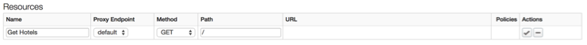
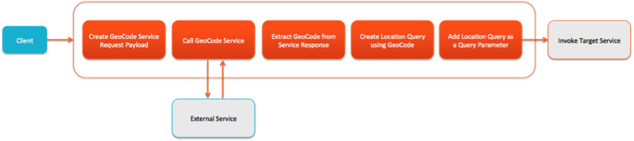
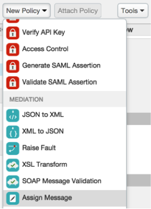

#API Services: Lesson 3 - Adding Resources and Policies

##Overview
Apigee Edge enables you to 'program' API behavior without writing any code, by using 'policies'. A policy is like a module that implements a specific, limited management function. Policies are designed to let you add common types of management capabilities to an API easily and reliably. Policies provide features like security, rate-limiting, transformation, and mediation capabilities, saving you from having to code and maintain this functionality on your own. 
You're not limited to the set of policy types provided by Apigee Edge. You can also write custom scripts and code (such as JavaScript and Node.js applications), that extend API proxy functionality and enable you to innovate on top of the basic management capabilities supported by Apigee Policies.

###Policy types
Technically, a policy is an XML-formatted configuration file. Each policy type's structure (for example, the required and optional configuration elements) is defined by an XML schema.
Edge Policy types are grouped into the following functional categories:

####Traffic management
Policies in the traffic management category enable you to control the flow of request and response messages through an API proxy. These policies support both operational- and business-level control. They give you control over raw throughput, and can also control traffic on a per-app basis. Traffic management policy types enable you to enforce quotas, and they also help you to mitigate denial of service attacks.

####Mediation
Policies in the mediation category enable you to actively manipulate messages as they flow through API proxies. They enable you to transform message formats, from XML to JSON (and vice-versa), or to transform one XML format to another XML format.  They also enable you to parse messages, to generate new messages and to change values on outbound messages. Mediation policies also interact with basic services exposed by API Services, enabling you to retrieve data about apps, developers, security tokens, and API products at runtime. 

####Security
Policies in the security category support authentication, authorization, as well as content-based security.

####Extension 
Policies in the extension category enable you to tap into the extensibility of API Services to implement custom behavior in the programming language of you choice.
Each Policy type is documented in detail in the [Policy reference overview](http://apigee.com/docs/api-services/reference/reference-overview-policy). This topic demonstrates general interaction, showing you how to create Policies, and how to attach them to Flows in an API proxy configuration.

##Objectives
The goal of this lesson is to get you familiar with how to use the Management UI to design and configure different types of policies to the API Proxy that we created in the previous lab. We will primarily work with mediation and extensibility policies in this lesson. 

By the end of this lesson, you will have enhanced the `hotels` proxy to accept a `zipcode` and a `radius` (in meters) query parameter, use those parameters to return a list of hotels that match the criteria, and format the results to filter out some metadata from the BaaS result.

**Note:** Now that you are familiar with the Apigee Edge Management UI navigation, the instructions will become terse and will be provided without screenshots unless a new concept is being introduced.

##Prerequisites
- [x] API Services - Lesson 2 completed

##Estimated Time: 90 mins

###Adding Resources to a Policy
is done from the ‘Overview’ tab of the API Proxy
- Go to the Apigee Edge Management UI browser tab
- Go to the ‘hotel’ proxy’s ‘Overview’ tab
- From the ‘resources’ section, click on the ‘+ Resources’ button
- In the new resource row, provide the following properties:
 ```
 - Name: Get Hotels
 - Proxy Endpoint: Default
 - Method: GET
 - Path: /
 - After setting those properties, click on the `Checkbox` in the `Actions` column to complete adding the resource 
 
 ```
- Add another resource with the following properties:
 ```
 - Name: Get Individual Hotel
 - Proxy Endpoint: Default
 - Method: GET
 - Path: /{hotel-uuid}
 ```
###Adding Policies to a Proxy
is done from the `Design` tab of the API Proxy.
- Now that you have an API Proxy configured with a couple of resources, you will add logic to the `Get Hotels` resource using policies. 
 The goal is to have the proxy perform a geo-location query against our `hotels` BaaS data collection to return results within a certain radius of a zipcode (zipcode and radius both being query parameters provided when calling the `/v1/hotels` API).
 API BaaS supports the ability to retrieve entities within a specified distance of any geocoordinate based on its location property:
```location within <distance_in_meters> of <latitude>, <longitude>````
 As you can see, you need to provide the latitude and longitude information to perform the query. 
 For mobile applications meant for smartphones, obtaining geocode information is easy and can be provided directly as part of an API call. For this lesson, assume that this API interface is being created for devices and applications that cannot easily provide the geocoordinate information, but simply requests the user to provide the zipcode. In such a situation, the first thing is to obtain the geocoordinate for the zipcode provided before doing further processing. Below is the initial logic to implement in the proxy:
  - Retrieve the zipcode and radius from the request query parameter
  - Use the zipcode as an input parameter to call an external service that converts the zipcode to the geocoordinate
  - Extract the latitude and longitude geocoordinate information from the response of the external service call 
  - Use the geocoordinate to create the geo-location query 
  - Add the location query as a query parameter before the target BaaS service is invoked. 
 A pictorial representation of the logic is depicted below:
 
 For the service callout to convert the zipcode to the geocoordinate, you will use the Google GeoCoding API. 

Now let’s implement the policies.

- Switch to the `Develop` tab of the API Proxy
- From the `Navigator` pane, select `Proxy Endpoints → Default → Get Hotels` 

###Using Assign Message Policy to prepare the service callout request

- From the `New Policy` drop-down, select the `Assign Message` policy

- In the ‘New Policy - Assign Message’ dialog box provide the following information:
```
 - Policy Display Name: **Create Geo Coding Request**
 - Policy Name: **Create-Geo-Coding-Request**
 - Attach Policy: **Checked**
 - Flow: **Flow Get Hotels, Proxy Endpoint default**
 - Segment: **Request**
``` 
- Click on the `Create Geo Coding Request` policy in the pipeline and modify the XML configuration in the `Code: Create-Geo-Coding-Request` section, which appears underneath the Map as follows:
```xml
<?xml version="1.0" encoding="UTF-8" standalone="yes"?>
<AssignMessage async="false" continueOnError="false" enabled="true" name="Create-Geo-Coding-Request">
    <DisplayName>Create Geo Coding Request</DisplayName>
    <AssignTo createNew="true" type="request">GeocodingRequest</AssignTo>
    <Set>
        <QueryParams>
            <QueryParam name="address">{request.queryparam.zipcode}</QueryParam>
            <QueryParam name="region">US</QueryParam>
            <QueryParam name="sensor">false</QueryParam>
        </QueryParams>
        <Verb>GET</Verb>
    </Set>
    <!-- Set variables for use in the flow -->
    <AssignVariable>
        <Name>zipcode</Name>
        <Ref>request.queryparam.zipcode</Ref>
    </AssignVariable>
    <AssignVariable>
        <Name>radius</Name>
        <Value>0</Value>
        <Ref>request.queryparam.radius</Ref>
    </AssignVariable>
</AssignMessage>
```

Here's a brief description of the elements in this policy. You can read more about this policy in [Assign Message policy](http://apigee.com/docs/api-services/reference/assign-message-policy).
**<AssignMessage name>** - Gives this policy a name. The name is used when the policy is referenced in a flow. 
**<AssignTo>** - Creates a named variable called `GeocodingRequest` of type `Request`. This variable encapsulates the request object that will be sent by the ServiceCallout policy. 
**<Set><QueryParams>** - Sets the query parameters that are needed for the service callout API call. In this case, the Google Geocoding API needs to know the location, which is expressed with a zipcode. The API calling client supplies this information, and we simply extract it here. The region and sensor parameters are by the API, and we just hardcode it to certain values here.
**<Verb>** - In this case, we are making a simple GET request to the API. 
**<AssignVariable>** - zipcode and radius are new variables being created to store values being passed to the API. In this example, the variables will be accessed later in the proxy flow. 
**Note:** The properties associated with the `Assign Message` policy could have been modified using the `Property Inspector` panel that’s presented in the `Design` tab on the right. Any changes made in the `Code` panel are reflected in the `Property Inspector` panel and vice-versa. We will use the `Property Inspector` panel to set properties for some of the policies as the lesson progresses.

###Using the Service Callout Policy to invoke the Google GeoCoding API
- From the `New Policy` drop-down, select the `Service Callout` policy and add it with the following properties:
```
 - Policy Display Name: **Call Geo Coding API**
 - Policy Name: **Call-Geo-Coding-API**
 - Attach Policy: **Checked**
 - Flow: **Flow Get Hotels, Proxy Endpoint default**
 - Segment: **Request**
``` 
- For the `Call Geo Coding API` policy, change the values of the following properties in the `Property Inspector`:
```
 - Request variable: **GeocodingRequest**
 - Response: **GeocodingResponse**
 - URL: **http://maps.googleapis.com/maps/api/geocode/json**
```

Here's a brief description of the elements that were modified in this policy. You can read more about this policy in [Service Callout policy](http://apigee.com/docs/api-services/reference/service-callout-policy).
**<Request variable>** - This is the variable `GeocodingRequest` that was created in the AssignMessage policy in the previous step. It encapsulates the request going to the Google Geocoding API.
**<Response>** - This element names a variable `GeocodingResponse` in which the response from the Google Geocoding API will be stored. As you will see, this variable will be accessed later by the ExtractVariables policy.
*<HTTPTargetConnection><URL>* - Specifies the target URL to be used by the service callout - in this case the URL of the Google Geocoding API: `http://maps.googleapis.com/maps/api/geocode/json`

###Using the Extract Message Policy to parse the service callout response
- From the `New Policy` drop-down, select the `Extract Variables` policy and add it with the following properties:
```
 - Policy Display Name: Extract Geo Codes
 - Policy Name: Extract-Geo-Codes
 - Attach Policy: Checked
 - Flow: Flow Get Hotels, Proxy Endpoint default
 - Segment: Request
```
- For the `Extract Geo Codes` policy, change the XML configuration of the policy using the `Code: Extract Geo Codes` panel as follows:
```xml
<?xml version="1.0" encoding="UTF-8" standalone="yes"?>
<ExtractVariables async="false" continueOnError="false" enabled="true" name="Extract-Geo-Codes">
    <DisplayName>Extract Geo Codes</DisplayName>
    <Source>GeocodingResponse</Source>
  	<VariablePrefix>geocodeResponse</VariablePrefix>
  	<JSONPayload>
    	<Variable name="latitude">
       		<JSONPath>$.results[0].geometry.location.lat</JSONPath>
    	</Variable>
    	<Variable name="longitude">
       		<JSONPath>$.results[0].geometry.location.lng</JSONPath>
    	</Variable>
  	</JSONPayload>
</ExtractVariables>
```
Here's a brief description of the elements that were modified in this policy. You can read more about this policy in [Extract Variables policy](http://apigee.com/docs/api-services/reference/extract-variables-policy).
**<Source>** - Specifies the response variable `GeocodingResponse` that we created in the ServiceCallout policy. This is the variable from which this policy extracts data. 
**<VariablePrefix>** - The variable prefix `geocodeResponse` specifies a namespace for other variables created in this policy. The prefix can be any name, except for the reserved names defined by the [Apigee Edge Platform's predefined variables](http://mktg-dev.apigee.com/docs/api-platform/api/variables-reference).
**<JSONPayload>** - This element retrieves the response data that is of interest and puts it into named variables. In fact, the Google Geocoding API returns much more information than latitude and longitude. However, these are the only values needed for these lessons. You can see a complete rendering of the JSON in the [Google Geocoding API documentation](https://developers.google.com/maps/documentation/geocoding/). The values of `geometry.location.lat` and `geometry.location.lng` are simply two of the many fields in the returned JSON object.
It may not be obvious, but it's important to see that ExtractVariables produces two variables whose names consist of the variable prefix (`geocodeResponse`) and the actual variable names that are specified in the policy. These variables are stored in the API proxy and will be available to other policies within the proxy flow, as you will see. The variables are: `geocodeResponse.latitude` & `geocodeResponse.longitude`

###Using the Javascript Policy to create the Location Query to send to the BaaS target endpoint

- From the `New Policy` drop-down, select the `Javascript` policy and add it with the following properties:
```
 - Policy Display Name: Create Location Query**
 - Policy Name: **Create-Location-Query**
 - Script File: **Create new script**
 - Script Name: **Create-Location-Query.js**
 - Attach Policy: **Checked**
 - Flow: **Flow Get Hotels, Proxy Endpoint default**
 - Segment: **Request**
```
- Once the policy has been added, from the `Navigator` panel go to `Scripts → Javascript` section and select the `Create-Location-Query.js` script file
- Add the following code to the `Create-Location-Query.js` script in the `Code: Create Location Query` panel:
```javascript
var latitude = context.getVariable("geocodeResponse.latitude"),
    longitude = context.getVariable("geocodeResponse.longitude"),
    radius = context.getVariable("radius");

// set default (0 meters)
radius = (radius == "") ? "0" : radius;

// set BaaS query
var baasQL = "location within " + radius + " of " + latitude + "," + longitude;
context.setVariable("baasQL", baasQL);
```
This Javascript code uses the `context` object, which is part of the [Apigee Edge Javascript object model](http://apigee.com/docs/api-services/reference/javascript-object-model) to retrieve 3 variables - `geocodeResponse.latitude`, `geoCodeResponse.latitude`, `radius` - that were set by policies earlier in the flow. 
It sets a default in case the variables are empty strings, creates a new query variable called `baasQL` using the API BaaS query language syntax for a location query, and adds the ‘baasQL’ variable to the `context` object to be used later in the flow by the Assign Message policy to set the query parameter before the API BaaS target endpoint is invoked.
You can read more about this policy in [Javascript policy](http://apigee.com/docs/api-services/reference/javascript-policy).

###Using the Assign Message Policy to add the Location Query to the query parameter before BaaS target endpoint invocation