#API Services: Lesson 3 - Adding Flows and Policies

## Overview
Apigee Edge enables you to 'program' API behavior without writing any code, by using 'policies'. A policy is like a module that implements a specific, limited management function. Policies are designed to let you add common types of management capabilities to an API easily and reliably. Policies provide features like security, rate-limiting, transformation, and mediation capabilities, saving you from having to code and maintain this functionality on your own. 
You're not limited to the set of policy types provided by Apigee Edge. You can also write custom scripts and code (such as JavaScript and Node.js applications), that extend API proxy functionality and enable you to innovate on top of the basic management capabilities supported by Apigee Policies.

### Policy types
Technically, a policy is an XML-formatted configuration file. Each policy type's structure (for example, the required and optional configuration elements) is defined by an XML schema.
Edge Policy types are grouped into the following functional categories:

#### Traffic management
Policies in the traffic management category enable you to control the flow of request and response messages through an API proxy. These policies support both operational- and business-level control. They give you control over raw throughput, and can also control traffic on a per-app basis. Traffic management policy types enable you to enforce quotas, and they also help you to mitigate denial of service attacks.

#### Mediation
Policies in the mediation category enable you to actively manipulate messages as they flow through API proxies. They enable you to transform message formats, from XML to JSON (and vice-versa), or to transform one XML format to another XML format.  They also enable you to parse messages, to generate new messages and to change values on outbound messages. Mediation policies also interact with basic services exposed by API Services, enabling you to retrieve data about apps, developers, security tokens, and API products at runtime. 

#### Security
Policies in the security category support authentication, authorization, as well as content-based security.

#### Extension 
Policies in the extension category enable you to tap into the extensibility of API Services to implement custom behavior in the programming language of you choice.
Each Policy type is documented in detail in the [Policy reference overview](http://apigee.com/docs/api-services/reference/reference-overview-policy). This topic demonstrates general interaction, showing you how to create Policies, and how to attach them to Flows in an API proxy configuration.

## Objectives
The goal of this lesson is to get you familiar with how to use the Management UI to design and configure different types of policies to the API Proxy that we created in the previous lab. We will primarily work with mediation and extensibility policies in this lesson. 

By the end of this lesson, you will have enhanced the `{your-initials}_hotels` proxy to accept a `zipcode` and a `radius` (in meters) query parameter, use those parameters to return a list of hotels that match the criteria, and format the results to filter out some metadata from the BaaS result.

**Note:** Now that you are familiar with the Apigee Edge Management UI navigation, the instructions will become terse and will be provided without screenshots unless a new concept is being introduced.

## Prerequisites
- [x] API Services - Lesson 2 completed

## Estimated Time: 90 mins

### Adding Flows to an API Proxy
A "flow" in an Apigee Edge API Proxy is one branch of the condition tree that processes inbound requests. In general, an API Proxy will have one or more flows, and the API Proxy will perform a distinct set of logic steps, or "policies", in each flow. A "passthrough" proxy may have zero flows, and will simply pass the inbound request unchanged to the backend system.

Adding Flows to an API Proxy is done from the `Develop` tab in the Edge UI. 
- Go to the Apigee Edge Management UI browser tab
- Click the "APIs" dropdown, and select "API Proxies"
- Click your hotels proxy, the one named {yourinitials}_hotels 
- You will now be viewing the  `xx_hotel` proxy’s `Overview` tab
- Click the `Develop` tab 
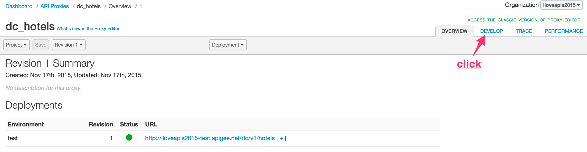  

- In the left-hand-side navigator, find the "Proxy Endpoints" section.  Click the + adjacent to the "default" proxy endpoint. 


- In the new resource row, provide the following properties:
  - Flow Name: Get Hotels
  - Description: Get Hotels
  - Condition Type: Path and Verb
  - Path: /
  - Verb: GET

  After setting those properties, click on the `Add` button to complete adding the Flow. 
  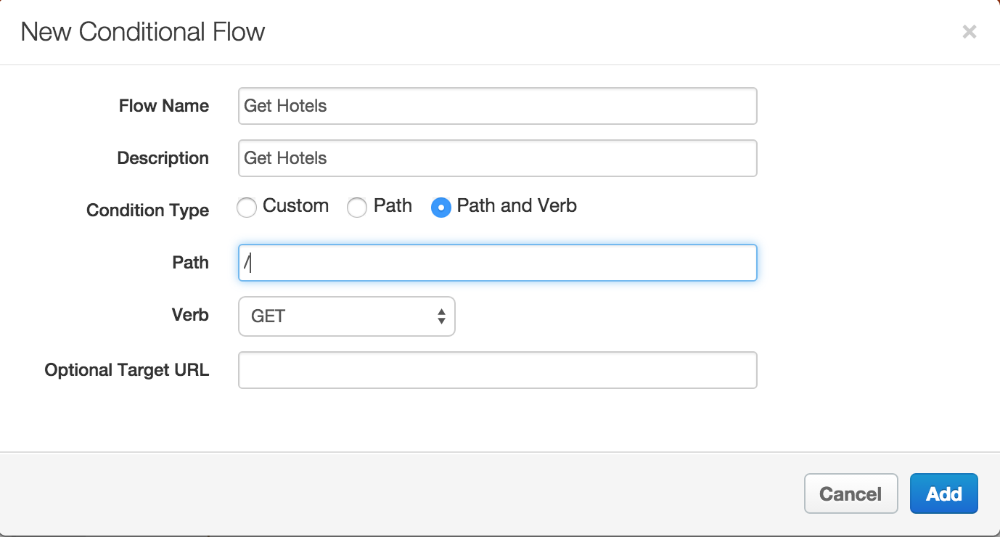

- Follow the above steps to add another Flow with the following properties:
  - Flow Name: Get Individual Hotel
  - Description: Get Individual Hotel
  - Condition Type: Path and Verb
  - Path: /{hotel-uuid}
  - Verb: GET

### Adding Policies to a Proxy

Policies are logic steps. Apigee Edge provides 30+ out of the box policies. Many can be configured to customize their behavior. To add intelligence of behavior to an API Proxy, you add policies. This is done from the `Develop` tab of the API Proxy Editor UI.

Now that you have an API Proxy configured with several flows, you will add logic to the `Get Hotels` flow using policies. 

The goal is to have the proxy perform a geo-location query against our `hotels` BaaS data collection to return results within a certain radius of a zipcode. The zipcode and radius will both  be passed as query parameters for the inbound API, when invoking `/{your-initials}/v1/hotels`.

 API BaaS supports the ability to retrieve entities within a specified distance of any geocoordinate based on its location property:
```
location within <distance_in_meters> of <latitude>, <longitude>
````
 As you can see, you need to provide the latitude and longitude information to perform the query.

 For mobile applications meant for smartphones, obtaining geocode information is easy and can be provided directly as part of an API call. For this lesson, assume that this API interface is being created for devices and applications that cannot easily provide the geocoordinate information, but simply requests the user to provide the zipcode. In such a situation, the first thing for the server or intelligent proxy to do is obtain the geocoordinates for the zipcode provided. Below is the initial logic to implement in the proxy:

  - Retrieve the zipcode and radius from the request query parameter
  - Use the zipcode as an input parameter to call an external service that converts the zipcode to the geocoordinates
  - Extract the latitude and longitude information from the response of the external service call 
  - Use the latitude/longitude to create the geo-location query string
  - Add the location query as a query parameter before the target BaaS service is invoked. 
 A pictorial representation of the logic is depicted below:
 
 

 For the service callout to convert the zipcode to the geocoordinate, you will use the Google GeoCoding API. 

Now let’s implement the policies.

- Switch to the `Develop` tab of the API Proxy
- From the `Navigator` pane, select `Proxy Endpoints → default → Get Hotels` 
 

###Using Assign Message Policy to prepare the service callout request

- From the flow canvas, click the "+ Step" box within the Request flow. 


- In the resulting dialog box, Scroll and choose the assign message policy


- Specify these values for the `Assign Message` policy customizations. 
```
 Display Name: Create Geo Coding Request
 Name: Create-Geo-Coding-Request
``` 

- You will now see a policy icon appearing in the flow canvas. Click it.  
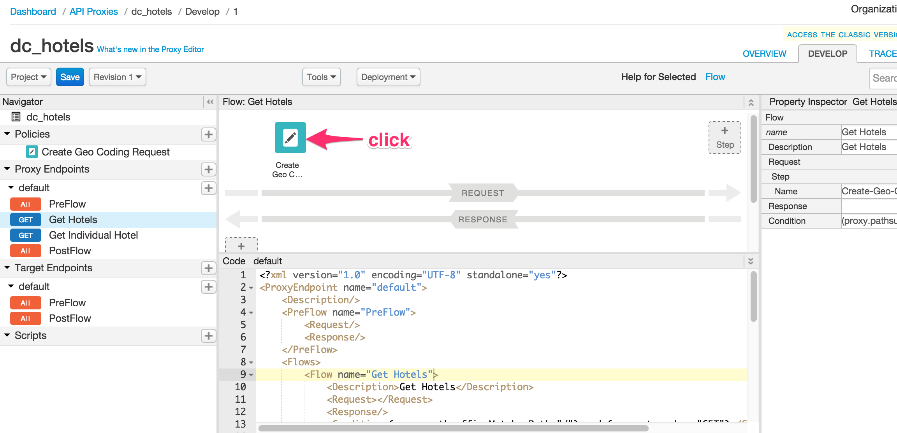

- Make sure you have selected the policy icon and that it is highlighted. 
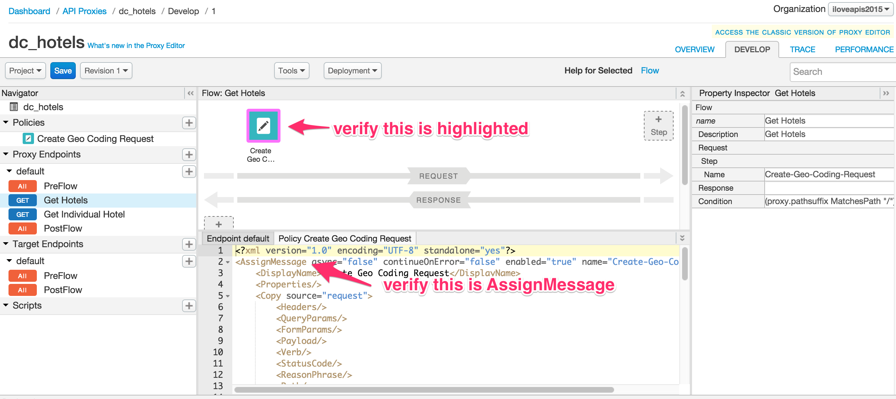

- In the lower panel beneath the canvas, modify the XML configuration. 
Copy the text below and paste it into the editor:  
    ```xml
    <AssignMessage name="Create-Geo-Coding-Request">
        <DisplayName>Create Geo Coding Request</DisplayName>
        <AssignTo createNew="true" type="request">GeocodingRequest</AssignTo>
        <Set>
            <QueryParams>
                <QueryParam name="address">{request.queryparam.zipcode}</QueryParam>
                <QueryParam name="region">US</QueryParam>
                <QueryParam name="sensor">false</QueryParam>
            </QueryParams>
            <Verb>GET</Verb>
        </Set>
        <!-- Set variables for use in the flow -->
        <AssignVariable>
            <Name>zipcode</Name>
            <Ref>request.queryparam.zipcode</Ref>
        </AssignVariable>
        <AssignVariable>
            <Name>radius</Name>
            <Value>0</Value>
            <Ref>request.queryparam.radius</Ref>
        </AssignVariable>
    </AssignMessage>
    ```

Here's a brief description of the elements in this policy. You can read more about this policy in [the online docs for the Assign Message policy](http://apigee.com/docs/api-services/reference/assign-message-policy).

- **```<AssignMessage name="xxx">```** - Gives this policy a name. The name is used when the policy is referenced in a flow. 

- **```<AssignTo>```** - Creates a named *context variable* called `GeocodingRequest` of type `Request`. This variable encapsulates the request object that will be sent by the ServiceCallout policy. 

- **```<Set><QueryParams>```** - Sets the query parameters that are needed for the service callout API call. In this case, the Google Geocoding API needs to know the location, which is expressed with a zipcode. The original inbound request supplies this information, and we simply embed it here. The region and sensor parameters are required by the Google API, and we just hardcode it to certain values here.  Not shown here, **```<Set><Headers>```**  and **```<Set><Payload>```** which work as you would expect. Of course it wouldn't make sense to set a payload for a GET request, but you could set a payload for a POST. 

- **```<Verb>```** - In this case, we are making a simple GET request to the API. 

- **```<AssignVariable>```** - zipcode and radius are new variables being created to store values being passed to the API. In this example, the variables will be accessed later in the proxy flow.  NB: the **```AssignMessage```** policy is designed to assign values to a variable of type message. The **```AssignVariable```** is an optional part of **```AssignMessage```** , which sets another context variable of a primitive type - boolean, string, number. We have found that often people want to make two assignments at once. This is why these capabilities are combined into a single policy.


**Note:** The properties associated with the `Assign Message` policy could have been modified using the `Property Inspector` panel that’s presented in the far right panel of the `Develop` tab. Any changes made in the `Code` panel are reflected in the `Property Inspector` panel and vice-versa. We will use the `Property Inspector` panel to set properties for some of the policies as the lesson progresses.

### Invoke the Google GeoCoding API Using the Service Callout Policy
- Click the "+ Step" button again


- Scroll to select the Service Callout policy
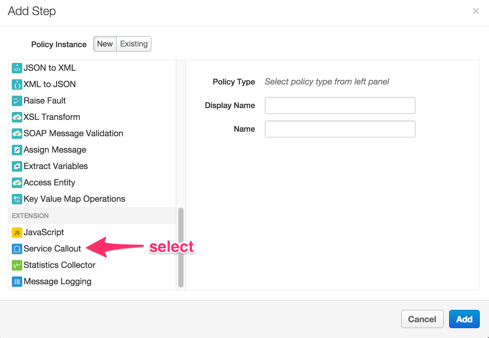

- Specify these values:
```
 Display Name: Call Geo Coding API
 Name: Call-Geo-Coding-API
``` 

- Click Add. The policy icon appears in the flow canvas. 

- Click the new icon to make sure it is selected and highlighted. 


- Copy the text below and paste it into the editor:  
    ```xml
    <ServiceCallout name="Call-Geo-Coding-API">
        <DisplayName>Call Geo Coding API</DisplayName>
        <Properties/>
        <Request clearPayload="true" variable="GeocodingRequest">
            <IgnoreUnresolvedVariables>false</IgnoreUnresolvedVariables>
        </Request>
        <Response>GeocodingResponse</Response>
        <HTTPTargetConnection>
            <Properties/>
            <URL>http://maps.googleapis.com/maps/api/geocode/json</URL>
        </HTTPTargetConnection>
    </ServiceCallout>
    ```
- Here's a brief description of the elements that were modified in this policy. You can read more about this policy in [the online documentation for the Service Callout policy](http://apigee.com/docs/api-services/reference/service-callout-policy).

  - **```<Request variable>```** - This is the variable `GeocodingRequest` that was created in the AssignMessage policy in the previous step. It encapsulates the request going to the Google Geocoding API.

  - **```<Response>```** - This element names a variable `GeocodingResponse` in which the response from the Google Geocoding API will be stored. As you will see, this variable will be accessed later by the ExtractVariables policy.

  - **```<HTTPTargetConnection><URL>```** - Specifies the target URL to be used by the service callout - in this case the URL of the Google Geocoding API: `http://maps.googleapis.com/maps/api/geocode/json`


### Parse the service callout response, using the Extract Message Policy

- Again click "+ Step" 
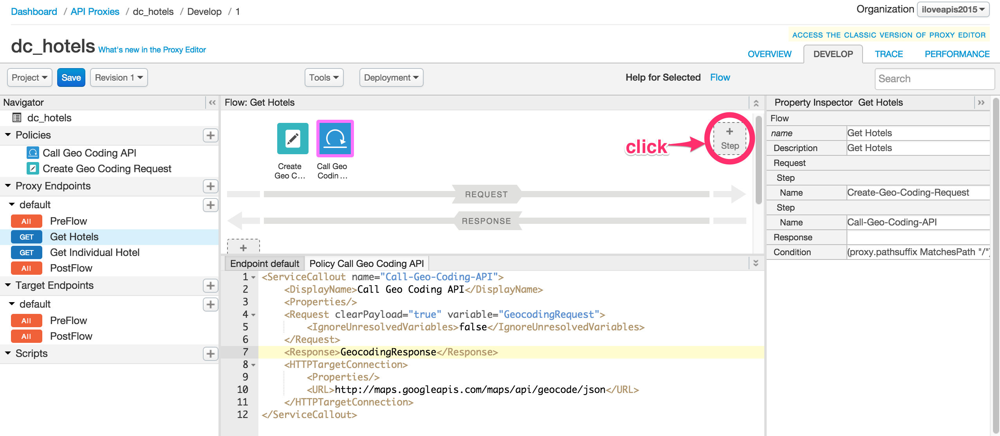

- Scroll to select the  `Extract Variables` policy, specify the following properties:
  ```
   Display Name: Extract Geo Codes
   Name: Extract-Geo-Codes
  ```
- click Add; as with previous policy steps, the policy icon will appear in the Flow canvas. 

- click the icon for the newly-added policy to select the policy. 

- in the XML panel below the canvas, copy-paste the following: 
    ```xml
    <ExtractVariables name="Extract-Geo-Codes">
      <DisplayName>Extract Geo Codes</DisplayName>
      <Source>GeocodingResponse</Source>
      <VariablePrefix>geocodeResponse</VariablePrefix>
      <JSONPayload>
        <Variable name="latitude">
          <JSONPath>$.results[0].geometry.location.lat</JSONPath>
        </Variable>
        <Variable name="longitude">
          <JSONPath>$.results[0].geometry.location.lng</JSONPath>
        </Variable>
      </JSONPayload>
    </ExtractVariables>
    ```

- Here's a brief description of the elements that were modified in this policy. You can read more about this policy in [the online documentation for the Extract Variables policy](http://apigee.com/docs/api-services/reference/extract-variables-policy).

  - **```<Source>```** - Specifies the response variable `GeocodingResponse` that we created in the ServiceCallout policy. This is the variable from which this policy extracts data. 

  - **```<VariablePrefix>```** - The variable prefix `geocodeResponse` specifies a namespace for other variables created in this policy. The prefix can be any name, except for the reserved names defined by the [Apigee Edge Platform's predefined variables](http://mktg-dev.apigee.com/docs/api-platform/api/variables-reference).

  - **```<JSONPayload>```** - This element retrieves the response data that is of interest and puts it into named variables. In fact, the Google Geocoding API returns much more information than latitude and longitude. However, these are the only values needed for these lessons. You can see a complete rendering of the JSON in the [Google Geocoding API documentation](https://developers.google.com/maps/documentation/geocoding/). The values of `geometry.location.lat` and `geometry.location.lng` are simply two of the many fields in the returned JSON object.

  This configuration of the  ```ExtractVariables``` policy produces two context variables whose names consist of the variable prefix (`geocodeResponse`) and the actual variable names that are specified in the policy. The resulting variable names are: `geocodeResponse.latitude` & `geocodeResponse.longitude` .  These variables are set into the request context at runtime, and will be available to subsequent policies that execute within the proxy flow, as you will see. 

###  Using the Javascript Policy to create the Location Query to send to the BaaS target endpoint

- Again click "+ Step" 

- Scroll to select the `JavaScript` policy, specify the following values:
```
 Display Name: Create Location Query
 Name: Create-Location-Query
 Script File: Create new script
 Script Name: Create-Location-Query.js
```

- Click Add; observe that the new policy icon appears in the flow canvas.

- From the `Navigator` panel on the left-hand-side, go to `Scripts → Javascript` and click to select the `Create-Location-Query.js` script file
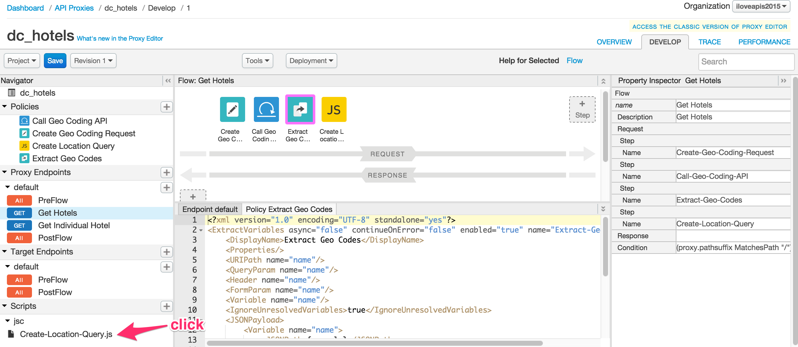

- in the code panel, center of the screen beneath the canvas, copy-paste the following code:
    ```javascript
    var latitude = context.getVariable("geocodeResponse.latitude"),
        longitude = context.getVariable("geocodeResponse.longitude"),
        radius = context.getVariable("radius");

    // set default (0 meters)
    radius = (radius === "") ? "0" : radius;

    // set BaaS query
    var baasQL = "location within " + radius + " of " + latitude + "," + longitude;
    context.setVariable("baasQL", baasQL);
    ```

- This Javascript code uses the `context` object, which is part of the [Apigee Edge Javascript object model](http://apigee.com/docs/api-services/reference/javascript-object-model), to retrieve 3 variables: `geocodeResponse.latitude`, `geoCodeResponse.latitude`, `radius`.  All of these variables had been set by policies occurring earlier in the flow. 

  It sets a default in case the variables are empty strings, creates a new query variable called `baasQL` using the API BaaS query language syntax for a location query, and adds the ‘baasQL’ variable, by calling `context.setVariable()`.  This new variable can then be used later in the flow. 
  You can read more about this policy in [the online documentation for the Javascript policy](http://apigee.com/docs/api-services/reference/javascript-policy).

### Using the Assign Message Policy to add the Location Query to the query parameter before BaaS target endpoint invocation

- Re-Select the "Get Hotels" Flow in the Navigator. 
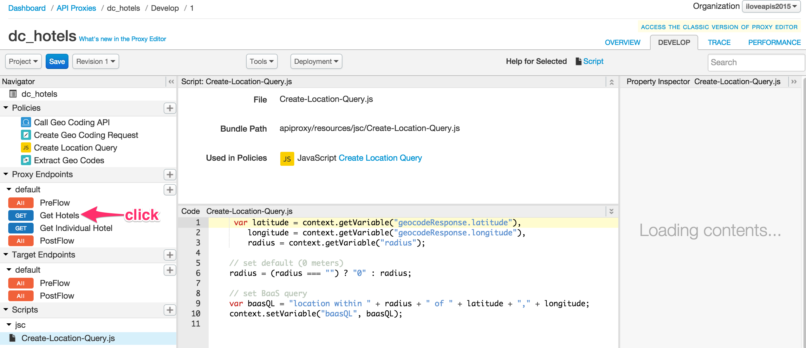

- Once again, "+ Step" 

- In the Add Step dialog box, scroll and select the `Assign Message` policy. Specify the following properties:
  ```
  Display Name: Set Query Parameters
  Name: Set-Query-Parameters
  ```

- Notice that the new icon appears in the flow.  Again, click the icon to select the newly added policy
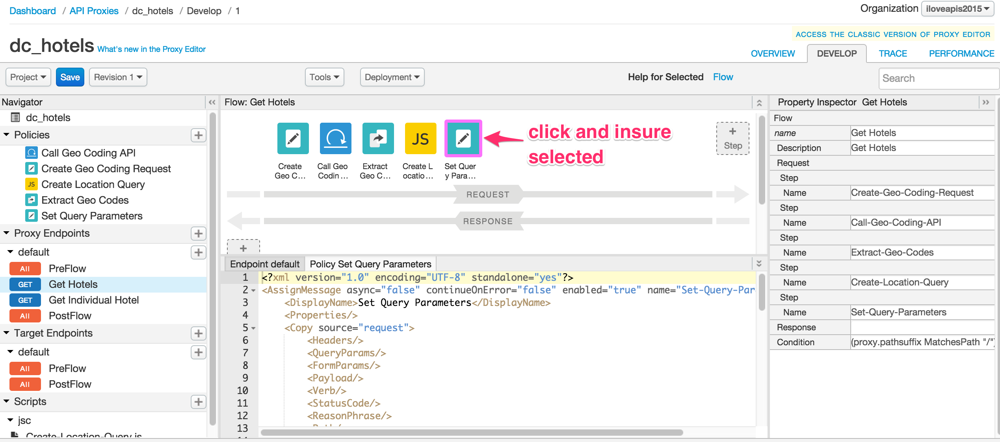

- copy-paste the following code in the center-lower panel: 
    ```xml
    <AssignMessage name="Set-Query-Parameters">
      <DisplayName>Set Query Parameters</DisplayName>
      <Remove>
        <QueryParams>
          <QueryParam name="zipcode"/>
          <QueryParam name="radius"/>
        </QueryParams>
      </Remove>
      <Set>
        <QueryParams>
          <QueryParam name="ql">{baasQL}</QueryParam>
        </QueryParams>
      </Set>
    </AssignMessage>
    ```

- Here's a brief description of the elements that were modified in this policy. You can read more about this policy in [the online documentation for the Extract Variables policy](http://apigee.com/docs/api-services/reference/extract-variables-policy).

  - **```<Remove><QueryParameters>```** - Removes the query parameters (`zipcode` and `radius`) that were sent in the original client request to the API Proxy. In Apigee Edge,  the original inbound request is implicitly copied to the request to be sent to the backend system. This step modifies the copy, so that the backend doesn't get query parameters it does not need or understand. 

  - **```<Set><QueryParameters>```** - Adds a new query parameter (`ql`) with the variable `baasQL` providing the actual value. Remember, the `baasQL` variable was set by the previous Javascript policy, using `context.setVariable()`.


### Testing the API Proxy with the location query after deploying changes

All the policies depicted in the diagram earlier in this lesson for the request flow have been implemented. Your Proxy Editor should look as follows:

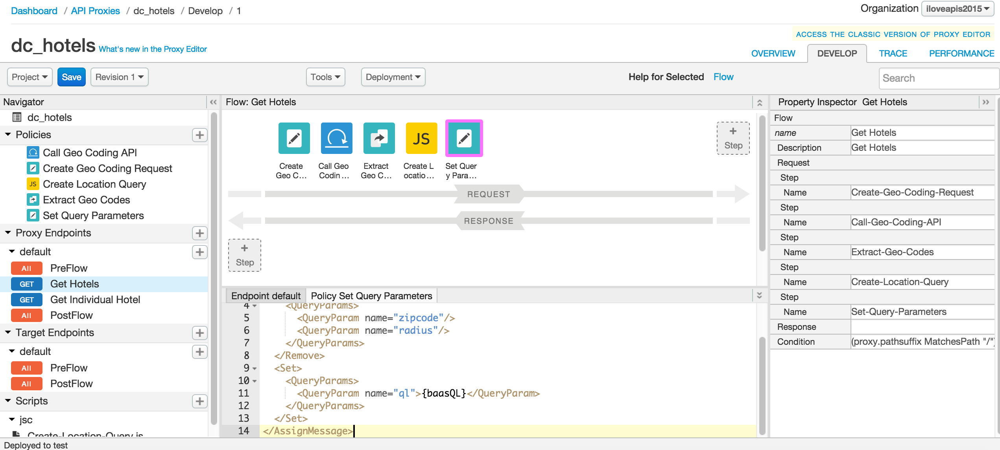

You could have tested the proxy in stages, as you added each policy to the flow. Instead, we added a set of policies in a group before testing. Now there is complete logic in the flow to allowing testing the behavior of the flow to see if the results being returned from the API BaaS are as expected. 

- Click on the `Save` button to save and deploy the changes to the `{your-initials}_hotels` API Proxy

  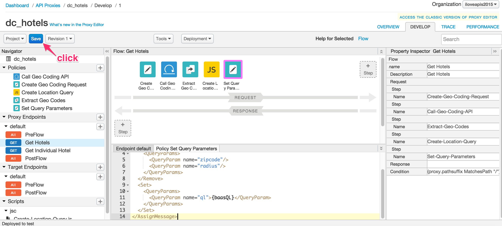

- Wait for the `Successfully saved API Proxy` message to appear and verify that the ‘{your-initials}_hotels’ proxy is deployed to the `test` environment

- Click the `Trace` tab and start a trace session by clicking the `Start Trace Session` button

- Use Postman or curl (etc) to test the `/GET hotels` request with the following query parameters combinations and review the results being returned
 - zipcode=98101&radius=1000
 - zipcode=98101&radius=200
 - zipcode=94105&radius=400
 - No query parameters

Notice that the responses being returned by the API BaaS for the various query parameter combinations are different as the location-based query finds hotels that match the criteria.

- Switch back to the `Trace` tab in the Apigee Edge Management UI. Review the executed policies and associated headers & variable data to better understand the flow

- Note that when the proxy is called without any query parameters now, it returns an fault indicating that the `zipcode` query parameter could not be resolved. You could customize this error message or add a condition to check for missing query paramters. We'll leave that as an exercise for the reader. 

### Modifying the response sent to the API client

Many times the response coming from the backend target endpoint is not exactly what you want to send to the calling client. The response may need to be transformed, filtered, or augmented. For example, as you review the response being returned from the API BaaS for this lesson, you will notice that it has several metadata attributes (e.g. `application`, `path`, `organization`, `applicationName`, etc.) that you may want to filter out prior to sending the response. You will use a simple Javascript policy, similar to the one used before to create the location query variable, to create a customized response.

- Click back to the `Develop` tab of `{your-initials}_hotels` proxy in the Apigee Edge Management UI.

- Insure the "Get Hotels" flow is selected in the left-hand-side navigator. 

- in the center panel, click and drag the divider downward.  Then click the "+ Step" in the response flow. 
  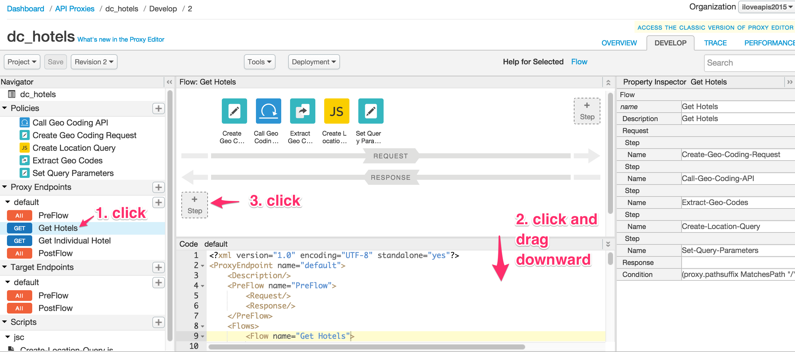

- In the dialog, scroll and select the `JavaScript` policy, and specify these values: 

 - Display Name: Create Final Response
 - Name: Create-Final-Response
 - Script File: Create new script
 - Script Name: Create-Final-Response.js

- at the bottom of the left-hand-side Nav, click to select the `Create-Final-Response.js` resource

- in the lower half of the center panel, copy-paste the following JS code: 
    ```javascript
    var hotelsResponse = context.getVariable("response.content"),
        // initialize hotels response
        finalResponse = {
          hotels : {
            queryparams : {
              zipcode : context.getVariable("zipcode"),
              radius : context.getVariable("radius")
            }
          }
        };

    // add the hotels response
    if (hotelsResponse !== null) {
      var hotelsJSON = JSON.parse(hotelsResponse);
      var md = {count : hotelsJSON.count || 0};

      // set current results cursor
      if (hotelsJSON.params && hotelsJSON.params.cursor) {
        md.currentCursor = hotelsJSON.params.cursor[0];
      }
      // set next results cursor
      if (hotelsJSON.cursor) {
        md.nextCursor = hotelsJSON.cursor;
      }
      finalResponse.hotels.resultsMetadata = md;
      // set the list of hotels
      finalResponse.hotels.entities = hotelsJSON.entities;
    }

    // update the response that will be returned to the client
    context.setVariable("response.content", JSON.stringify(finalResponse));
    ```

  The above script creates a customized JSON response by merging information from the query parameters received in the original request and certain attributes from the API BaaS response. The final JSON format being created and returned is as follows:

    ```json
    {
        "hotels": {
            "queryparams": {
                "zipcode": "98010",
                "radius": "1000"
            },
            "resultsMetadata": {
                "count": "211",
                "currentCursor": "ABCDEFG126528",
                "nextCursor": "9198198191jskjskjs"
            },
            "entities": [
                ...Array of hotel entities...
            ]
        }
    }
    ```

- Save the changes to the API Proxy, wait for it to successfully deploy and test again using Postman as described in the earlier in the lesson.

## Summary

That completes this hands-on lesson. 

In this lesson you learned how to use a variety of transformation and extensibility policies within Apigee Edge to create an API Proxy that acts as a facade for an existing  backend system. The facade exposes a more consumable interface than the raw backend. You also learned how to call external services within the flow using the Service Callout extensibility policy and to use the results to augment the request to the target endpoint. Finally you learned how to quickly incorporate Javascript code to transform and manipulate data before sending it to the API consumer.
