# API Services_ Lesson 5 - Add Security Policies

## Overview
There are several out-of-the-box security policies that Apigee Edge provides to protect your APIs. These security policies must be used appropriately based upon your use cases. Apigee Edge supports:

### API Keys
API key validation is the simplest form of app-based security that you can configure for an API. Using key validation, apps simply present an API key with each inbound request, and Apigee Edge checks to see that the API key is in an approved state for the resource being requested. 

API Key security is easy to use and implement in Apigee Edge, but because it is so simple, the security associated with API keys is limited. 

For example, API Keys are expected to live "forever", or at least a very long time. OFten keys are embedded into application code to allow an application to access an API.  Anyone with access to the application code could theoretically extract the API Key from the code, and then use that key to access an API. 

You may find that API keys work better as unique, but unauthenticated app identifiers, rather than as security tokens. 

For more information, see [API Keys](http://apigee.com/docs/api-services/content/api-keys).


### OAuth v2.0
To go beyond app identification using API Keys, Apigee Edge provides comprehensive support for OAuth v2.0. Apigee Edge includes an OAuth 2.0 authorization server implementation that lets you register apps and secure API proxies with OAuth 2.0 using the four grant types that are part of [OAuth 2.0](http://apigee.com/docs/api-services/content/oauth-introduction). 

Here's the definition of OAuth from the OAuth 2.0 IETF specification. 

> The OAuth 2.0 authorization framework enables a third-party application to obtain limited access to an HTTP service, either on behalf of a resource owner by orchestrating an approval interaction between the resource owner and the HTTP service, or by allowing the third-party application to obtain access on its own behalf.

When you use OAuth, All requests from the app for protected resources from the backend service is negotiated using a bearer token, so named because the *bearer* of such a token is implicitly assumed to be authorized for specific actions. 

In Apigee Edge, OAuth v2.0 access tokens are opaque strings, long random strings generated by an authorization server after appropriate app and/or user credentials are presented. 

Tokens are used to validate requests for protected resources. If an app is compromised, the resource server can revoke it's access token. In that case, the end user does not need to change her username/password on the resource server, her app simply needs to renegotiate for a new access token. 

For more information, see OAuth 2.0 and the [OAuth the Big Picture](https://pages.apigee.com/oauth-big-picture-ebook.html) Apigee eBook.

### OAuth v1.0a

A standard that predates OAuth 2.0, OAuth v1.0a provides a standard way for client applications to sign requests being sent to servers, asserting the identity of the app and the end user. When servers receive the signed request, they can verify the signature, verify the access_token included in the signature, and grant access to APIs based on the verified identify of the app and user. 

In this way, OAuth v1.0a  enables app users to authorize applicationss to consume APIs on their behalf, without requiring app users to disclose their passwords to the app in the process. 

Apigee Edge enables you to protect APIs in a way that ensures that an app uses has authorized the app to consume an API. Edge also provides policy-based functionality for configuring the endpoints that app developers can use to obtain access tokens. For more information, see [OAuth v1.0a policy](http://apigee.com/docs/api-services/reference/oauth-10-policy).

### SAML
Apigee Edge enables you to authenticate and authorize apps that are capable of presenting SAML tokens. A SAML token is a digitally signed fragment of XML that presents a set of "assertions". These assertions can be used to enforce authentication and authorization.

To use SAML terminology, Apigee Edge can function as a service provider (SP) or an Identity Provider (IP). When Apigee Edge validates SAML tokens on inbound requests from apps, it acts in the role of SP. (API Services can also act in the IP role, when generating SAML tokens to be used when communicating with backend services. For details on SAML validation, see [SAML Assertion policies](http://apigee.com/docs/api-services/reference/saml-assertion-policy).


### Other token and security schemes
There are numerous other security schemes in various stages of maturity in the marketplace. Among these are HttpSignature, HAWK, HMAC signatures, JWT, and more. Apigee Edge supports all of these security mechanisms via custom policies written in JavaScript or Java. 


### Content Based Security
Message content is a significant attack vector used by malicious API consumers. API Services provides a set of Policy types to mitigate the potential for your backend services to be compromised by attackers or by malformed request payloads.

#### JSON threat protection
JSON attacks attempt to use structures that overwhelm JSON parsers to crash a service and induce application-level denial-of-service attacks.
Such attacks can be mitigated using the JSONThreatProtection Policy type.
See [JSON Threat Protection policy](http://apigee.com/docs/api-services/reference/json-threat-protection-policy).

#### XML threat protection
XML attacks attempt to use structures that overwhelm XML parsers to crash a service and induce application-level denial-of-service attacks.
Such attacks can be mitigated using the XMLThreatProtection Policy type.
See [XML Threat Protection policy](http://apigee.com/docs/api-services/reference/xml-threat-protection-policy).

#### General content protection
Some content-based attacks use specific constructs in HTTP headers, query parameters, or payload content to attempt to execute code. An example is SQL-injection attacks. Such attacks can be mitigated using the Regular Expression Protection Policy type.
See [Regular Expression Protection policy](http://apigee.com/docs/api-services/reference/xml-threat-protection-policy).

###Data Masking
Apigee Edge enables developers to capture message content to enable runtime debugging of APIs calls. In many cases, API traffic contains sensitive data, such as credit cards or personally identifiable health information (PHI) that needs to filtered out of the captured message content.
To meet this requirement, Edge defines 'mask configurations' that enable you to specify data that will be filtered out of trace sessions. Masking configurations can be set globally (at the organization-level) or locally (at the API proxy level). Role-based capabilities govern which users have access to the data that is defined as sensitive.
For more information, see [Data Masking](http://apigee.com/docs/api-services/content/data-masking) 

## Objectives

The objective of this lesson is to become familiar with Apigee’s API Key Verification and OAuth 2.0 Token Validation policies. 

As discussed in the Overview section, API Key Verification policy enables you to identify the API consumer and prevents unidentified API consumers from being able to call your APIs. You will implement an API Key Verification policy in this lesson to get familiar with several associated concepts such as: API Key, API Secret, API Products and Developer Apps.

Identifying an API consumer is beneficial from an analytics and audit perspective, but in many situations, simply identifying the API consumer (or, the calling application) is not secure enough to make authorization decisions. To add an additional level of security, in this lesson you will replace the API Key Verification policy with an OAuth 2.0 Token Validation policy using the client-credentials two-legged OAuth flow. 

## Prerequisites
- [x] API Services - Lesson 4 completed 
- [x] A preliminary understanding of OAuth 2.0
- [x] Apigee’s oauth proxy deployed to your organization

## Estimated Time: 60 mins

### Adding an API Key Verification Policy 

- Go to the Apigee Edge Management UI browser tab

- Insure you have selected APIs → API Proxies  → the `{your-initials}_hotels` proxy.

- click the `Develop` tab

- in the left-hand-side navigator, in the Proxy Endpoints section, under the default proxy, highlight the Pre-Flow. 
  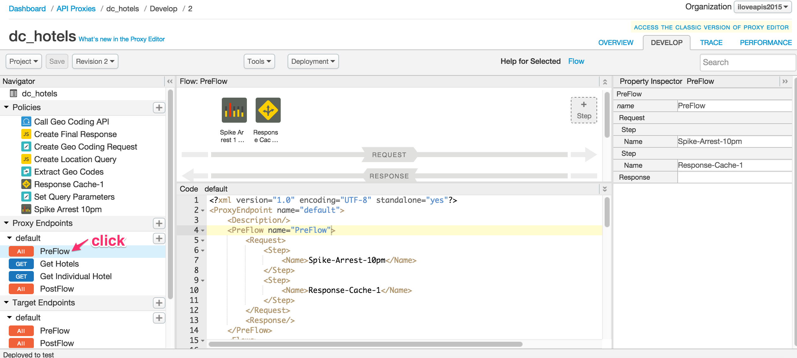

- In the center canvas, click the "+ Step" in the request flow. 
  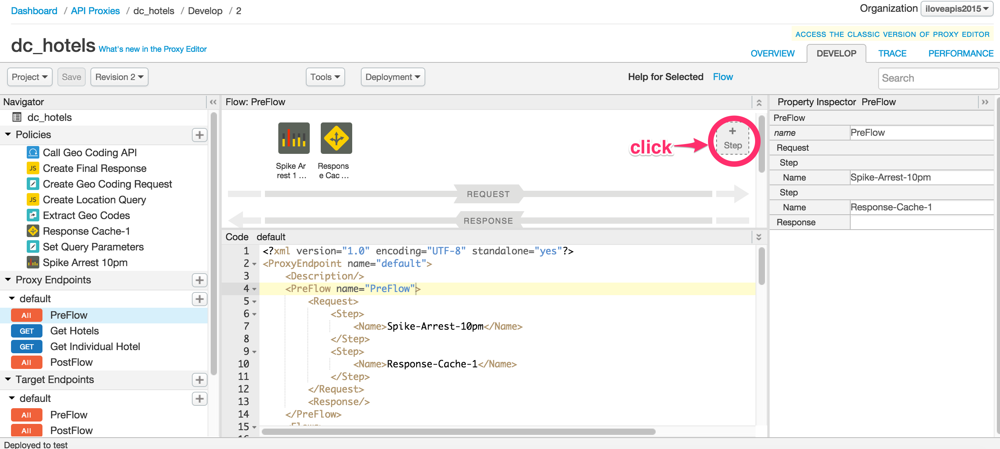

- In the resulting dialog, scroll and select the `Verify API Key` policy. Specify the following values:

  - Display Name: **Verify API Key**
  - Name: **Verify-API-Key**

- The `Verify API Key` policy will get added after the `Response Cache` policy. **Drag and move** the `Verify API Key` policy so that it appears _**before**_ the `Response Cache` policy

  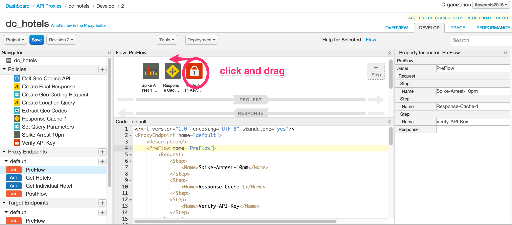
 
- The result should look like this: 
  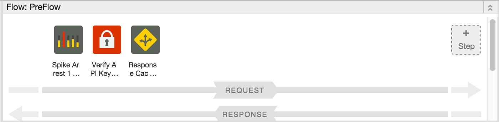

  **Note:** Typically API Key verification should be one of the first policies in the flow. In this scenario, we verify the API Key before the Response Cache policy to ensure that an API Consumer whose API Key may have been revoked is not able to get the data from the cache. If the Key verification was placed after the Response cache, then callers with revoked or invalid keys would be able to get real results from the Edge Cache. 

- Examine the XML configuration in the `Code` panel (or properties using the `Property Inspector` panel) associated with the `Verify API Key` policy. copy-paste the following XML into the lower panel:

  ```xml
  <VerifyAPIKey name="Verify-API-Key">
      <DisplayName>Verify API Key</DisplayName>
      <APIKey ref="request.queryparam.apikey"/>
  </VerifyAPIKey>
  ```

  The `<APIKey>` element identifies where the policy should check for the API key. In this example, the policy looks for the API key in a query parameter named `apikey`. API keys can be located in a query parameter, a form parameter, or an HTTP header, or even in the message body or URL path element. Apigee Edge provides message-variable access for query or form parameters, or for headers. For using URL Path elements or message body, you will have to use an Extract Variables policy. For policy reference information, see [Verify API Key policy](http://apigee.com/docs/api-services/reference/verify-api-key-policy).

### Removing the API Key from the query parameters

- Once again, click "+ Step"

- In the "Add Step" dialog, scroll and select the `Assign Message` policy. Specify the following values:

  - Display Name: **Remove APIKey QP** 
  - Name: **Remove-APIKey-QP**

- The `Remove APIKey QP` policy will get added after the `Response Cache` policy. **Drag and move** the `Remove APIKey QP` policy to be _**before the**_ `Response Cache` policy. It should appear like this: 

  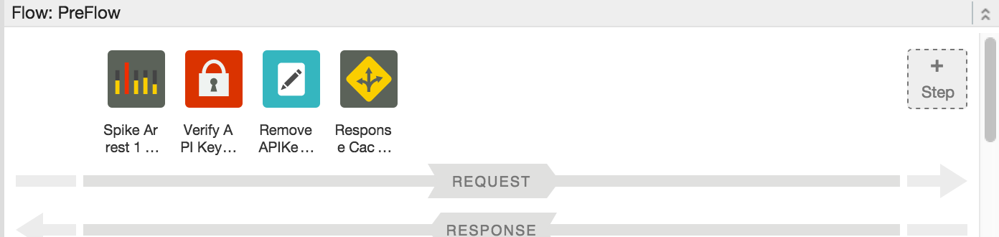
 
- For the `Remove APIKey QP` policy, change the XML configuration of the policy using the `Code: Remove APIKey QP` panel as follows:

  ```xml
  <AssignMessage name="Remove-APIKey-QP">
      <DisplayName>Remove APIKey QP</DisplayName>
      <Remove>
        <QueryParams>
          <QueryParam name="apikey"></QueryParam>
        </QueryParams>
      </Remove>
      <IgnoreUnresolvedVariables>true</IgnoreUnresolvedVariables>
      <AssignTo createNew="false" transport="http" type="request"/>
  </AssignMessage>
  ```

  As a security measure, the `Remove APIKey QP` policy simply removes the `apikey` query parameter from the HTTP request message attached to the flow so it is not sent to the backend service. In this scenario we are removing the `apikey` immediately after verify API Key policy, but depending on your use case, removing the `apikey` may need to be done at a later stage in the flow.

### Testing the API Key Verification Policy

Until now anyone with the URL to the `hotel` API Proxy has been able to make a request with appropriate parameters and get a response back. Now that you have added the API Key Verification policy, that will no longer be the case. 

- Start the `Trace` session for the `{your-initials}_hotels` proxy

- send a test `/GET hotels` request from `Postman` with the following query parameters: `zipcode=98101&radius=200`

- You will notice that the following fault is returned since an API Key has not been provided as a request query parameter:
  ```json
  {
    "fault": {
      "faultstring": "Failed to resolve API Key variable request.queryparam.apikey",
      "detail": {
        "errorcode": "steps.oauth.v2.FailedToResolveAPIKey"
      }
    }
  }
  ```

  The above response shows that the API Key Verification policy is being enforced as expected.

- Review the `Trace` for the proxy and the returned response to ensure that the flow is working as expected.

- Stop the `Trace` session for the `{your-initials}_hotels` proxy

### Obtaining an API Key 

Up to now you have been playing the role of an API Developer configuring various policies in the `{your-initials}_hotels` proxy. 

To understand the concept of an API Key and associated concepts such as API Products, Developer and Developer Apps, you need to now think about the role of an App Developer. This Developer needs an API Key that can be used whenever their app needs to use the `{your-initials}_hotels` proxy. 

To make it easier for Developers to consume APIs, Apigee Edge provides the capability of publishing APIs. Publishing is the process of making your APIs available to Developers for consumption. Publishing APIs can be broadly defined by the following tasks:
- Create the API Products on Apigee Edge that bundle your APIs.
- Register Developers on Edge. Only a registered App Developer can register an App.
- Developers register Developer Apps on Edge to access API products. In response, the developer receives an API key. Now that the developer has an API key, they can make requests to your APIs.

For more, see [Publishing Overview](http://apigee.com/docs/developer-services/content/publishing-overview).

The following table defines some of the terms used to register apps and generate keys:

| Term        | Definition      |
| :------------:|:-------------:|
| API product      | A bundle of API proxies combined with a service plan that sets limits on access to those APIs. API products are the central mechanism that Apigee Edge uses for authorization and access control to your APIs. For more, see [API Products](http://apigee.com/docs/developer-services/content/what-api-product) |
| Developer      | The person or party that builds applications that use the API. Developers write apps the make requests to your APIs. For more, see [Adding Developers to an API Product](http://apigee.com/docs/developer-services/content/adding-developers-your-api-product).      |
| App | A client-side app that a developer registers to access an API product. Each developer may have zero or more registered applications. Registering an app with the API product generates the API key for accessing the APIs in that product.      |
| API key | A string with authorization information that a client-side app uses to access the resources exposed by the API product. The API key is generated when a registered app is associated with an API product.      |

With the above brief introduction to API Products, Developers and Developer Apps, you will now create one of each to obtain a valid API Key that can be used to call the `{your-initials}_hotels` proxy

## Publishing an API Product

- From the Apigee Edge Management UI, go to `Publish` → `API Products`

- Click on `+ Product` button to add a new product

- In the `Product Details` section of the new product screen, enter or select the following values for the various fields:

  - Display Name: **{your-initials} Hospitality Basic Product** 
  - Description: **API Bundle for a basic Hospitality App.**
  - Environment: **Test**
  - Access: **Public**
  - Key Approval Type: **Automatic**

    
 

 - In the `Resources` section select the following values for the various fields:

   - API Proxy: **{your-initials}_hotels** 
   - Revision: **1**
   - Resource Path: **/**

   

 - Click on `Import Resources` to add the `/` resource of the `{your-initials}_hotels` proxy to the `{your-initials} Hospitality Basic Product`
 - **Repeat** the above two steps for the ‘/**’ resource
 - Click `Save` to save the API Product. The new product should now be listed on the `Products` page.

## Registering a Developer

 Developers access your APIs through apps. When the developer registers an app, they receive a single API key that allows them to access all of the API products associated with the app. However, developers must be registered before they can register an app.

 Developers typically have several ways of registering:

 - If you have a paid Edge account, through a Developer Services portal. See [Add and manage user accounts](http://apigee.com/docs/developer-services/content/add-and-manage-user-accounts) for more.

 - By accessing a form or application that uses the Edge management API to register the developer. See [Using the Edge management API to Publish APIs](http://apigee.com/docs/developers-services/content/using-edge-management-api-publish-apis) for more.

 - By a back-end administrator using the Edge management UI. This is really just a special case of the above. 

You will be learning more about how Developers can go through a self-service registration process using Developer Services Portal in later lessons. For the continuity of this lesson, the following steps describe the process of registering Developers and Developer Apps using the Apigee Edge Management UI.

- From the Apigee Edge Management UI, go to Publish → Developers

- Click on `+ Developer` button to add a new product

- Add a new developer with the following properties:

  - First Name: **Marco** 
  - Last Name: **Polo**
  - Email: **{your email}+mpolo@gmail.com**
  - Username: **mpolo**

  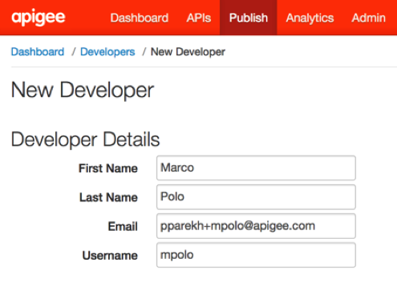

 - Click `Save` to save the Developer. The new developer should now be listed on the `Developers` page.

## Registering a Developer App

 Now that you have an API product and a developer, you can register a Developer App with the API product. Registering the Developer App generates the API key for the API products associated with the app. You can then distribute the key to app developers so they can access the features in the API products from the app.

 As mentioned earlier, you will learn about self-registering apps as a developer using Developer Services Portal in later lessons. For the continuity of this lesson, the following steps describe the process of registering Developer Apps using the Apigee Edge Management UI.

- From the Apigee Edge Management UI, go to Publish → Developer Apps
- Click on `+ Developer App` button to add a new product
- In the `Developer App Details` section, enter or select the following values for the various fields:

  - Display Name: **<your initials> iExplore App**
  - Developer: **Marco Polo**
  - Callback URL: **Leave it blank**

- In the `Products` section, click on the `+ Product` button
- From the `Product` drop-down, select `{your-initials} Hospitality Basic Product`
- Click the `check-mark` button in the `Actions` column to accept the changes

 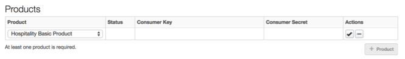

 - Click `Save` to save the Developer App. The new app should now be listed on the `Developer Apps` page

 - From the `Developer Apps` page, select the `iExplore App` to view the details page for the app

 - In the `Products` section, next to the entry for `{your-initials} Hospitality Basic Product`, click `Show` in the `Consumer Key` and `Consumer Secret` columns to display the generated keys

 **Note:** Since you selected `Key Approval Type: Automatic` when you created the API product, the API key is automatically approved and you can view it immediately. 

If you had selected `Approval Type: Manual`, you would need to click `Approve` in the `Actions` column to approve the API key, before it could be used. 

The way the `{your-initials}_hotels` proxy is configured, as of now, the Consumer Key (i.e. the API Key) is the only key that the `iExplore App` will need to access the `{your-initials}_hotels` proxy resources. You will not use the Consumer Secret (i.e. the API Secret, or Client Secret) at this time.  You will use the `Consumer Secret` in the next section when the security policy is changed from API Key Verification to an OAuth Token Validation policy.

### Re-testing the API Key Verification Policy

Now that you have a valid API Key associated with a Developer App (`iExplore App`) with access to the API Product (`{your-initials} Hospitality Basic Product`) that bundles the `{your-initials}_hotels` proxy, test the API Key Verification policy to ensure that everything works as expected.

- Copy the `Consumer Key` associated with the `iExplore App` by going to Publish → Developer Apps → iExplore App 
- Start the Trace session for the `{your-initials}_hotels` proxy

- Send a test `/GET hotels` request from `Postman` with the following query parameters: `zipcode=98101&radius=200&apikey={INSERT CONSUMER KEY HERE}`

**Note:** Be sure to insert the consumer key appropriately. As you copy-paste, be sure to remove any spaces before and after the Consumer Key. Also, don't keep the curly braces.

- Again from `Postman`, send the same kind of request to `/GET hotels`, but use a bogus API Key: `zipcode=98101&radius=200&apikey={INSERT BOGUS KEY HERE}`

- Now switch back to the Trace tab in the browser. Review the Trace for the proxy and the returned response to ensure that the flow is working as expected. It allows requests with valid API keys and rejects requests with invalid keys. 

- Stop the Trace session for the ‘{your-initials}_hotels’ proxy

### Stepping-up security using OAuth 2.0: Client Credentials Grant

For convenience, all organizations on Apigee Edge come preconfigured with a set of OAuth 2.0 endpoints that implement the `client credentials grant type`.  For information about the configuration of the default `oauth` proxy, review [policies in the oauth token endpoint](http://apigee.com/docs/api-services/tutorials/secure-calls-your-api-through-oauth-20-client-credentials).

This section of the lesson explains how to protect an API using this default `oauth` proxy configuration.

### About the client credentials grant type

The client credentials grant type defines a procedure for issuing access tokens in exchange for *App credentials*. These app credentials are the consumer key and secret pair that Apigee Edge issues for each app that is registered in an organization. 

For this reason, it is relatively simple to 'step up' your API security scheme from API key validation to OAuth client credentials. Both schemes use the same consumer key and secret to validate the client app. The difference is that client credentials provides an extra layer of control, since you can easily revoke an access token when needed, without requiring you to revoke the app's consumer key. To work with the default OAuth endpoints, you can use any consumer key and secret generated for app in your organization to retrieve access tokens from the token endpoint. You can even enable client credentials for apps that already have consumer keys and secrets.

Client credentials has very specific use cases, and is not the grant type most commonly used for web and mobile apps.  For a general introduction to OAuth 2.0 grant types with definitions and use cases, see [Introduction to OAuth 2.0](http://apigee.com/docs/api-services/content/oauth-introduction). 

To support use cases with grant types other than client credentials, the OAuth proxy must be configured with authorization endpoints. For additional information, see [configuring authorization endpoints](http://apigee.com/docs/api-services/content/oauth-endpoints) and [authorizing requests using OAuth 2.0](http://apigee.com/docs/api-services/reference/authorize-requests-using-oauth-20). 

## Adding an OAuth 2.0 Token Validation Policy

- Go to the Apigee Edge Management UI browser tab

- Insure you have selected APIs → API Proxies  → the `{your-initials}_hotels` proxy.

- click the `Develop` tab

- in the left-hand-side navigator, in the Proxy Endpoints section, under the default proxy, highlight the Pre-Flow. 
  

- Since you will be adding an OAuth v2.0 policy, the API Key Verification policy is no longer necessary. Delete the `Verify API Key` policy from the ‘{your-initials}_hotels’ proxy default proxy endpoint preflow. Do this by hovering over the icon, and clicking the X character. 

  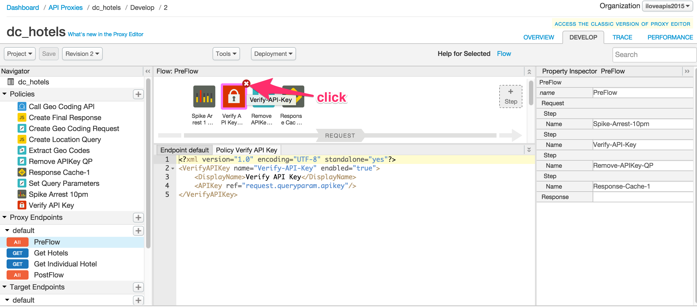 

- In the canvas showing the request flow, click the "+ Step" button

  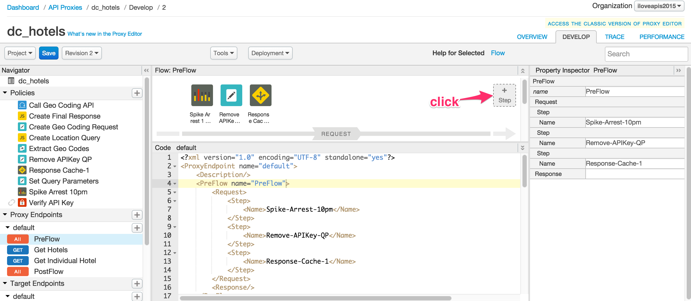 

- In the "Add Step" dialog, scroll and choose the `OAuth v2.0` policy. Specify the following values:

  - Display Name: **Validate OAuth v2 Token**
  - Name: **Validate-OAuth-v2-Token**

- The `Validate OAuth v2 Token` policy will get added after the `Response Cache` policy. **Drag and move** the `Validate OAuth v2 Token` policy 2 steps to the left, so that it appears _**before**_ the `Remove APIKey QP` policy. The result should look like this in the canvas: 

  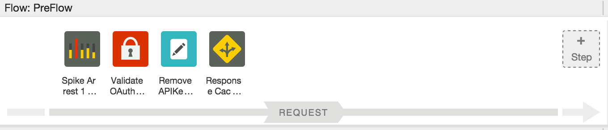 

- Click the icon for the `Validate OAuth v2 Token` policy. In the lower panel, copy-paste the following XML configuration for the policy.

   ```xml
  <OAuthV2 name="Validate-OAuth-v2-Token">
      <DisplayName>Validate OAuth v2 Token</DisplayName>
      <ExternalAuthorization>false</ExternalAuthorization>
      <Operation>VerifyAccessToken</Operation>
      <SupportedGrantTypes/>
      <GenerateResponse enabled="true"/>
      <Tokens/>
  </OAuthV2>
   ```

The value of the `<Operation>` element indicates the action to take - in this case, verifying the access token. 

The value of the `<ExternalAuthorization>` element is set to `false`, indicating that Apigee Edge should validate the OAuth Token rather than delegating it to an external validator.

## Removing the Authorization Header After Validating the OAuth Token

- Again, in the proxy editor, make sure you have the Preflow selected for the default proxy endpoint. 

- Select the existing `Assign Message` policy in the flow. Make sure it is highlighted. 

  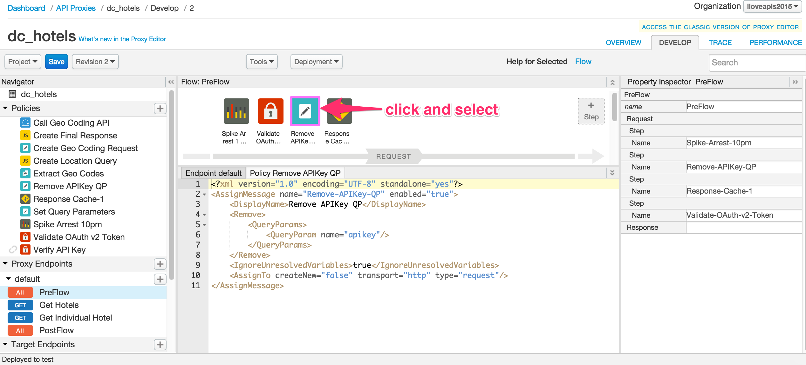 

- copy-paste the following XML for this policy into the lower middle panel. 

   ```xml
  <AssignMessage name="Remove-Authorization-Header">
      <DisplayName>Remove Authorization Header</DisplayName>
      <Remove>
          <Headers>
              <Header name="Authorization"></Header>
          </Headers>
      </Remove>
      <IgnoreUnresolvedVariables>true</IgnoreUnresolvedVariables>
      <AssignTo createNew="false" transport="http" type="request"/>
  </AssignMessage>
   ```

As a security measure, the `Remove Authorization Header` policy removes the `Authorization` header from the HTTP request message so it is not sent to the backend service. In fact, if the `Authorization` header is not removed, the Backend-as-a-Service API will throw an invalid token error. This is the equivalent of removing the API Key from the outbound request, when we were using API Key security in the previous section of this lesson. 

- click the blue Save button near the top left of the page. You will then see a dialog box confirming the save: 

  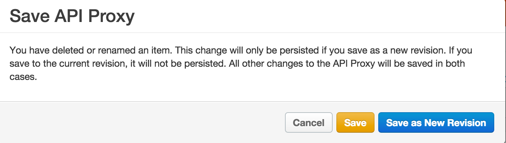 

- Click "Save as New Revision"

- At this point you have saved a new revision of the API Proxy.  The older revision still exists, and in fact is deployed. Confirm this by clicking the Revision dropdown to see the list of revisions of the API proxy, along with the deployment status of each. 

  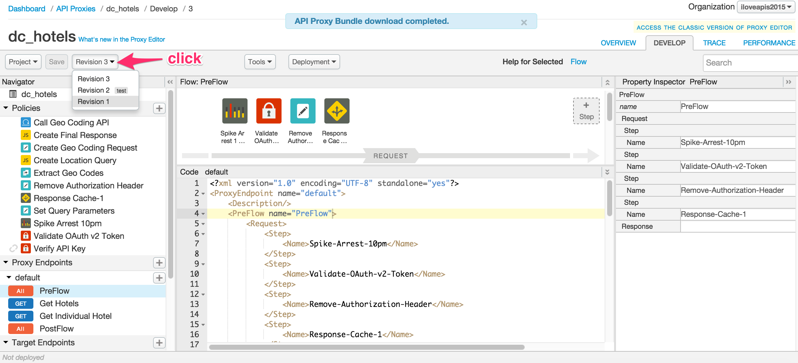 

  
- Select the revision deployed to the test environment.  This might be revision 1 for you. 

- Select the Deployment dropdown, to UNdeploy the older revision from the test environment. 

- Click the revision dropdown again, and select the latest revision.

- Again select the Deployment dropdown, to Deploy the newest revision to the test environment. 


## Testing the OAuth 2.0 Token Validation Policy without a Token

- Copy the `Consumer Key` associated with the `iExplore App` by going to Publish → Developer Apps → iExplore App
- Start a `Trace` session for the `{your-initials}_hotels` proxy

- Send a test `/GET hotels` request from `Postman` with the following query parameters: `zipcode=98101&radius=200`

- As expected, a fault will be returned since a valid OAuth Token has not been provided as part of the request:

   ```json
  {
    "fault": {
      "faultstring": "Invalid access token",
      "detail": {
        "errorcode": "oauth.v2.InvalidAccessToken"
      }
    }
  }
   ```

  The above response shows that the OAuth Verification policy is being enforced as expected.

- Review the `Trace` for the proxy and the `returned response` to ensure that the flow is working as expected.

- Stop the `Trace` session for the `{your-initials}_hotels` proxy

## Testing the OAuth 2.0 Token Validation Policy with a Valid Token

- You will obtain a valid oauth token by directly calling the `oauth` API proxy token endpoint and passing the consumer key and consumer secret of the `iExplore App` app. 
- Send a test `/POST OAuth Token - Client Cred` request from Postman after setting appropriate values in the `x-www-form-urlencoded` section of the request:

  - client_id: **{iExplore App Consumer Key}**
  - client_secret: **{iExplore App Consumer Secret}**

  

  **Note:** Copy-paste the Consumer Key and Consumer Secret from the `iExplore App`’s detail page in the Apigee Edge UI. As you copy-paste, remove any spaces before and after the values of the Consumer Key and Consumer Secret.

- Review the response within Postman. It should look something like this: 

  ```json
  {
    "issued_at": "1414962637000",
    "application_name": "ef723b8b-fdb1-4aae-9418-096d8ab7fec7",
    "scope": "",
    "status": "approved",
    "api_product_list": "[Hospitality]",
    "expires_in": "3599",
    "developer.email": "pparekh+mpolo@apigee.com",
    "organization_id": "0",
    "token_type": "BearerToken",
    "client_id": "P24PNGrXN0gTNdVi6giT12Dq0vrG3ruB",
    "access_token": "j1AA2PeAtKOMCZa9tuCdDDsRqn8J",
    "organization_name": "demo37",
    "refresh_token_expires_in": "0",
    "refresh_count": "0"
  }
  ```
- Copy the value of the `access_token` attribute to use in the next step.

- Start a Trace session for the `{your-initials}_hotels` proxy

- Set up the `/GET hotels` request in Postman with the following query parameters **AND header**: 

  - **Query Parameters:**
    - zipcode: **98101**
    - radius: **200**
  - **Header:**
    - Authorization: **Bearer {access_token}**

  
 

  **Note:** Replace the {access_token} with the value of the `access_token` that you copied from the response in the step above.

- Send the `Postman` request.  You should see success. 

- Now, send a similar request from `Postman`, but modify the access_token so that it incudes 1 extra character. You should see a failure. 

- Review the `Trace` for the proxy and the returned response to ensure that the flow is working as expected.

- Stop the `Trace` session for the `{your-initials}_hotels` proxy


## Summary

That completes this hands-on lesson. In this lesson you learned about the various out-of-the-box security related policies that are available in Apigee Edge and to leverage a couple of those policies - API Key Verification and OAuth 2.0 client credentials grant - to secure your APIs. 
