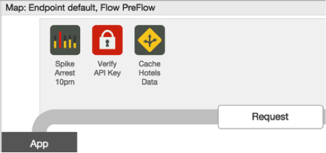
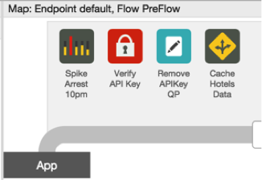
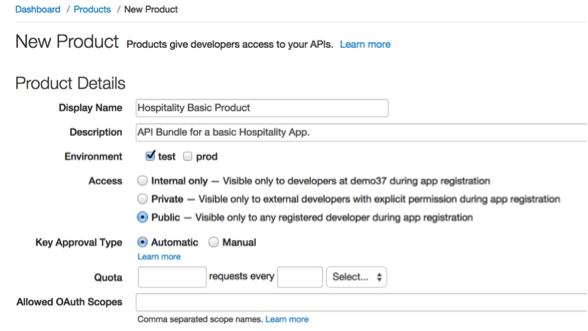
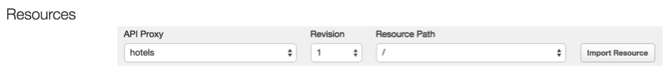
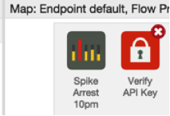
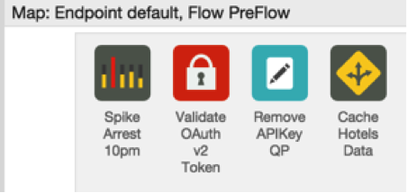
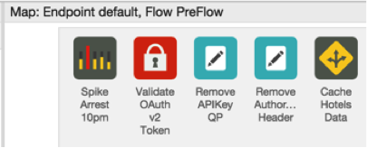

#API Services_ Lesson 5 - Add Security Policies

##Overview
There are several out-of-the-box security policies that Apigee Edge provides to protect your APIs. These security policies must be used appropriately based upon your use cases. Apigee Edge supports:

###API Keys
API key validation is the simplest form of app-based security that you can configure for an API. Apps simply present an API key, and Apigee Edge checks to see that the API key is in an approved state for the resource being requested. For this reason the security associated with API keys is limited. API keys can easily be extracted from app code and used to access an API. You may find that API keys work better as unique app identifiers than as security tokens. For more information, see [API Keys](http://apigee.com/docs/api-services/content/api-keys).

###OAuth v2.0
Here's the definition of OAuth from the OAuth 2.0 IETF specification. "The OAuth 2.0 authorization framework enables a third-party application to obtain limited access to an HTTP service, either on behalf of a resource owner by orchestrating an approval interaction between the resource owner and the HTTP service, or by allowing the  third-party application to obtain access on its own behalf."
All requests from the app for protected resources from the backend service is negotiated using an access token. Access tokens are long random strings generated by an authorization server after appropriate app and/or user credentials are presented. Tokens are used to validate requests for protected resources. If an app is compromised, the resource server can revoke it's access token. In that case, the end user does not need to change her username/password on the resource server, her app simply needs to renegotiate for a new access token. 
To go beyond app identification using API Keys, Apigee Edge provides comprehensive support for OAuth v2.0. Apigee Edge includes an OAuth 2.0 authorization server implementation that lets you register apps and secure API proxies with OAuth 2.0 using the four grant types that are part of [OAuth 2.0](http://apigee.com/docs/api-services/content/oauth-introduction). For more information, see OAuth 2.0 and the [OAuth the Big Picture](https://pages.apigee.com/oauth-big-picture-ebook.html) Apigee eBook.

###OAuth v1.0a
OAuth 1.0a defines a standard protocol that enables app users to authorize apps to consume APIs on their behalf, without requiring app users to disclose their passwords to the app in the process. Apigee Edge enables you to protect APIs in a way that ensures that an app uses has authorized the app to consume an API. Edge also provides policy-based functionality for configuring the endpoints that app developers can use to obtain access tokens. For more information, see [OAuth v1.0a policy](http://apigee.com/docs/api-services/reference/oauth-10-policy).

###SAML
Apigee Edge enables you to authenticate and authorize apps that are capable of presenting SAML tokens. A SAML token is a digitally signed fragment of XML that presents a set of "assertions". These assertions can be used to enforce authentication and authorization.
To use SAML terminology, Apigee Edge can function as a service provider (SP) or an Identity Provider (IP). When Apigee Edge validates SAML tokens on inbound requests from apps, it acts in the role of SP. (API Services can also act in the IP role, when generating SAML tokens to be used when communicating with backend services. For details on SAML validation, see [SAML Assertion policies](http://apigee.com/docs/api-services/reference/saml-assertion-policy).

###Content Based Security
Message content is a significant attack vector used by malicious API consumers. API Services provides a set of Policy types to mitigate the potential for your backend services to be compromised by attackers or by malformed request payloads.

####JSON threat protection
JSON attacks attempt to use structures that overwhelm JSON parsers to crash a service and induce application-level denial-of-service attacks.
Such attacks can be mitigated using the JSONThreatProtection Policy type.
See [JSON Threat Protection policy](http://apigee.com/docs/api-services/reference/json-threat-protection-policy).

####XML threat protection
XML attacks attempt to use structures that overwhelm XML parsers to crash a service and induce application-level denial-of-service attacks.
Such attacks can be mitigated using the XMLThreatProtection Policy type.
See [XML Threat Protection policy](http://apigee.com/docs/api-services/reference/xml-threat-protection-policy).

####General content protection
Some content-based attacks use specific constructs in HTTP headers, query parameters, or payload content to attempt to execute code. An example is SQL-injection attacks. Such attacks can be mitigated using the Regular Expression Protection Policy type.
See [Regular Expression Protection policy](http://apigee.com/docs/api-services/reference/xml-threat-protection-policy).

###Data Masking
Apigee Edge enables developers to capture message content to enable runtime debugging of APIs calls. In many cases, API traffic contains sensitive data, such as credit cards or personally identifiable health information (PHI) that needs to filtered out of the captured message content.
To meet this requirement, Edge defines 'mask configurations' that enable you to specify data that will be filtered out of trace sessions. Masking configurations can be set globally (at the organization-level) or locally (at the API proxy level). Role-based capabilities govern which users have access to the data that is defined as sensitive.
For more information, see [Data Masking](http://apigee.com/docs/api-services/content/data-masking) 

Objectives
The objective of this lesson is to get you familiar with Apigee’s API Key Verification and OAuth 2.0 Token Validation policies. 

As discussed in the Overview section, API Key Verification policy enables you to identify the API consumer and prevents unidentified API consumers from being able to call your APIs. You will implement an API Key Verification policy in this lesson to get familiar with several associated concepts such as: API Key, API Secret, API Products and Developer Apps.

Identifying an API consumer is beneficial from an analytics and audit perspective, but in many situations, simply identifying the API consumer is not secure enough. To add an additional level of security, in this lesson you will replace the API Key Verification policy with an OAuth 2.0 Token Validation policy using the client-credentials two-legged OAuth flow. 

##Prerequisites
- [x] API Services - Lesson 4 completed 
- [x] A preliminary understanding of OAuth 2.0
- [x] Apigee’s oauth proxy deployed to your organization

##Estimated Time: 60 mins

###Adding an API Key Verification Policy 
- Go to the Apigee Edge Management UI browser tab
- Using the `New Policy` drop-down from the `Design` tab of the `hotels` proxy, add the `Verify API Key` policy with the following properties:
 - Policy Display Name: **Verify API Key**
 - Policy Name: **Verify-API-Key**
 - Attach Policy: **Checked**
 - Flow: **Flow PreFlow, Proxy Endpoint default**
 - Segment: **Request**
- The `Verify API Key` policy will get added after the `Response Cache` policy. **Drag and move** the `Verify API Key` policy to be _**before**_ the `Response Cache` policy


 

**Note:** It depends on your use case, but typically API Key verification should be one of the first policies in the flow. In this scenario, we verify the API Key before the Response Cache policy to ensure that an API Consumer whose API Key may have been revoked is not able to get the data from the cache.

- Examine the XML configuration in the `Code` panel (or properties using the `Property Inspector` panel) associated with the `Verify API Key` policy. The XML for the policy should look something like this:

```xml
<?xml version="1.0" encoding="UTF-8" standalone="yes"?>
<VerifyAPIKey async="false" continueOnError="false" enabled="true" name="Verify-API-Key">
    <DisplayName>Verify API Key</DisplayName>
    <FaultRules/>
    <Properties/>
    <APIKey ref="request.queryparam.apikey"/>
</VerifyAPIKey>
```

**Note** the `<APIKey>` element, which identifies where the policy should check for the API key. In this example, the policy looks for the API key in a `query parameter` named `apikey`. API keys can be located in a query parameter, a form parameter, or an HTTP header. Apigee Edge provides a message variable for each type of location. For policy reference information, see [Verify API Key policy](http://apigee.com/docs/api-services/reference/verify-api-key-policy).

###Removing the API Key from the query parameters

- Using the `New Policy` drop-down from the `Design` tab of the `hotels` proxy, add the `Assign Message` policy with the following properties:

 - Policy Display Name: **Remove APIKey QP** 
 - Policy Name: **Remove-APIKey-QP**
 - Attach Policy: **Checked**
 - Flow: **Flow PreFlow, Proxy Endpoint default**
 - Segment: **Request**

- The `Remove APIKey QP` policy will get added after the `Response Cache` policy. **Drag and move** the `Remove APIKey QP` policy to be _**before the**_ `Response Cache` policy


 

- For the `Remove APIKey QP` policy, change the XML configuration of the policy using the `Code: Remove APIKey QP` panel as follows:

```xml
<?xml version="1.0" encoding="UTF-8" standalone="yes"?>
<AssignMessage async="false" continueOnError="false" enabled="true" name="Remove-APIKey-QP">
    <DisplayName>Remove APIKey QP</DisplayName>
    <Remove>
        <QueryParams>
            <QueryParam name="apikey"></QueryParam>
        </QueryParams>
    </Remove>
    <IgnoreUnresolvedVariables>true</IgnoreUnresolvedVariables>
    <AssignTo createNew="false" transport="http" type="request"/>
</AssignMessage>
```

As a security measure, the `Remove APIKey QP` policy simply removes the `apikey` query parameter from the HTTP request message attached to the flow so it is not sent to the backend service. In this scenario we are removing the `apikey` immediately after verify API Key policy, but depending on your use case, removing the `apikey` may need to be done at a later stage in the flow.

###Testing the API Key Verification Policy

Until now anyone with the URL to the `hotel` API Proxy has been able to make a request with appropriate parameters and get a response back. Now that you have added the API Key Verification policy, that will no longer be the case. 

- Start the `Trace` session for the `hotels` proxy
b)	Now that the API Key Verification policy has been added to the proxy, try and send a test `/GET hotels` request from `Postman` with the following query parameters: `zipcode=98101&radius=200`

- You will notice that the following fault is returned since an API Key has not been provided as a request query parameter:

```json
{
    "fault": {
        "faultstring": "Failed to resolve API Key variable request.queryparam.apikey",
        "detail": {
            "errorcode": "steps.oauth.v2.FailedToResolveAPIKey"
        }
    }
}
```
The above response shows that the API Key Verification policy is being enforced as expected.

- Review the `Trace` for the proxy and the returned response to ensure that the flow is working as expected.
- Stop the `Trace` session for the `hotels` proxy

###Obtaining an API Key 

Up to now you have been playing the role of an API Developer configuring various policies in the `hotels` proxy. 

To understand the concept of an API Key and associated concepts such as API Products, Developer and Developer Apps, you need to now think about the role of an App Developer. This Developer needs an API Key that can be used whenever their app needs to use the `hotels` proxy. 

To make it easier for Developers to consume APIs, Apigee Edge provides the capability of publishing APIs. Publishing is the process of making your APIs available to Developers for consumption. Publishing APIs can be broadly defined by the following tasks:
- Create the API Products on Apigee Edge that bundle your APIs.
- Register Developers on Edge. Only a registered App Developer can register an App.
- Developers register Developer Apps on Edge to access API products. In response, the developer receives an API key. Now that the developer has an API key, they can make requests to your APIs.

For more, see [Publishing Overview](http://apigee.com/docs/developer-services/content/publishing-overview).
The following table defines some of the terms used to register apps and generate keys:

| Term        | Definition      |
| :------------:|:-------------:|
| API product      | A bundle of API proxies combined with a service plan that sets limits on access to those APIs. API products are the central mechanism that Apigee Edge uses for authorization and access control to your APIs. For more, see [API Products](http://apigee.com/docs/developer-services/content/what-api-product) |
| Developer      | The API consumer. Developers write apps the make requests to your APIs. For more, see Developer      |
| App | A client-side app that a developer registers to access an API product. Registering the app with the API product generates the API key for accessing the APIs in that product.      |
| API key | A string with authorization information that a client-side app uses to access the resources exposed by the API product. The API key is generated when a registered app is associated with an API product.      |

With the above brief introduction to API Products, Developers and Developer Apps, you will now create one of each to obtain a valid API Key that can be used to call the `hotels` proxy

- **Publishing an API Product**

 - From the Apigee Edge Management UI, go to `Publish` → `API Products`
 - Click on `+ Product` button to add a new product
 - In the `Product Details` section of the new product screen, enter or select the following values for the various fields:

   	- Display Name: **<your initials> Hospitality Basic Product** 
   	- Description: **API Bundle for a basic Hospitality App.**
   	- Environment: **Test**
   	- Access: **Public**
   	- Key Approval Type: **Automatic**

	
 

 - In the `Resources` section select the following values for the various fields:

 	- API Proxy: **<your initials>_hotels** 
  	- Revision: **1**
  	- Resource Path: **/**

	

 - Click on `Import Resources` to add the `/` resource of the `hotels` proxy to the `Hospitality Basic Product`
 - **Repeat** the above two steps for the ‘/**’ resource
 - Click `Save` to save the API Product. The new product should now be listed on the `Products` page.

- **Registering a Developer**

 Developers access your APIs through apps. When the developer registers an app, they receive a single API key that allows them to access all of the API products associated with the app. However, developers must be registered before they can register an app.
 Developers typically have several ways of registering:
 - If you have a paid Edge account, through a Developer Services portal. See [Add and manage user accounts](http://apigee.com/docs/developer-services/content/add-and-manage-user-accounts) for more.
 - By accessing a form that uses the Edge management API to register the developer. See [Using the Edge management API to Publish APIs](http://apigee.com/docs/developers-services/content/using-edge-management-api-publish-apis) for more.
 - By a back-end administrator using the Edge management UI.

You will be learning more about how Developers can go through a self-service registration process using Developer Services Portal in later lessons. For the continuity of this lesson, the following steps describe the process of registering Developers and Developer Apps using the Apigee Edge Management UI.
 - From the Apigee Edge Management UI, go to Publish → Developers
 - Click on `+ Developer` button to add a new product
 - Add a new developer with the following properties:

  	- First Name: **Marco** 
  	- Last Name: **Polo**
  	- Email: **{your email}+mpolo@gmail.com**
  	- Username: **mpolo**

 	

 - Click `Save` to save the Developer. The new developer should now be listed on the `Developers` page.

- **Registering a Developer App**

 Now that you have an API product and a developer, you can register a Developer App with the API product. Registering the Developer App generates the API key for the API products associated with the app. You can then distribute the key to app developers so they can access the features in the API products from the app.
 As mentioned earlier, you will learn about self-registering apps as a developer using Developer Services Portal in later lessons. For the continuity of this lesson, the following steps describe the process of registering Developer Apps using the Apigee Edge Management UI.
 - From the Apigee Edge Management UI, go to Publish → Developer Apps
 - Click on `+ Developer App` button to add a new product
 - In the `Developer App Details` section, enter or select the following values for the various fields:

  	- Display Name: **<your initials> iExplore App**
  	- Developer: **Marco Polo**
  	- Callback URL: **Leave it blank**

 - In the `Products` section, click on the `+ Product` button
 - From the `Product` drop-down, select `Hospitality Basic Product`
 - Click the `check-mark` button in the `Actions` column to accept the changes

 
 

 - Click `Save` to save the Developer App. The new app should now be listed on the `Developer Apps` page
 - From the `Developer Apps` page, select the `iExplore App` to view the details page for the app
 - In the `Products` section, next to the entry for `Hospitality Basic Product`, click `Show` in the `Consumer Key` and `Consumer Secret` columns to display the generated keys

 **Note:** Since you selected `Key Approval Type: Automatic` when you created the API product, the API key is automatically approved and you can view it immediately

If you had selected `Approval Type: Manual`, you would need to click `Approve` in the `Actions` column to approve the API key.

The way the `hotels` proxy is configured, as of now, the Consumer Key (i.e. the API Key) is the only key that the `iExplore App` will need to access the `hotels` proxy resources. You will use the Consumer Secret (i.e. the API Secret) in the next section when the security policy is changed from API Key Verification to an OAuth Token Validation policy.

###Re-testing the API Key Verification Policy

Now that you have a valid API Key associated with a Developer App (`iExplore App`) with access to the API Product (`Hospitality Basic Product`) that bundles the `hotels` proxy, test the API Key Verification policy to ensure that everything works as expected.

- Copy the `Consumer Key` associated with the `iExplore App` by going to Publish → Developer Apps → iExplore App 
- Start the Trace session for the `hotels` proxy
- Send a test `/GET hotels` request from `Postman` with the following query parameters: `zipcode=98101&radius=200&apikey={iExplore App Consumer Key}`

**Note:** Replace the {iExplore App Consumer Key} with the actual Consumer Key. As you copy-paste, be sure to remove any spaces before and after the Consumer Key 

- Review the Trace for the proxy and the returned response to ensure that the flow is working as expected.
- Stop the Trace session for the ‘hotels’ proxy

###Stepping-up security using OAuth 2.0: Client Credentials Grant

For convenience, all organizations on Apigee Edge come preconfigured with a set of OAuth 2.0 endpoints that implement the `client credentials grant type`.  For information about the configuration of the default `oauth` proxy, review [policies in the oauth token endpoint](http://apigee.com/docs/api-services/tutorials/secure-calls-your-api-through-oauth-20-client-credentials).

This section of the lesson explains how to protect an API using this default `oauth` proxy configuration.

**About the client credentials grant type**
The client credentials grant type defines a procedure for issuing access tokens in exchange for *App credentials*. These app credentials are the consumer key and secret pair that Apigee Edge issues for each app that is registered in an organization. 
For this reason, it is relatively simple to 'step up' your API security scheme from API key validation to OAuth client credentials. Both schemes use the same consumer key and secret to validate the client app. The difference is that client credentials provides an extra layer of control, since you can easily revoke an access token when needed, without requiring you to revoke the app's consumer key. To work with the default OAuth endpoints, you can use any consumer key and secret generated for app in your organization to retrieve access tokens from the token endpoint. You can even enable client credentials for apps that already have consumer keys and secrets.
Client credentials has very specific use cases, and is not the grant type most commonly used for web and mobile apps.  For a general introduction to OAuth 2.0 grant types with definitions and use cases, see [Introduction to OAuth 2.0](http://apigee.com/docs/api-services/content/oauth-introduction). 
To support use cases with grant types other than client credentials, the OAuth proxy must be configured with authorization endpoints. For additional information, see [configuring authorization endpoints](http://apigee.com/docs/api-services/content/oauth-endpoints) and [authorizing requests using OAuth 2.0](http://apigee.com/docs/api-services/reference/authorize-requests-using-oauth-20). 

- **Adding an OAuth 2.0 Token Validation Policy** 

 - Go to the Apigee Edge Management UI browser tab
 - Since you will be adding an OAuth v2.0 policy, the API Key Verification policy is no longer necessary. Delete the `Verify API Key` policy from the ‘hotels’ proxy default proxy endpoint preflow.

  

 - Using the `New Policy` drop-down from the `Design` tab of the `hotels` proxy, add the `OAuth v2.0` policy with the following properties:
  	- Policy Display Name: **Validate OAuth v2 Token**
  	- Policy Name: **Validate-OAuth-v2-Token**
  	- Attach Policy: **Checked**
  	- Flow: **Flow PreFlow, Proxy Endpoint default**
  	- Segment: **Request**

 - The `Validate OAuth v2 Token` policy will get added after the `Response Cache` policy. **Drag and move** the `Validate OAuth v2 Token` policy to be _**before**_ the `Remove APIKey QP` policy

  

 - Review the XML configuration and/or the properties associated with the `Validate OAuth v2 Token` policy.

 ```xml
<?xml version="1.0" encoding="UTF-8" standalone="yes"?>
<OAuthV2 async="false" continueOnError="false" enabled="true" name="Validate-OAuth-v2-Token">
    <DisplayName>Validate OAuth v2 Token</DisplayName>
    <FaultRules/>
    <Properties/>
    <Attributes/>
    <ExternalAuthorization>false</ExternalAuthorization>
    <Operation>VerifyAccessToken</Operation>
    <SupportedGrantTypes/>
    <GenerateResponse enabled="true"/>
    <Tokens/>
</OAuthV2>
 ```

The value of the `<Operation>` element indicates the action to take - in this case, verification of the access token. 
The value of the `<ExternalAuthorization>` element is set to `false`, indicating that Apigee Edge should validate the OAuth Token rather than delegating it to an external validator.

- **Removing the Authorization Header After Validating the OAuth Token** 

 - Using the `New Policy` drop-down from the `Design` tab of the `hotels` proxy, add the `Assign Message` policy with the following properties:

  	- Policy Display Name:**Remove Authorization Header** 
  	- Policy Name: **Remove-Authorization-Header**
  	- Attach Policy: **Checked**
  	- Flow: **Flow PreFlow, Proxy Endpoint default**
  	- Segment: **Request**

 - The `Remove Authorization Header` policy will get added after the `Response Cache` policy. **Drag and move** the `Remove Authorization Header` policy to be _**before**_ the `Response Cache` policy

   

 - For the `Remove Authorization Header` policy, change the XML configuration of the policy using the `Code: Remove Authorization Header` panel as follows:

 ```xml
<?xml version="1.0" encoding="UTF-8" standalone="yes"?>
<AssignMessage async="false" continueOnError="false" enabled="true" name="Remove-Authorization-Header">
    <DisplayName>Remove Authorization Header</DisplayName>
    <Remove>
        <Headers>
            <Header name="Authorization"></Header>
        </Headers>
    </Remove>
    <IgnoreUnresolvedVariables>true</IgnoreUnresolvedVariables>
    <AssignTo createNew="false" transport="http" type="request"/>
</AssignMessage>
 ```

As a security measure, the `Remove Authorization Header` policy removes the `Authorization` header from the HTTP request message so it is not sent to the backend service. In fact, if the `Authorization` header is not removed, the Backend-as-a-Service API will throw an invalid token error.

- **Testing the OAuth 2.0 Token Validation Policy without a Token**

 - Copy the `Consumer Key` associated with the `iExplore App` by going to Publish → Developer Apps → iExplore App
 - Start a `Trace` session for the `hotels` proxy
 - Send a test `/GET hotels` request from `Postman` with the following query parameters: `zipcode=98101&radius=200&apikey={iExplore App Consumer Key}`
 - As expected, a fault will be returned since a valid OAuth Token has not been provided as part of the request:

 ```json
{
    "fault": {
        "faultstring": "Invalid access token",
        "detail": {
            "errorcode": "oauth.v2.InvalidAccessToken"
        }
    }
}
 ```

 The above response shows that the OAuth Verification policy is being enforced as expected.

 - Review the `Trace` for the proxy and the `returned response` to ensure that the flow is working as expected.
 - Stop the `Trace` session for the `hotels` proxy

- **Testing the OAuth 2.0 Token Validation Policy with a Valid Token**

 - You will obtain a valid oauth token by directly calling the `oauth` API proxy token endpoint and passing the consumer key and consumer secret of the `iExplore App` app. 
 - Send a test `/POST OAuth Token - Client Cred` request from Postman after setting appropriate values in the `x-www-form-urlencoded` section of the request:

  	- client_id: **{iExplore App Consumer Key}**
  	- client_secret: **{iExplore App Consumer Secret}**

  	

 **Note:** Copy-paste the Consumer Key and Consumer Secret from the `iExplore App`’s detail page. As you copy-paste, remove any spaces before and after the values of the Consumer Key and Consumer Secret.

 - Review the response of the `/POST OAuth Token - Client Cred` request. Copy the value of the `access_token` attribute to use in the next step.

 ```json
{
    "issued_at": "1414962637000",
    "application_name": "ef723b8b-fdb1-4aae-9418-096d8ab7fec7",
    "scope": "",
    "status": "approved",
    "api_product_list": "[Hospitality]",
    "expires_in": "3599",
    "developer.email": "pparekh+mpolo@apigee.com",
    "organization_id": "0",
    "token_type": "BearerToken",
    "client_id": "P24PNGrXN0gTNdVi6giT12Dq0vrG3ruB",
    "access_token": "j1AA2PeAtKOMCZa9tuCdDDsRqn8J",
    "organization_name": "demo37",
    "refresh_token_expires_in": "0",
    "refresh_count": "0"
}
 ```

 - Start a Trace session for the `hotels` proxy
 - Set up the `/GET hotels` request in Postman with the following query parameters **AND header**: 

  	- **Query Parameters:**
    	- zipcode: **98101**
    	- radius: **200**
  	- **Header:**
    	- Authorization: **Bearer {access_token}**

	
 

 **Note:** Replace the {access_token} with the value of the `access_token` from the response in the step above.

 - Send the `Postman` request. 
 - Review the `Trace` for the proxy and the returned response to ensure that the flow is working as expected.
 - Stop the `Trace` session for the `hotels` proxy


##Summary
That completes this hands-on lesson. In this lesson you learned about the various out-of-the-box security related policies that are available in Apigee Edge and to leverage a couple of those policies - API Key Verification and OAuth 2.0 client credentials grant - to secure your APIs. 
