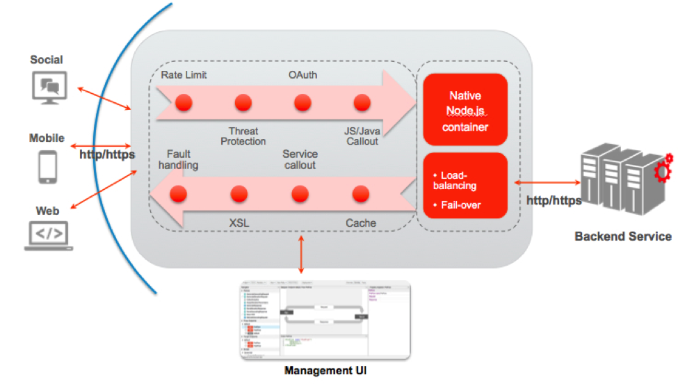

#API Services: Lesson 6 - Create a Node.js Proxy

##Overview
Node.js on Apigee Edge adds more programmability to the Edge API platform. Running on Edge, Node.js apps take advantage of Edge's enterprise-grade cloud operations like traffic management, security, deployment tools, revision control, logging, and analytics. Furthermore, you can leverage thousands of third-party Node.js modules in your APIs.


 
Enterprise developers have found many creative ways to integrate Node.js applications into the Edge platform. Some common use cases include:
- Build highly customized **standalone APIs** and **backend services**.
- Build **backend logic for API BaaS** to leverage cloud data storage and management, user management, push notifications, and more.
- Solve complex **orchestration** and **mobile optimization** problems using Apigee policies with the advantage of a scriptable target endpoint.
- Build **composite services** and **mashups**.
- Rapidly develop prototypes of new APIs using frameworks like [Express](http://expressjs.com/), [Argo](http://expressjs.com/), and [Usergrid](https://npmjs.org/package/usergrid).

##Objectives
The goal of this lesson is to introduce you to Node.js, download and use Node.js modules from NPM, create a simple API using Node.js and deploy the API to your Apigee Edge environment using Apigee’s deployment tool.

##Prerequisites
- [x] Your Apigee Edge organization name, user name, and the password 
- [x] Node downloaded from http://nodejs.org/download/ and installed as an admin user
- [x] apigeetool NPM module downloaded and installed globally as an admin user. 
```sh
sudo npm install -g apigeetool
```
- [x] An understanding of Node.js and Javascript

##Estimated Time: 45 mins

- Open up a terminal window
- In your home directory, create a new directory structure as follows: `apigee/node-api/weather`
- Go to the `apigee/node-api/weather` directory that you just created
- Using your favorite code editor, create a new file in the `apigee/node-api/weather` directory with the following Javascript code in it and save it as `weather.js`

```node
var express = require('express'),
    YQL = require('yql'),
    urlparse = require('url');

// Set up Express environment and enable it to read and write JavaScript
var app = express();

// The API starts here
var rootTemplate = {
  'weather' : { 'href' : './weather' }
};

// GET /
app.get('/', function(req, res) {
  res.jsonp(rootTemplate);
});

// GET /forecast
app.get('/forecast', function(req, res) {
  try {
    // parse the url and check for zipcode
    var parsed = urlparse.parse(req.url, true);
    if (!parsed.query.zipcode) {
      sendError(res, 400, 'Missing query parameter "zipcode"');
    } else {
      // create the query per YQL module documentation & then execute the query
      var forecastQuery = 'SELECT * FROM weather.forecast WHERE (location = ' + parsed.query.zipcode + ')';
      var query = new YQL(forecastQuery);
      // execute the query and create/send the final response in the anonymous callback function
      query.exec(function(err, data) {
        var finalResponse = {};
        finalResponse.location = data.query.results.channel.location;
        finalResponse.units = data.query.results.channel.units;
        finalResponse.condition = data.query.results.channel.item.condition;
        finalResponse.forecast = data.query.results.channel.item.forecast;
        res.end(JSON.stringify(finalResponse));
      });
    }
  } catch(err) {
    sendError(res, 500, "Internal Server Error - " + err.message);
  }
});

// Generic Send Error Function
function sendError(res, code, msg) {
  var o = { 'error': msg };
  res.writeHead(code, {'Content-Type': 'application/json'});
  res.end(JSON.stringify(o));
}

// start the server
app.listen(process.env.PORT || 7000);
console.log('The server is running!');
```

- The above code is fairly self explanatory, but below is a brief explanation:

The first few lines declare Node modules - `express`, `yql` and `urlparse` - that the rest of code will utilize. 

**Express** is a minimal and flexible Node.js web application framework that provides a robust set of features for web and mobile applications. 

**yql** (Yahoo! Query Language) is a module from Yahoo that can be used to to query, filter, and combine data across the web through a single interface. It exposes a SQL-like syntax for getting the right data.

**urlparse** is a module that enables parsing of URLs to extract various parts, such as the query parameters, as necessary.

The code then uses the express framework to handle `HTTP GET` requests for the following two resources: `/` and `/forecast`.

In the implementation for the `GET /forecast` resource, the URL is parsed using the urlparse module to obtain the `zipcode` query parameter. If the `zipcode` parameter is available then the yql module is used to query for the weather for that zipcode.

The response from the yql call is processed in a callback function. This callback function extracts relevant information from the yql response to create a final response to be sent to the API consumer.

All of the HTTP requests get processed by the HTTP server that is started on port 9000 with the `app.listen(portNumber)` code.

- Go back to your terminal window and in the `apigee/node-api/weather` directory, run the following commands:

  ```sh 
  npm init
  ```

Provide the following values during the interactive npm init session to create a package.json file for the Node module that you will be deploying to Apigee Edge:

 - name: weather
 - version: 1.0.0
 - description: Apigee API facade to a Yahoo weather service
 - entry point: weather.js
 - test command: curl -i http://HOSTNAME/YOUR-INITIALS/v1/weather/forecast?zipcode=ZIPCODE
 - git repository: 
 - keywords:
 - author: YOUR-NAME
 - license: MIT

**Note:** You do not have to replace **only** the `<host>` and `<your-initials>` with the actual value

```sh
npm install express@3.x.x --save
```
        
This command downloads the `express` module and updates the dependencies list in the `package.json` file.

```sh
npm install yql@1.x.x --save
```
        
This command downloads Yahoo’s `yql` module locally and updates the dependencies list in the `package.json` file.

```sh
npm install urlparse@0.x.x --save
```

This command downloads the `urlparse` module locally and updates the dependencies list in the `package.json` file.

- To test the weather API locally:
 - Start the `weather.js` module from the command line as follows: 
   ```sh
  node weather.js
   ```
  The server should start within a few seconds with a message `The server is running!` on the console

 - Go to the Postman tool and run the ‘/GET forecast - localhost’ request.  Alternatively, you can invoke the command from another terminal window, with something like this: 
   ```
   curl -i http://localhost:7000/forecast?zipcode=95113
   ```

 - If everything is working correctly, you should see a response similar to the following: 

   ```json
   {
     "location": {
         "city": "Seattle",
         "country": "US",
         "region": "WA"
     },
     "units": {
         "distance": "mi",
         "pressure": "in",
         "speed": "mph",
         "temperature": "F"
     },
     "condition": {
         "code": "29",
         "date": "Sun, 26 Oct 2014 9:53 pm PDT",
         "temp": "49",
         "text": "Partly Cloudy"
     },
     "forecast": [
         {
             "code": "29",
             "date": "26 Oct 2014",
             "day": "Sun",
             "high": "55",
             "low": "46",
             "text": "Partly Cloudy"
         },
         {
             "code": "28",
             "date": "27 Oct 2014",
             "day": "Mon",
             "high": "58",
             "low": "51",
             "text": "Mostly Cloudy"
         },
         {
             "code": "11",
             "date": "28 Oct 2014",
             "day": "Tue",
             "high": "59",
             "low": "53",
             "text": "Showers"
         },
         {
             "code": "30",
             "date": "29 Oct 2014",
             "day": "Wed",
             "high": "59",
             "low": "51",
             "text": "Partly Cloudy"
         },
         {
             "code": "12",
             "date": "30 Oct 2014",
             "day": "Thu",
             "high": "59",
             "low": "53",
             "text": "Rain"
         }
     ]
    }
    ```

- Stop the locally running node process by pressing `ctrl-c` in the appropriate terminal window.

- To deploy the weather API to Apigee Edge you will use the `apigeetool`. 

  As mentioned in the Overview section, running on Edge, Node.js apps take advantage of Edge's enterprise-grade cloud operations like traffic management, security, deployment tools, revision control, logging, and analytics. You can deploy an existing Node.js API application, including any dependent Node.js modules, from your local system to Apigee Edge using a command-line utility called `apigeetool`. The utility automatically bundles the application and its dependencies into an API proxy and deploys it on Edge. To deploy the weather API to Apigee Edge:

  - In the terminal, ensure that you are in the `apigee/node-api/weather` directory
  - Run the following command:
    ```sh
    apigeetool deploynodeapp -n {your-initials}_weather -d . -m weather.js -o YOUR-ORG -e test -b /{your-initials}/v1/weather
    ```

    ***Note:*** Replace `YOUR-ORG` in the above command with the actual name of your Apigee Edge organization.

    Provide the Apigee Edge Org. Admin username and password when prompted.

  - Wait for the `apigeetool` to deploy the API to Apigee Edge. `apigeetool` uses the administrative APIs exposed by Apigee Edge to import and then deploy the API proxy for this nodejs server. 

    If the API is deployed successfully, you should see a message similar to the following:

      ```
      "weather" Revision 1
        deployed
        environment = test
        base path = /
        URI = http://ORGNAME-ENVNAME.apigee.net/{your-initials}/v1/weather
      ```

- Go to the Postman tool and run the `/GET forecast - Apigee Edge` request. If everything is working correctly, you should see a response similar to the one received from weather API running on your localhost.


## Extra Credit

Feel free to experiment with the nodejs logic. You can require other npm packages, modify the code, introduce other endpoints. Hosting nodejs logic inside Apigee Edge is a very powerful feature, and a clear differentiator for Apigee. 

## Summary
That completes this hands-on lesson. In this lesson you learned how to use Node and some of the available modules to create your API, run and test the API from your localhost and use Apigee’s apigeetool to deploy the API written in Node to Apigee Edge.
