# Analytics Services: Lesson 1 - Load Generator

## Overview

Apigee Edge Analytics Services delivers the analytics tools and infrastructure that provides end-to-end visibility across the entire digital value chain. With Edge Analytics, enterprises can make data-driven decisions to grow the reach and revenue of your digital program, increase customer engagement, and accelerate digital transformation. In addition, Edge Analytics provides unmatched flexibility to meet changing business and analytics needs.

Edge Analytics does this by collecting a data record for each transaction or message that flows through Apigee Edge, and then computing aggregates on that data, and providing ready-to-use analytics charts and visualizations.  Edge Analytics also provides the ability to serve ad-hoc queries, and to build custom reports, to allow anyone to gain finely-tuned visibility into traffic trends and usage. 

### Demonstrating Edge Analytics

It's relatively simple to demonstrate the capabilities in Edge API Services - you can build a proxy that performs OAuth token verification, caching, rate limiting, or data transformation. In contrast, 
it's difficult to demonstrate Edge Analytics Services. To effectively demonstrate or exercise Edge Analytics, you need lots and lots od Analytics data, and the only way to get that data is to send transactions into APIs managed by Apigee Edge. 

We have developed a "load generator" tool which allows any Edge technician to generate load on APIs, which thereby generates Analytics data, and allows you to demonstrate and exercise Apigee Edge analytics services. 


## Objectives of this Lesson

In this lab you will get familiar with a tool that can be used to drive
arbitrary contrived loads through APIs. In the configurations we show
here, API Proxies defined in Apigee Edge handle the API traffic, which
means Edge will collect an Analytics record for each transaction, which
allows you to visualize data charts on that data.

We call this tool "the load generator" and is implemented as a nodejs program called runLoad.js that runs within Apigee Edge.  Running  runLoad.js as a Script Target within Apigee Edge means the load generator runs continuously, in the cloud.  The load generator is packaged within an API Proxy, and it acts as a client, for one or more APIs that you specify.  

Being able to generate a load on an API which varies over time in a somewhat random fashion is critical to being able to effectively demonstrate Apigee Edge Analytics. 

## Prerequisites

- API Services - Lesson 1 completed
- The [weather-quota API Proxy](./weather-quota.zip) , which includes an oauth token verification policy.
- The [oauth API Proxy](./oauth.zip), which dispenses oauth tokens via the client_credentials flow. 
- The [runload-1 API Proxy](./runload-1.zip) , which contains the runLoad.js script which generates load
a tool to invoke single APIs, like curl, Postman, or Advanced REST Client

Estimated Total Time for all Phases: 45 minutes

### Phase 1: preparation

1. Deploy the oauth proxy. Import the oauth proxy if necessary. After it is imported, verify the oauth proxy is deployed to the test environment. If it is not, deploy the oauth proxy to test. The oauth proxy will dispense tokens for other APIs in use in your organization.

  a. Open up a browser tab and log in to http://edge.apigee.com  
  b. From the Organization drop-down in the top-right corner, select the organization assigned to you  
  c. From the Environment drop-down, select "test"  
  d. From the main menu, select APIs   
  e. you should see a list of API Proxies. Click the "+ API Proxy" button
  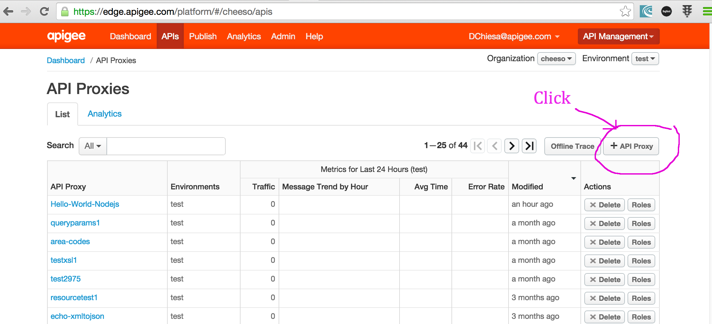

  f. In the New API Proxy panel, select "API Bundle". 
  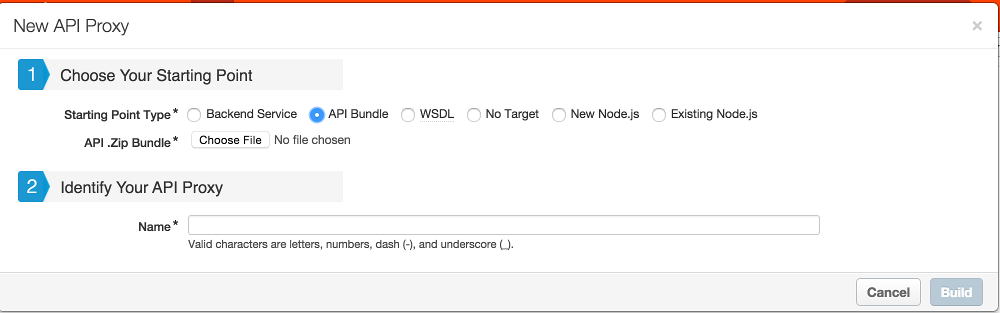

  g. Select "Choose file" and upload the oauth.zip bundle . The name of the proxy will be pre-populated with the word "oauth".  That's good.  Click "Build".

  h. click "Close" when the build completes. 

  i. In the resulting list of API Proxies, click the "oauth" proxy. 

  j. Click the Deployment drop-down, and select "test".  This will deploy the oauth proxy to the test environment.
  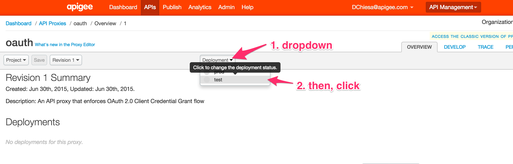

2. Import and Deploy the weather-quota apiproxy the same way.  

3. Import the runload-1 apiproxy the same way. EXCEPT - do not deploy the runload-1 proxy.  We'll deploy it in a few moments. 

4. Using the "new API Proxy editor", examine the oauth proxy you have imported - you will see that it has exactly two flows: the first is named AccessTokenClientCredential, which accepts a POST to /token. Apps can use this to request a bearer token which will be verified by the weather-quota proxy. The second is a "default flow" which matches all other inbound requests.  This one just returns an "Unknown request" error (404)  to the caller. 
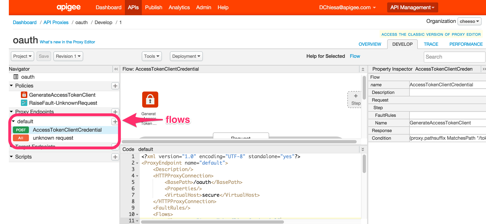

5. Now examine the weather-quota proxy in the same way.  You will see that it has two flows - the first queries the weather. This request is protected by an oauth token verification.  The second is again an "unknown request" flow, which gets executed for all other requests. 
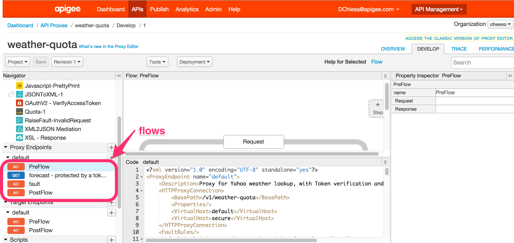

6. In the Edge UI, create a new Product, containing the weather-quota proxy: 

  a. Click "Publish", and select "Products" from the dropdown  
  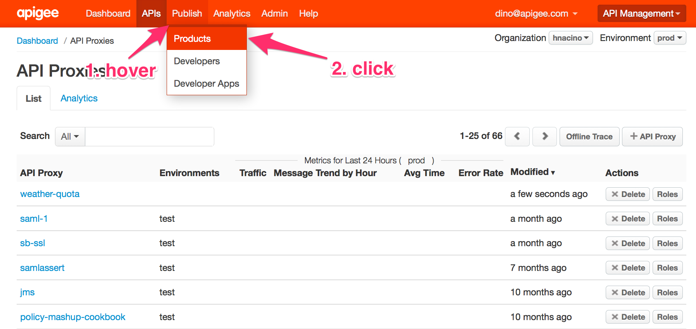  
  b. click "+Product"  
  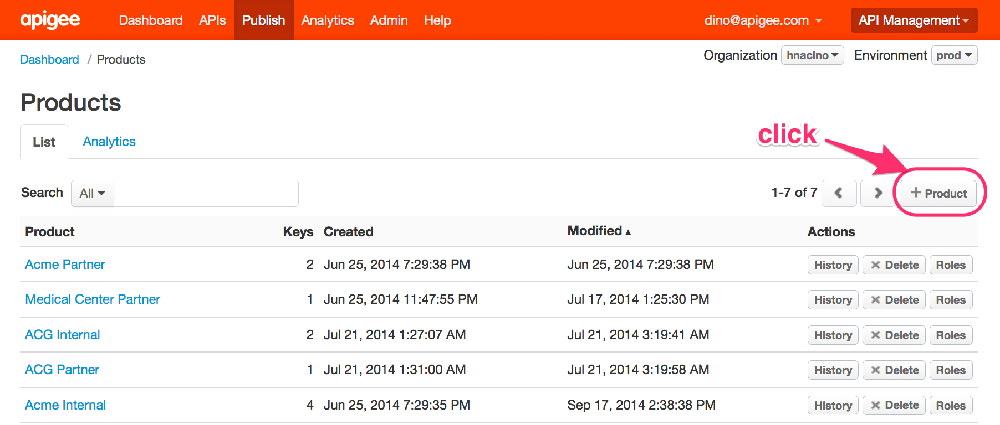  
  c. name the product "WeatherQuota-1"  
  d. tick the "test" checkbox  
  e. mark it public   
  f. set the quota to be 1000 requests for every 1 minute  
  g. ignore the oauth scopes section; it is not used in this exercise.  
  h. add a proxy by clicking the "+ API Proxy" button
  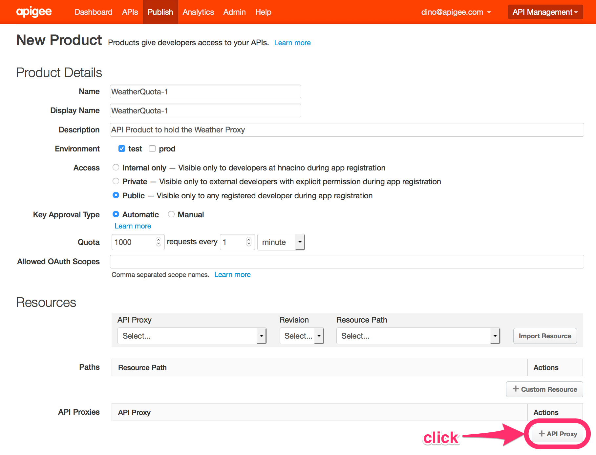  

  i. select the weather-quota apiproxy.  
  j. click Save to save the API Product

7. Create a new Developer App that has access to this new product. 

  a. Click "Publish", then select "Developer Apps" from the dropdown.  
  b. Click "+ Developer App"  
  c. name the app "wq-app-1"  
  d. select any developer you like from the dropdown  
  e. ignore the callback URL; it is not used for this exercise.   
  f. click "+ Product"
    
  g. select the WeatherQuota-1 product you just created.  
  h. be sure to click the checkmark on the right-hand-side of the form  
  i. click Save  

8. Get the client_id and client_secret for that app.  

  a. After saving the new developer app, you should see a list of developer apps. In the list, click the wq-app-1 you just created - it should be the top item in the list.   
  b. click the "show" buttons to display the client_id and client_secret respectively.  Copy these values to a text file.  


9. Now examine the runload-1 proxy, in the API Proxy editor. Scroll the left-hand-side project navigator panel all the way down.  Select the runLoad.js file. This is the file that contains the generic logic for the load generator. You can browse the source of this nodejs module. It's about 36k of code. 
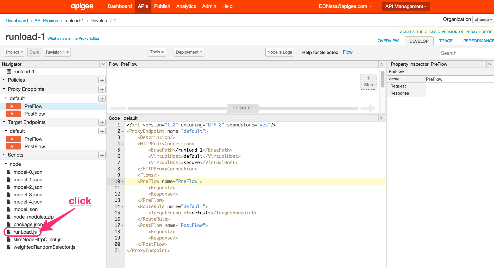

10. You don't need to understand all the code, but you should be aware of the design of runload.js, which is as follows:

  a. The runload nodejs server starts up and "listens" on a control interface. Via this REST interface you can send start or stop signals to the server, or you can query its status.  
  b. In the callback to the listen() function, runload calls setTimeout() to run a function "later".  In this case about 1200 ms later.  
  c. in the function called by the setTimeout(), runload reads a configuration file, then sends out a batch of API calls as described in that configuration file.   
  d. After receiving responses from the api calls, the runload logic then sets another timeout, for some delay. About 60 seconds by default, but this time varies depending on the configuration.   
  e. After the delay period, the timeout fires, and Javascript invokes the specified function. The effect is that runload "wakes up" and sends out another batch of API calls.   
  f. This continues indefinitely, or until you administratively "undeploy" the proxy, or send a "stop" command to the runload server. 


11. Now, back in the Edge UI, viewing the runload-1 proxy, select the model.json file in that lower panel.  
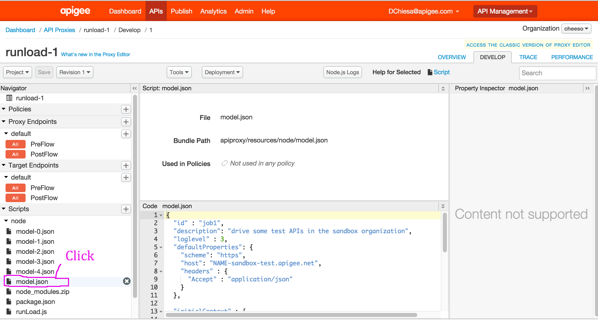

12. This shows some basic configuration for runload. The json looks like this: 
```json
{
  "id" : "job1",
  "description": "drive some test APIs in the sandbox organization",
  "loglevel" : 3,
  "defaultProperties": {
    "scheme": "https",
    "host": "NAME-sandbox-test.apigee.net",
    "headers" : {
      "Accept" : "application/json"
    }
  },

  "initialContext" : {
    "client_id" : "CLIENT_ID_HERE",
    "client_secret": "CLIENT_SECRET_HERE"
  },

  "sequences" : [{
    "description" : "create-token",
    "iterations" : 1,
    "requests" : [ {
      "method" : "post",
      "url" : "/oauth/token",
      "payload" : "grant_type=client_credentials&client_id={client_id}&client_secret={client_secret}"
    }]
  }]
}
```


### Phase 2: initial deployment of runload

1. Modify the configuration in model.json in this way: 

  a. set the "host" property to point to the DNS name of your Apigee Edge organization   
  b. Replace CLIENT_ID_HERE with the client_id you saved earlier  
  c. Likewise replace CLIENT_SECRET_HERE with the client_secret value  

2. Save the apiproxy. 

3. Deploy the API proxy to the "test" environment by clicking the Deployment dropdown and selecting "test". When runload deploys, it will read this configuration, and proceed with the logic as described above - periodically invoking the API call described in the model.json file to send a request for a token using client_credentials flow. IT will then sleep, and then send out another call. 

4. You should view these calls in Edge Trace.  In the Edge UI, go to the list of API Proxies, select the oauth proxy, and then select the Trace tab.  Start tracing this proxy. After a short delay you should see inbound requests arriving from loadgen / runload.js. If you do not, seek assistance from the lesson proctor. 

5. Runload is looking for patterns in the outbound request payload like {vname}, and then replacing those patterns with the values of the "context variable" with the name 'vname'.  In this case, the variables are {client_id} and {client_secret}.  At runtime, runload replaces these with the values you provided in the initialContext field.  


### Phase 3: addition of hourly variation

1. Back in the API Proxy Editor for runload-1, select the "model-1.json" file.  (**Note**: model-1.json, not model.json)  

2. you will see an additional field like so: 

    "invocationsPerHour" : [
         88,  74,  80,  64,  80,  78,  80, 108,
        100, 124,  81, 188, 120, 140, 101,  86,
        128, 161, 192, 141, 167, 145, 146, 103
    ],

3. copy this segment, and paste it into model.json, just after "initialContext", and just before "sequences"

4. Save the apiproxy.  It will be automatically re-deployed. 

5. This configuration tells runload to vary the rate of calls made per hour, according to the numbers you provided. The first number provides the rate of calls for the hour between midnight and 1am.  The second for 1am-2am, and so on. In this way the number of calls varies over the course of a day.  runload also applies a Gaussian function, so that the number of calls it actually makes varies randomly around that specified number. This meakes the transaction volume more random-looking. 

6. To verify that your change has worked, return to the Trace tab for the oauth proxy.  Start a trace if necessary - it may be still running. You should still see transactions flowing. It will be difficult to tell, but trust me, they're arriving at a different rate now. 


### Phase 4: addition of variation by day of week. 

1. Back in the API Proxy Editor for runload-1, select the "model-2.json" file.

2. you should see a segment like this: 
    "variationByDayOfWeek" : [
      1.2, 1.42, 0.942, 0.82, 1.184, 1.1, 0.64
    ],

3. copy this and paste it into model.json, right after the close-square bracket following "invocationsPerHour", amd just before "sequences". 

4. Save.  Redeploy is automatic. 

5. Again, verify with the Trace tab. 


### Phase 5: randomly choosing values

1. Back in the API Proxy Editor for runload-1, select the "model-3.json" file.

2. from model-3.json copy-paste the "initialContext" into the appropriate place in model.json, replacing the original "initialContext". Replace client_id_here and client_secret_here with the values you saved earlier.   

3. from model-3.json, also copy-paste the "sequences" section, replacing the "sequences" section in model.json 

4. For the values "another_client_id_here" and "another_client_secret_here" , you have two options: Leave them as is, or, create a new developer app, and place the new values there. 

5. In either case, with this configuration, you are instructing runload to select the first pair of values at a rate of 20/(20+10) = 66% of the time, and the second pair of values at 10/(20+10) = 33% of the time. This uses a "Weighted random selection" function that is part of runload. (Examine the sequences section closely to see how this works).   Obviously if you have left the second client_id as "another_client_id_here", the oauth proxy will not grant a token for such a request.  That's ok though - the point is not to have all 200 status codes. The point of driving traffic is to show a mix of transactions, some of which are failures or errors. 

6. You may wonder, Why have a context at all? Why use variable replacement in these outbound requests?  Here's why: You can tell runload to modify that context with data from responses, which can then be used in subsequent calls. For example, you can extract the returned access_token, and insert it into the context, and then use that token in subsequent calls. This is what the "extracts" configuration is doing in the model.json file. 

7. Open the Trace tab for the oauth proxy, and you should see some variation among the client_id and client_secret used for requesting tokens. 


### Phase 6. Using extracted values in sunsequent requests

1. Back in the API Proxy Editor for runload-1, select the "model-4.json" file.

2. grab the "cities" property for "initialContext". Paste it into the appropriate place in model.json 

3. also grab the updated "sequences" section in model-4.json, and paste it into model.json, replacing the previous data. 

4. Examine the "sequences" value - you will see an additional sequence, which uses the extracted access_token.  This request also uses context "import" logic - it invokes a function to randomly select a city value to use in the outbound request.  Finally the outbound request is made to weather-quota. Notice the "iterations" value on that weather-quota sequence - it is a Javascript expression that resolves to a numeric. In this case a random value from 3 to 7. This simply introduces one more factor of variation in the request rate of runload. 

5. Now open on the Trace tab for the "weather-quota" proxy. You should see a varying number of requests arrive, using tokens. 


## Conclusion

You now have seen how to use runload to generate "contrived" load on any API endpoint. You've deployed an API proxy into Edge that contains a nodejs script target; and this script target runs indefinitely, invoking outbound API calls. You now know how to generate load on any set of arbitrary API endpoints, using this tool. If those endpoints are managed by Apigee Edge, then you now have the capability to generate interesting looking Analytics charts via Edge, based on this contrived load. 

Some further notes: 

1. The runload API proxy need not be provisioned into the same organization as the APIs it targets.  You specify the URL in the runload configuration, and obviously it can be "anything" . 

2. runload need not send requests to an API hosted in Apigee Edge. It can be any HTTP target. We use it for Apigee Edge so that we can generate Analytics data. 

3. There is a complete readme for the runload tool, explaining its behavior and configuration, available [here](./Runload-README.md). There are many more possibilities that we haven't explored here. Also, we suggest that you play around with different values for the rates, and different values for the weights of input, to generate different load profiles. Experiment! 

4. You can download the runload API Proxy and re-use it in any organization. We recommend running it for a week or more, to generate reasonable data and Analytis charts that are worth demonstrating. For example: 
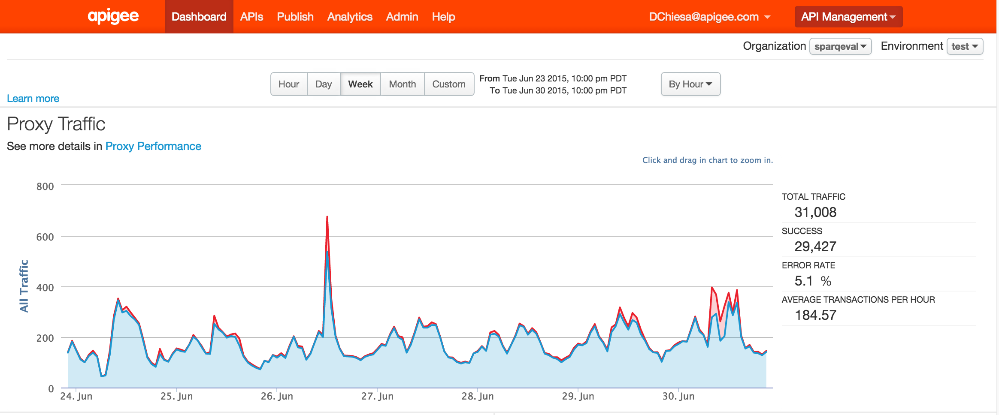
