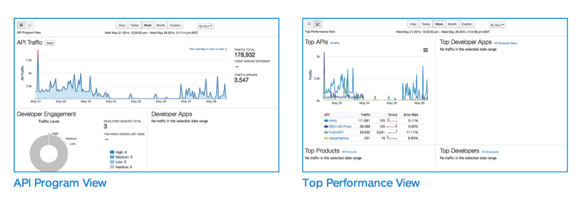
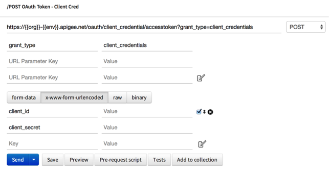
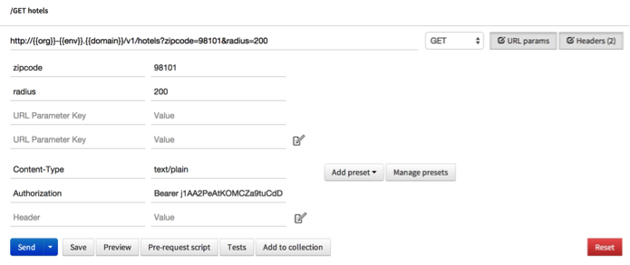
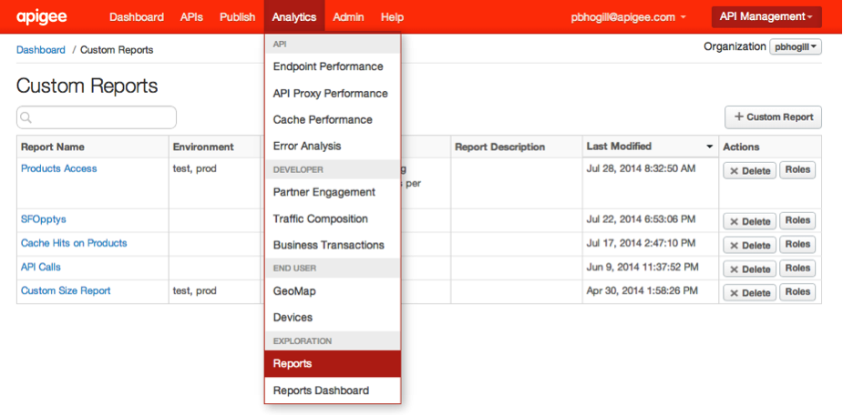
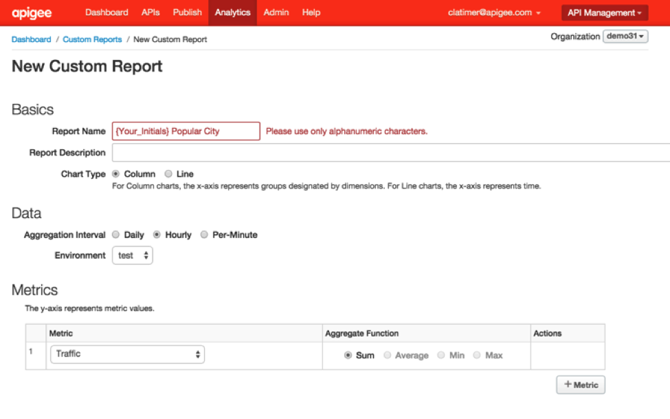
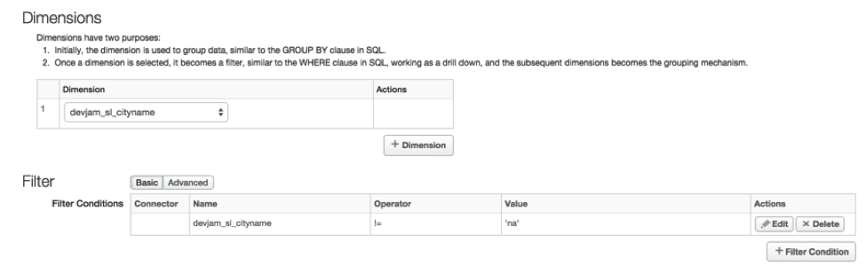
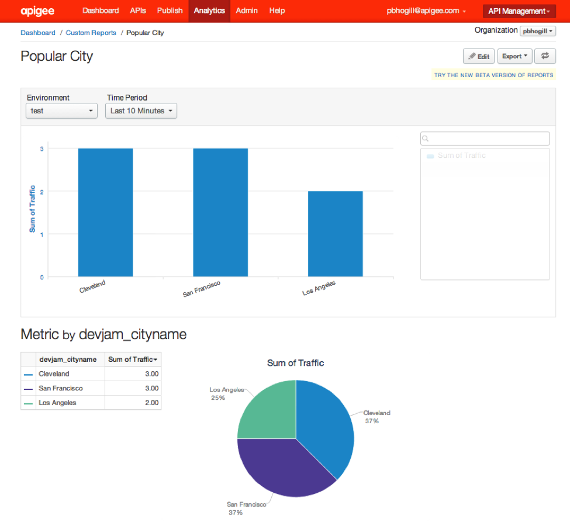
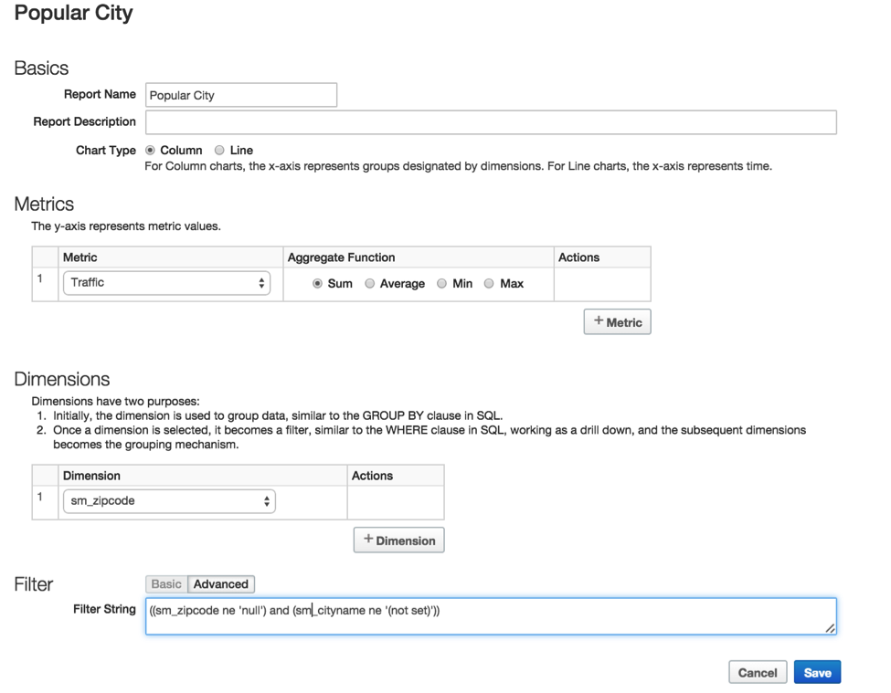
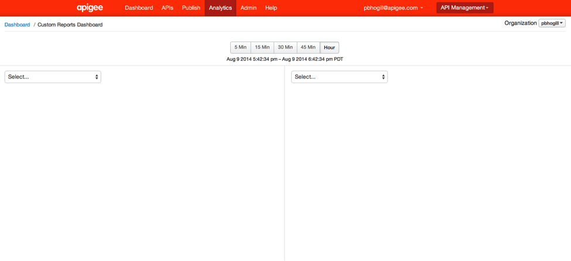
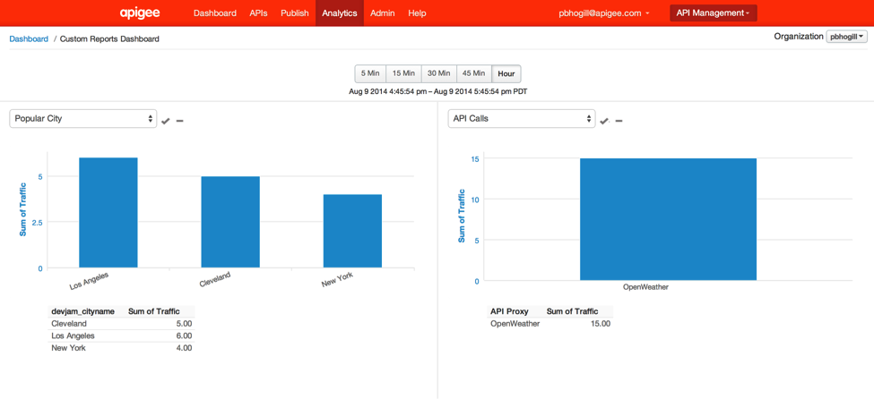

#Analytics Services: Lesson 3 - Create & Review Custom Report

##  Overview
Edge Analytics Services delivers the analytics tools and infrastructure that provides end-to-end visibility across your entire digital value chain. With Edge Analytics, enterprises can make data-driven decisions to grow the reach and revenue of your digital program, increase customer engagement, and accelerate your digital transformation. In addition, Edge Analytics provides unmatched flexibility to meet changing business and analytics needs.

 

##Objectives
In this lab you will get a first-hand exposure of creating a custom report and configuring your custom dashboard. You will leverage the custom dimension (city) you created in the statistics collector policy of the Open Weather API proxy that you built in Lab 1 to create reports and dashboards.

##Prerequisites
- [x] API Services - Lesson 3 completed

##Estimated Time: 30 mins

###Updating the Extract Message Policy to parse the service callout response
Now we will extract an additional attribute, city name from the Google Geo Code API and log it to analytics.
- From the policy drop-down, select the `Extract Geo Codes` policy
- For the `Extract Geo Codes` policy, change the XML configuration of the policy using the `Code: Extract Geo Codes` panel as follows. Add the additional extract variable tag:

```xml
<Variable name="city_name">
   <JSONPath>$.results[0].formatted_address</JSONPath>
</Variable>
```
- Your policy should look like this
```xml
<?xml version="1.0" encoding="UTF-8" standalone="yes"?>
<ExtractVariables async="false" continueOnError="false" enabled="true" name="Extract-Geo-Codes">
    <DisplayName>Extract Geo Codes</DisplayName>
    <Source>GeocodingResponse</Source>
    <VariablePrefix>geocodeResponse</VariablePrefix>
    <JSONPayload>
        <Variable name="latitude">
            <JSONPath>$.results[0].geometry.location.lat</JSONPath>
        </Variable>
        <Variable name="longitude">
            <JSONPath>$.results[0].geometry.location.lng</JSONPath>
        </Variable>
        <Variable name="city_name">
            <JSONPath>$.results[0].formatted_address</JSONPath>
        </Variable>
    </JSONPayload>
</ExtractVariables>
```


###Adding Statistics Collector Policy

- Go to the Apigee Edge Management UI browser tab
- Go to the `{your initials}-hotels` proxy’s `develop` tab
- From the `Navigator` pane, select `Proxy Endpoints → Default → Get Hotels`
- From the `New Policy` drop-down, select the `Statistics Collector` policy
- In the `New Policy - Statistics Collector` dialog box provide the following information:
  - Policy Display Name: **Get Hotels Statistics Collector**
  - Policy Name: **Get-Hotels-Statistics-Collector**
  - Attach Policy: **Checked**
  - Flow: **Flow Get Hotels, Proxy Endpoint default**
  - Segment: **Request**
- Click on the `Get Hotels Statistics Collector` policy in the pipeline and modify the XML configuration in the `Code: Get-Hotels-Statistics-Collector` section, which appears underneath the Map as follows:

```xml
<?xml version="1.0" encoding="UTF-8" standalone="yes"?>
<StatisticsCollector async="false" continueOnError="false" enabled="true" name="Statistics-Collector-1">
    <DisplayName>Statistics Collector-1</DisplayName>
    <Properties/>
    <Statistics>
        <Statistic name="{your initials}_zipcode" ref="request.queryparam.zipcode" type="STRING">NO_CITY</Statistic>
        <Statistic name="{your initials}_cityname" ref="city_name" type="STRING">NO_CITY</Statistic>
    </Statistics>
</StatisticsCollector>
```

###Testing the API
- You will obtain a valid oauth token by directly calling the `oauth` API proxy token endpoint and passing the consumer key and consumer secret of the `iExplore App` app. 
- Send a test `/POST OAuth Token - Client Cred` request from Postman after setting appropriate values in the `x-www-form-urlencoded` section of the request:

 - client_id: **{iExplore App Consumer Key}**
 - client_secret: **{iExplore App Consumer Secret}**
 - grant_type: **client_credentials**

  

 **Note:** Copy-paste the Consumer Key and Consumer Secret from the `iExplore App`’s detail page. As you copy-paste, remove any spaces before and after the values of the Consumer Key and Consumer Secret.

- Review the response of the `/POST OAuth Token - Client Cred` request. Copy the value of the `access_token` attribute to use in the next step.

```json
{
 issued_at: "1414962637000",
 application_name: "ef723b8b-fdb1-4aae-9418-096d8ab7fec7",
 scope: "",
 status: "approved",
 api_product_list: "[Hospitality]",
 expires_in: "3599",
 developer.email: "pparekh+mpolo@apigee.com",
 organization_id: "0",
 token_type: "BearerToken",
 client_id: "P24PNGrXN0gTNdVi6giT12Dq0vrG3ruB",
 access_token: "j1AA2PeAtKOMCZa9tuCdDDsRqn8J",
 organization_name: "demo37",
 refresh_token_expires_in: "0",
 refresh_count: "0"
}
```

- Set up the `/GET hotels` request in `Postman` with the following query parameters **AND header**: 

  - Query Parameters:
    - zipcode: **98101**
    - radius: **200**
  - Header:
    - Authorization: **Bearer {access_token}**

 

 **Note:** Replace the `{access_token}` with the value of the ‘access_token’ from the response in the step above.

- Send the `Postman` request. 
- Send a few requests

###Creating the custom report
[Custom Reports](http://apigee.com/docs/analytics-services/content/create-custom-reports) - There are several OOTB (Out of the box) reports that are automatically provided for every org, they track several critical operational metrics. 
You can also create custom reports to capture custom metrics. By adding custom reports, you can create a set of charts that provide insight into every aspect of your API program.

- Login to the Apigee Edge Management User Interface (Management UI). On the top menu, click on the Analytics item and  then click on `Reports`. When on that page click on the `+ Custom Report` button on the top right. 

 

- Define the custom report - Enter the values as indicated below and click on the blue `Save` button.

 
 

  - Report Name: **{your initials} Popular City**
  - Report Description: **This report shows the most popular city queried for its weather.**
  - Chart Type: **Column**
  - Aggregation Interval: **Per-Minute**
  - Environment: **{your env} test or prod**
  - Metrics: Traffic - **Sum of traffic**, **Target Response Time - Average**
  - *This will create a multi dimensional report.*

  - Dimensions: `{your initials}_zipcode` (This is the name of the variable which we created in Lab 1 to capture the city name from the response payload. You can create different variables from either the request or response header/body/attributes and have the analytics engine start harvesting these values for you. Generally these variables will show up under the `custom dimensions` category in the Drilldown drop-down)

- Filters `{your initials}_cityname` != ‘na’ (this will ensure only traffic that used this dimension will display on your report)
- You should see the following (once you have given enough time to for the data to be aggregated): 

  

- Add a filter 
```
(({your initials}_zipcode ne 'null') and ({your initials}_cityname ne '(not set)'))
``` 
in your custom report. This will remove any unknown cities from the report . 


The final configuration of the custom report will look like the following :
 
 

###Create  Custom Dashboard
A [custom report dashboard](http://apigee.com/docs/api-services/content/custom-report-dashboard) is a dashboard that lets you visualize API analytics data from a previously created custom report. A custom report is a way to specify precisely what you want to measure across your API program. For instance, you can measure all API traffic generated from a specific client IP address.

Click on Analytics Reports Dashboard from the main menu. You will most likely see an empty dashboard because you haven’t configured anything yet. A custom dashboard lets you select upto 4 different pre-built reports (OOTB or Custom Reports) that you can monitor across 5 different time domains
 
 

- On the first Select drop-down select the Popular City report that you just built. You can pick any report for the second drop-down or other drop-downs. You should see something like this:
 
 


##Summary
That completes this hands-on lesson. You have learned how to create a simple custom report to capture the most popular city being queried. You also added the custom report along with other reports to a custom dashboard. Please visit the documentation to see the different kinds of operational reports and dashboards that are available to you..

