#Developer Services: Lesson 1 - Configure Developer Portal

##Overview
Developer portals with social publishing features are increasingly being used for communication with the development community. This includes communicating static content, such as API documentation and terms-of-use, as well as dynamic community-contributed content such as blogs and forums.

As an API provider, you need a way to expose your APIs, educate developers about your APIs, sign up developers, and let developers register apps. Exposing your APIs to developers is only part of creating a truly dynamic community. You also need a way for your developer community to provide feedback, make support and feature requests, and submit their own content that can be accessed by other developers.

Apigee Edge provides you with a Developer Services portal that you can use to build and launch your own customized website to provide all of these services to your development community. Every Edge customer can create their own developer portal, either in the cloud or on-prem. 

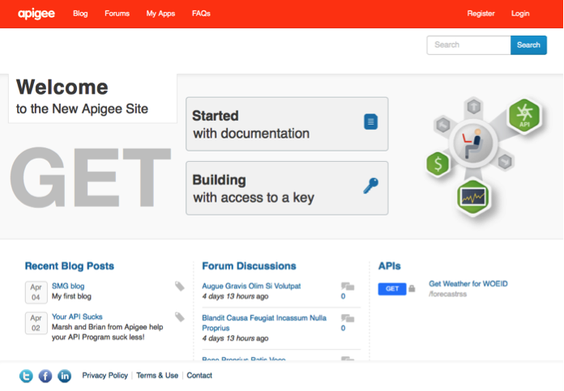 

Out of the box, the [developer portal](http://apigee.com/docs/developer-services/content/what-developer-portal) lets you create API documentation, supports blogging, and provides threaded forums. You can also customize the developer portal to meet your specific requirements. Customization lets you modify the portal appearance and also the way that developers interact with the portal.

The developer portal is essentially a content management system (CMS) based on the open source Drupal (http://www.drupal.org) project. Drupal provides a core set of features in the form of modules that make it easy for you to build the content for, as well as manage, web sites.

The following image shows the two main types of portal users:

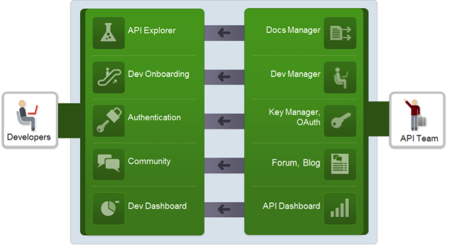  

**Developers** make up the community of users that build apps by using your APIs. App developers use the portal to learn about your APIs, to register an account on the portal, to register apps that use your APIs, and to interact with the developer community.

**API team** is the API provider that creates portal content including API documentation, makes their APIs available to app developers, and provides a mechanism for developers to register apps and obtain API keys. The API team performs basic configuration of the developer portal to:
- Configure automatic or manual requests for API keys
- Maintain API documentation, forums, and blogs and optionally revision all changes
- Add API call tracing in real time from within the portal using Apigee’s Console To-Go
- Handle user comments and forum moderation
- Enforce Role Based Access Control (RBAC) to control access to features on the portal. For example, an administrator can enable controls to allow a registered user to create forum posts or use test consoles
- Customize email notifications to both administrators and developers for user creation and approvals
- Customize web forms such as "contact us" pages

##Objectives
After this lesson you should be able to configure your instance of developer portal to point to a specific Apigee Edge org and customize the developer portal; this includes skinning the look-and-feel, changing the logo, update the color scheme and other appearance based configuration changes. 

##Estimated Time: 30 mins

###Dev Portal Connection Settings 
In this section you will do the basic configuration necessary to establish the connection to your Apigee Edge org.

- Make sure that you are already be an “orgadmin” in the Apigee Edge org assigned to you.

- Open a browser tab & enter the portal URL `{}.devportal.apigee.com` provided to you. Make sure you sign-in into your developer portal as an admin; click on “Authenticate with Apigee” option. The way to tell that you are logged in as admin is that you should see the following menu banner at the top of the browser screen.

  

- From the menu click on Configuration → Dev Portal Settings

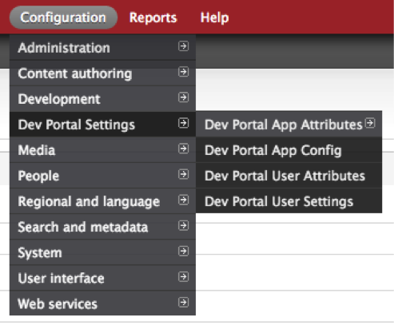  

- You will see a configuration page like the following below:

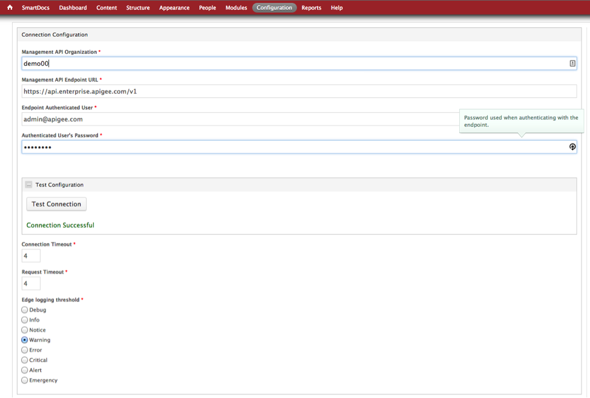  

- Enter the values in the fields as follows:

 - Management API Organization: **{The name of your Edge org}**
 - Management API Endpoint URL: **https://api.enterprise.apigee.com/v1**
 - Endpoint Authenticated User: **{your apigee user id}**
 - Authenticated User’s Password: **{your apigee password}**

- Then click on `Test Configuration` button to validate that your connection the Apigee Edge org is successful. This step is mandatory before you do anything meaningful with the portal.

- After the connection is successful, click on the `Save Configuration` button to save the configuration in the portal.

###Configure Search 
In this section you will configure search so you can search across various assets in the developer portal. he developer portal provides a built-in search engine implemented by Apache Solr, which uses the Apache Lucene search library. This is the search engine for the site itself, which the user accesses through the search box in the upper-right corner of all portal pages.
External search engines, such as Google, can also index your portal. The developer portal lets you control whether or not external search engines can index your portal.

- From the main menu click on `Configuration` → `Search and Metadata` → `Apache Solr Search`. Review the settings on that page.

- Select Modules in the main menu.

- Select the Meta tags section to expand the section.

- Uncheck the Meta tags checkbox.

- Click Save configuration.

- In the main menu select `Configuration` →  `Search and metadata` →  `Metatag`.

- Select Override operation for the Global type.

- Click the Advanced section to open it.

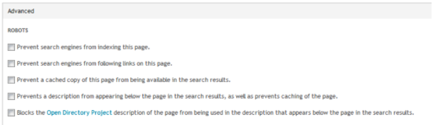 

- Check the checkbox for Prevent search engines from indexing this page.

- Click Save.

###Portal Skinning 
In this section you will change various elements (skinning) of the UI to give a more custom look-and-feel to your developer portal. For this section, pick any prospect/customer web-site that you are currently working with and use their color scheme as a reference to skin your portal. (One easy way to get the color values & other attributes such as dimensions of images etc is to use the Developer Tools in Chrome or similar tools in other browsers to inspect the metadata for their sites)

- First lets change the logo that appears on the developer portal. Click on the main menu `Appearance` → `Settings` → `Apigee Responsive`. (*Apigee Responsive is an OOTB [theme](http://apigee.com/docs/developer-services/content/customizing-theme) that is shipped with the developer portal. A theme is a collection of files that defines the look and feel of a site. The Developer Services portal is initially defined with a default theme, which you can customize. This allows you to select your preferences for the look and feel of your portal. More specifically, you can change the color of links, backgrounds, text, and other theme elements. You can also change the welcome message that appears on the front page of your developer portal.*)

You can customize the theme through the developer portal UI, or by creating a custom theme file that overrides the default theme file.

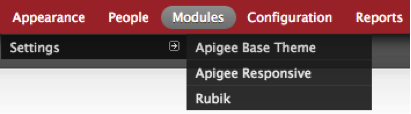  

- You will see a screen like this:

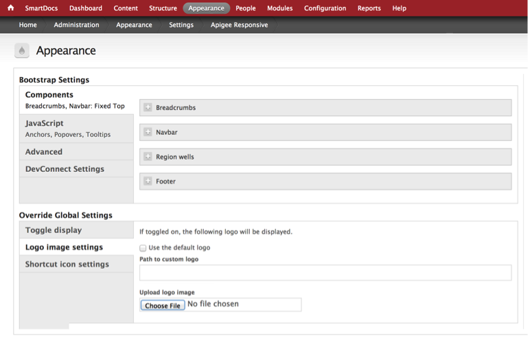  

Click on the `Logo Image Settings` section under `Override Global Settings`, click on the `Choose File` button to select an image of your choice. If you check on the `Use the default logo`, the default logo image (Apigee logo image in this case) will be rendered. Finally click on the `Save Configuration` button to save this configuration.

- Its probably a good idea from time-to-time click on `Home` → `Flush All Caches` to force refresh of recent configuration changes to the portal.

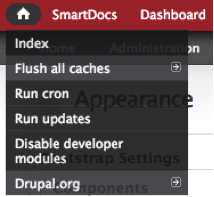 
 
- The `Welcome Message` is displayed on the home page every time someone visits the developer portal. Its a good idea to customize it to make it more relevant to the customer/audience.
- Next lets change the colors & text for various elements (Header, Hover, Link, Footer, Background etc) of the developer portal. Click on the main menu `Appearance` → `Settings` → `Apigee Responsive`. Click on `DevConnect Settings` under the `Bootstrap Settings` section. Enter the corresponding values in the sections that appear below.

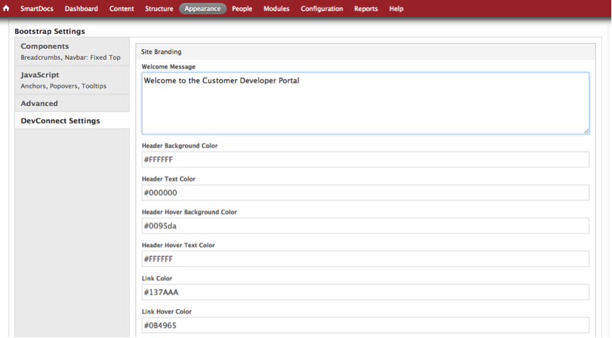  

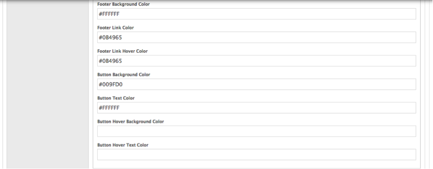  

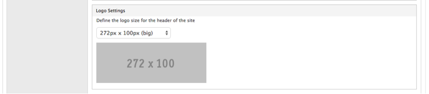  

- Finally click on the `Save Configuration` button to save this configuration.

- You can now go back to your developer portal and check all the changes you have made.

##Summary
In this section you learned how to setup and customize a developer portal instance. You configured the DevConnect settings so that the portal is correctly configured to interact with your Apigee Edge Org. You also configured search and skinned the portal to change the look-and-feel. Additionally you can also add / update the tabs that you see on the top of the portal, add child pages and add/customize permissions for specific roles. For further information refer to the [developer portal documentation](http://apigee.com/docs/developer-services/content/add-and-edit-content).

