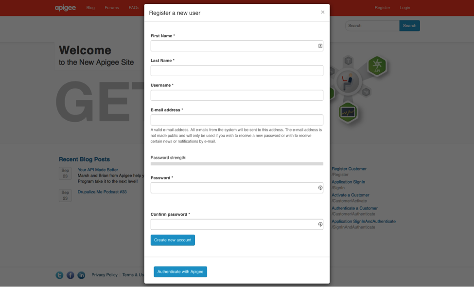
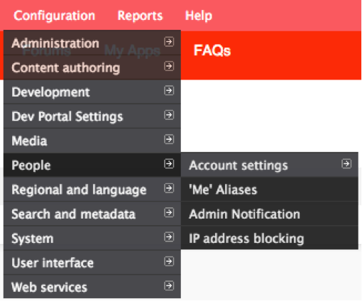
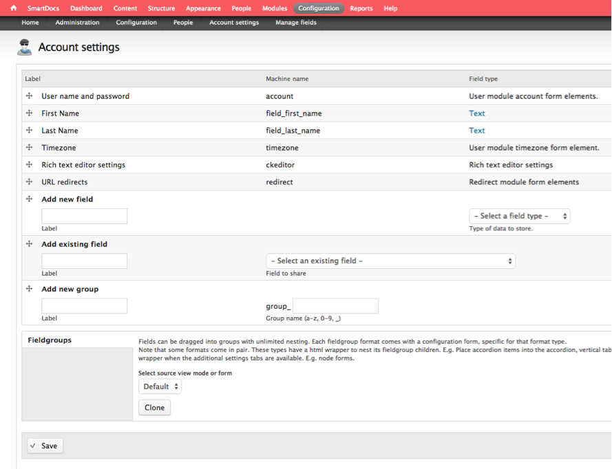
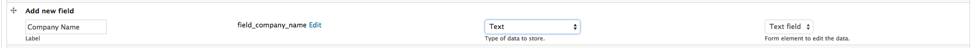
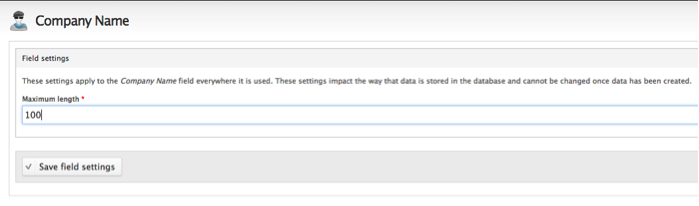
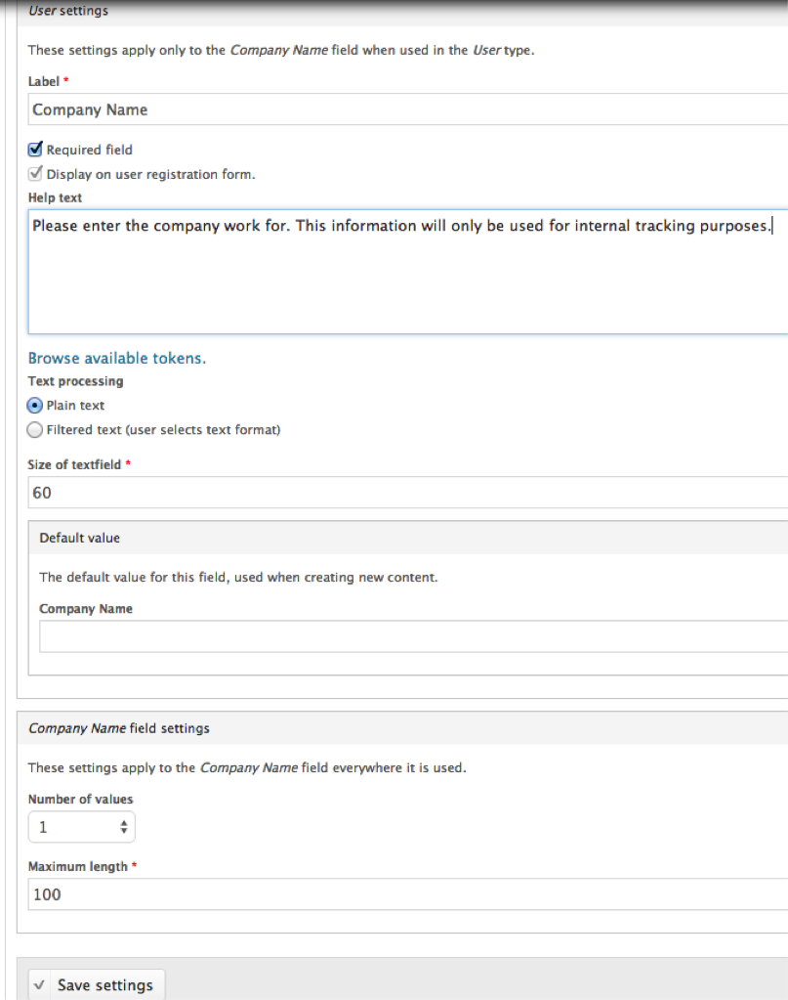
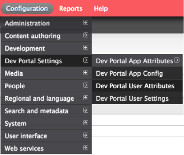
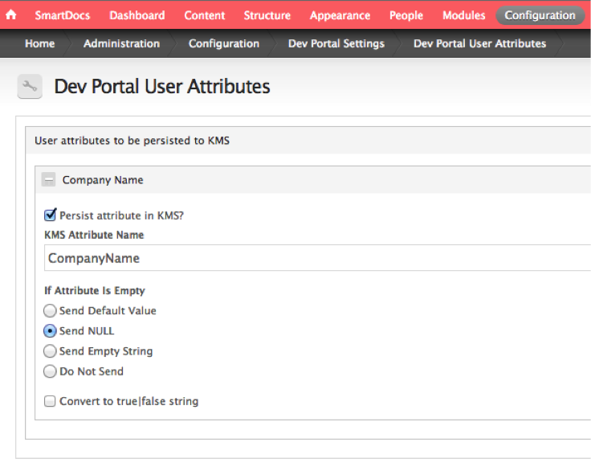
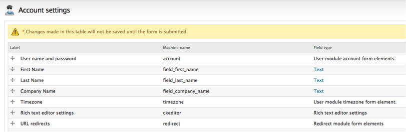
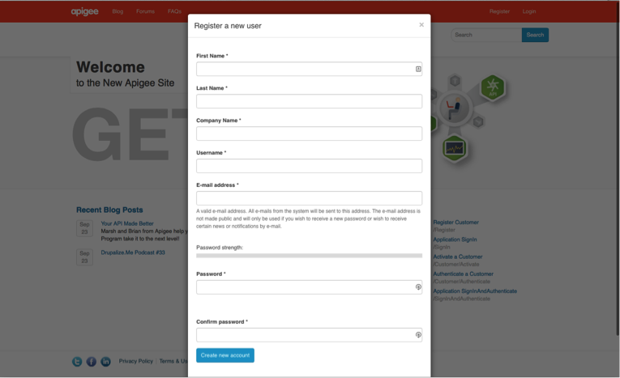

#Developer Services: Lesson 2 - Customize Developer Sign-Up Form

##Overview
Apigee Edge provides you with a Developer Services portal that you can use to build and launch your own customized website to provide all of these services to your development community. Every Edge customer can create their own developer portal, either in the cloud or on-prem. 

In essence the developer portal is the primary channel of the entire developer onboarding experience. The developer portal is extremely flexible and provides a range of options from customizing forms, blogs, forums and and many other UI aspects as you previously saw.

In this lesson we will customize the registration form which a user sees when they try to register or create a new account on the developer portal. When the user registers for an account on the portal, the portal displays the default registration page with fields for First Name, Last Name, Username, Email address, and Password. 

 

As an API provider, you might want to modify this form to prompt the user to provide additional information such as a company name, mailing address, or other information. 

The portal provides you with a the ability to add new fields to this form. These fields can be:

- Required or optional
- Displayed by different HTML elements, such as text boxes, radio buttons, check boxes, and more
- Can be set to appear anywhere on the form

##Objectives
After this lesson you should be able to customize the user registration form by adding a few fields and making some of them mandatory.

##Estimated Time: 30 mins

- Log in to your portal as a user with admin or content creation privileges.

- Select `Configuration` > `People` > `Account Settings` in the Drupal administration menu.

	
 
- Select the `Manage fields` button at the top of the page and you should see a page like this:

 

- Scroll down the page to the `Add new field` and configure it as follows:

 - *Label* **Company Name**
 - *Type of data to store* **Text**

It will generate the field name automatically for you

 

- Select Save. on the next page change the maximum length to 100, and the select Save field settings.

 

- A new page appears that lets you specify additional information for the field, select the options and enter help text as follows:

 

- Finally click on `Save Settings` button.

- Click on the Drupal administration menu → `Home` → `Flush all caches` to push the recent changes.

- Next you need to upload this new field to Edge. (This has to be done everytime you add new fields to the form). 

- Select `Configuration` > `Dev Portal Settings` > `Dev Portal User Attributes` in the Drupal administration menu.

 

- A list of the available user attributes appears - In this case the recently entered `Company Name` and select the options as follows:

 

- Finally click on `Save Configuration` button.

- Now lets make sure the Company Name field gets placed where we want it to.

- Select `Configuration` > `People` > `Account Settings` in the Drupal administration menu.

- Select the `Manage fields` button at the top of the page. Select the plus, `+`, symbol under the Label column and drag the field to the location below the `Last Name` field. The form should look like this:

 

- Save your changes. Go back to the Home icon and click on `Flush All Caches`

- Logout of the portal. Go back to another browser tab, re-enter the developer portal URL on the address bar and click on the `Register` menu item. Your user registration page should have a Company Name field and should look like this:

 

##Summary
In this section you learned how to customize the register user form. In this way you can customize many standard forms in the portal by adding various kinds of field types including images. For further information refer to the [developer portal documentation](http://apigee.com/docs/developer-services/content/add-and-manage-user-accounts). 
