#Developer Services: Lesson 3 - Register Developers & Apps

##Overview
Developer portals with social publishing features are increasingly being used for communication with the development community. This includes communicating static content, such as API documentation and terms-of-use, as well as dynamic community-contributed content such as blogs and forums.

Developers make up the community of users that build apps by using your APIs. App developers use the portal to learn about your APIs, to register an account on the portal, to register apps that use your APIs, and to interact with the developer community. Developers have to go through a registration process to register with the portal to start using the APIs and building Apps.

The steps in the default registration process are:

- The developer registers through the developer portal. In response, the portal sends an email to administrators to approve the account.
- An administrator approves the account, and an email is sent to the developer letting them know that they can now log in.
- The developer registers an app and selects the API products used by the app. In response, the portal assigns a unique API key to the app.
- The developer passes the API key when making requests to your API.

This out of the box experience is highly customizable. For example, you can override the default registration and authorization scheme so that a new developer is automatically approved and logged in after registration. Or, you can require the developer to accept a set of terms and conditions before they can log in for the first time.

You also have complete control over the content available on the developer portal. Out of the box, the developer portal presents sample content such as API documentation, blog posts, and forum discussions. You can provide your own content, and customize the appearance of each content type.

Developers use your developer portal to access and use your API. Administrators perform account management tasks, such as:

- Customizing the developer registration process, including registration fields, built in Captcha, and automatic or manual approval
- Adding or approving developers. By default, any developer can register through the developer portal but needs to be approved by an administrator through the Dev Portal user interface.  Administrators can also create developers directly on the portal. The portal then automatically emails the developer that an account has been created for them.
- Modifying a developer's account. For example, administrators can change the user's account status from active to blocked or change the developer’s profile information such as the company’s name.
- Removing a developer. Administrators can disable or delete a developer's account.
- Assigning roles and permissions: Administrators can assign a specific role to a developer account. A role is associated with various permissions, such as permission to create books or other content. You can also change the permissions associated with a role or make new roles.

##Objectives
After this lesson you should be able to register developers, approve them and also administer user apps. You will also be able to customize what happens when the user/developer account is created.

##Estimated Time: 30 mins

###Configuring registration actions and permissions 
In this section you will configure administration settings for developer registration first in order for the developers to have the desired sign-in experience.

- Log in to your portal as a user with admin or content creation privileges.

- Select `Configuration` > `System` in the Drupal administration menu. This opens the System settings page.

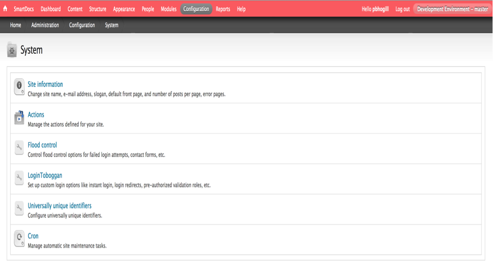 

- Click on `LoginToboggan` link. Once the page opens, make sure that the `Set Password` checkbox is `unchecked`. Then click `Save Configuration`

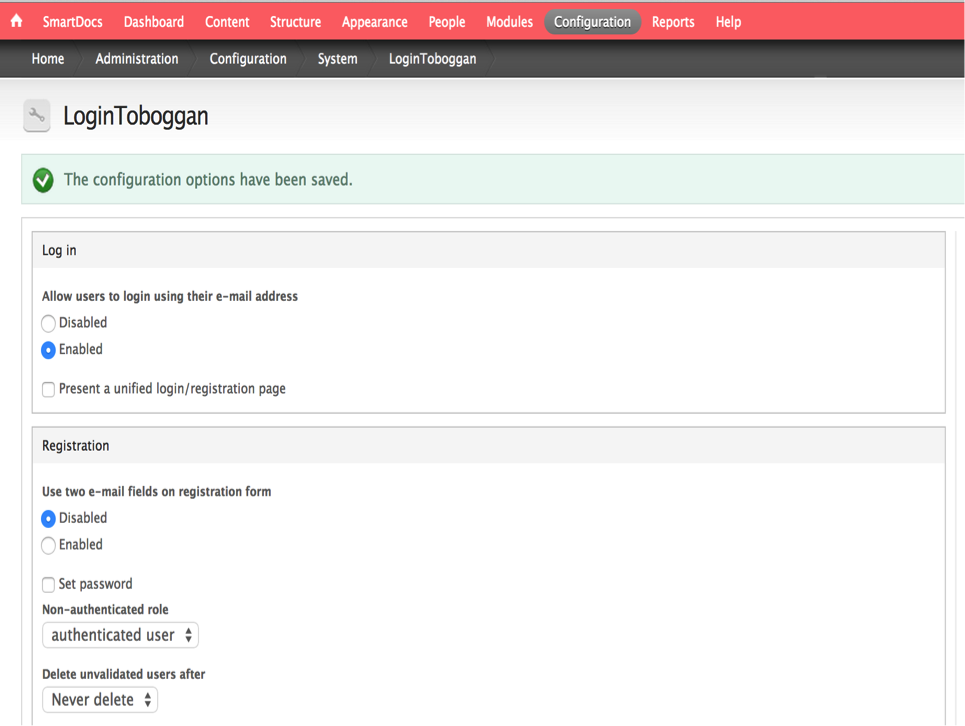 

- From the menu, Select `Configuration` > `People` > `Account settings` in the Drupal administration menu. This opens the `Account settings` page.

- Click the last option (Visitors, but admin approval required) under *Who Can Register Accounts* in the Registration and cancellation section. The choices are:

 - Administrators only: Only administrators can register user accounts.

 - Visitors: Anyone can register. This is the default.

 - **Visitors, but administrator approval is required:** Anyone can register, but an administrator needs to authorize the account.

- Select the checkbox for `Require e-mail verification when a visitor creates an account`. (When unchecked, the developer is immediately logged in to the portal after registering. When checked, the user receives an email that they use to validate their email address before they can log in.)

- Click Save configuration, the page should look like this:

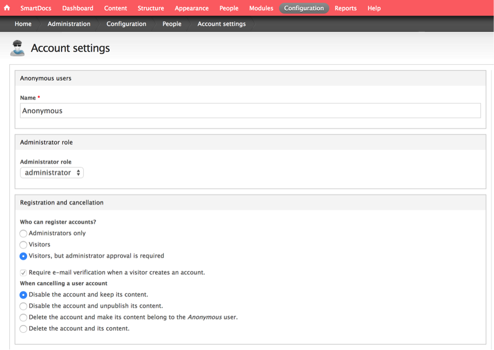 

###Registering a Developer 
In this section you will sign up a new user as a developer in the dev portal instance that is assigned to you..

- Logout of the portal as an admin. 

- On the top right-hand corner, click the register link and a pop-up window will be displayed.

- Enter details in the new developer window as follows & click on the `Create new account` button when done. (*You can use the gmail feature of adding a few characters in your email address by adding a + sign after your first letter last name sequence*)

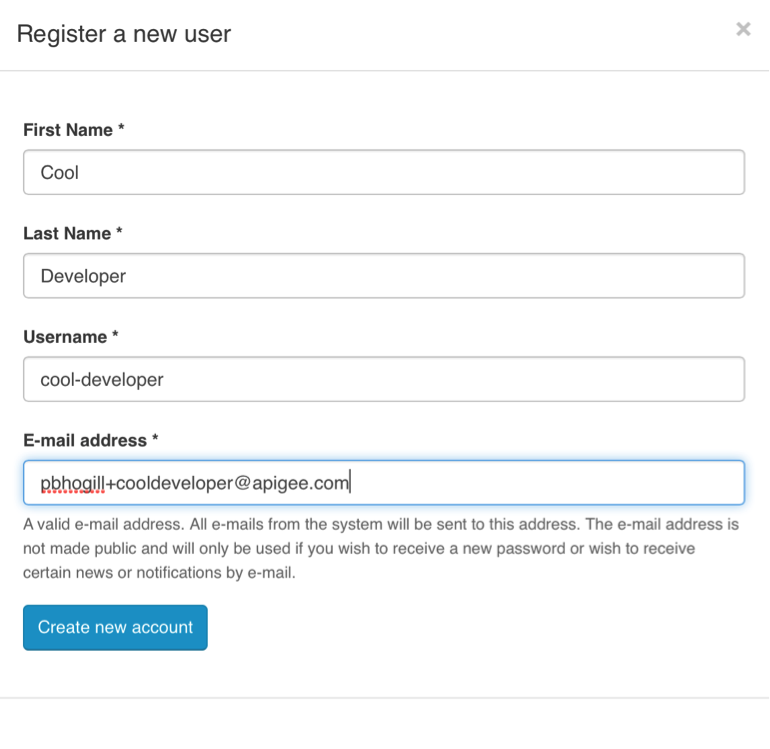 

- At this point you have registered for a new developer account on the dev portal but you are not yet approved.

- I did not get an email.” In a few minutes you should get an email saying that your account is pending approval from the administrator.

- Now login to the developer portal as an Administrator.

- Click on the `People` menu and you should see the developer account that you just signed up for (Filter by `cool` in the top filter bar)

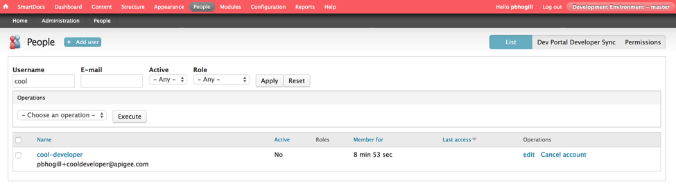 

- Click on `edit` link in the `Operations` column. On the next page, select the `Active` radio button to activate this new developer account and click `Save`

- At this point you should get an email saying that this account has been approved. (This email will contain a one-time link to activate your account)

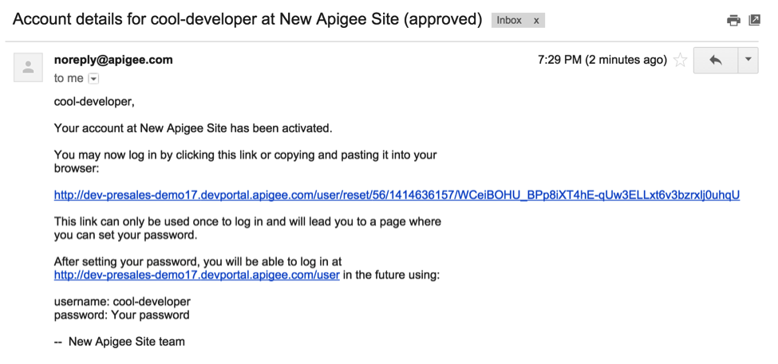 

- Open the one-time link in a new browser and set your password & save it as follows:

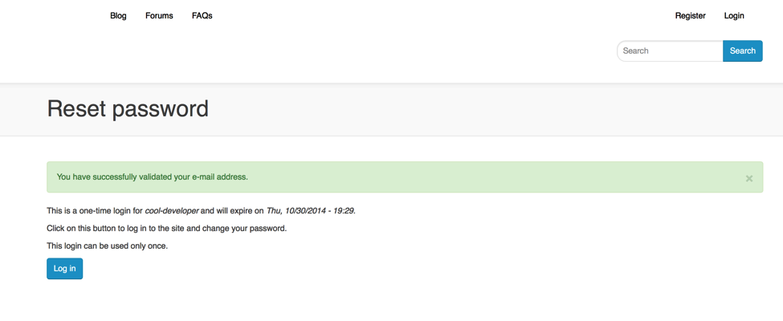

- **Cron Job -** There are various sync activities that happen in the background between Apigee Edge and the Developer portal. One of them is to sync the product information over to the portal. This can be done using the Admin menu. Click on `Home` → `Run Cron Job` → Click on the `Run cron job manually` link. (*Depending on when the products were created this step maybe optional as the portal is configured by default to run the cron job automatically every 3 hours*) 

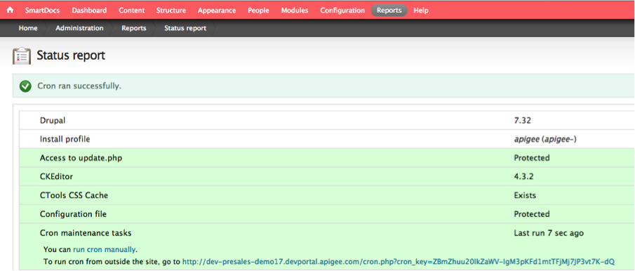 

- Logout as an administrator and Login as the developer account you created using the password you entered to make sure you are able to access the account.

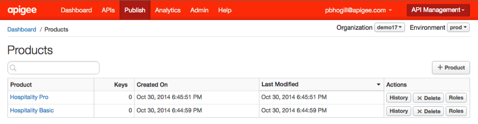

###Registering an App 
In this section you will register your first app as a developer.

- Login to your Apigee Edge Management UI and make sure you have the 2 products (*Hospitality Basic* & *Hospitality Pro*) configured in your assigned org.

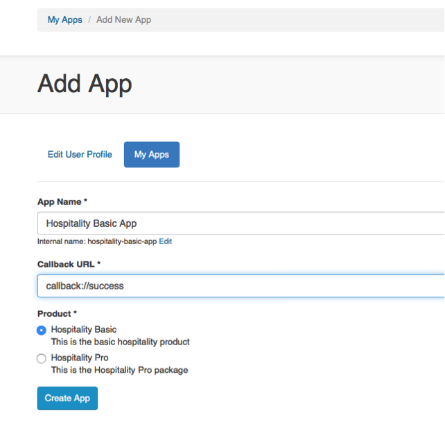
 
- Login into your developer portal using the credentials of the newly created developer account.

- Click on `My Apps` link  on the top of the portal page. Click on the `+ Add a new app` button and enter details regarding the new app as follows:

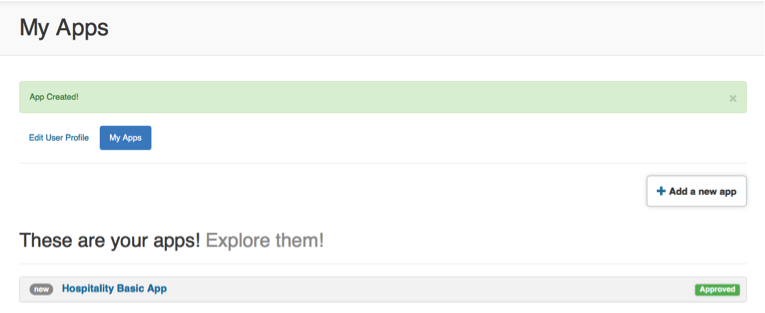 

 - App Name: **Hospitality Basic App**
 - Callback URL: **callback://success** (This is just a sample URL)
 - Product: **Hospitality Basic**

- Click on `Create App`, you should see something like this below. Go ahead click on the app link and check out the settings in the app. You will also see that the app is auto approved. 

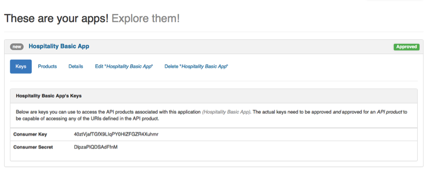
 
- Login into your Apigee Edge Management UI in a different browser tab. Navigate to `Publish` → `Developer Apps` from the main menu and you should see the app you just created show up under the Developer Apps.

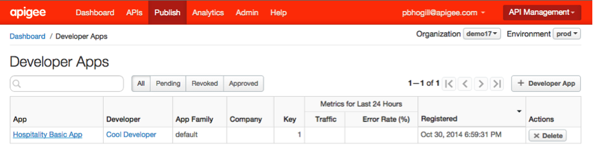 

- Click on the `Hospitality Basic App` link and you will see the App details. Compare to make sure that the `Consumer Key` and `Consumer Secret` matches what was generated in the developer portal

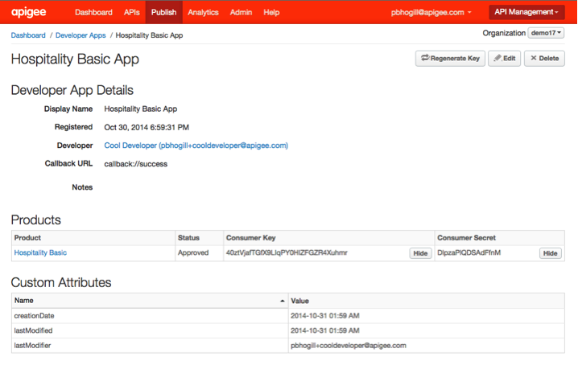 

- After this point any request which comes to the API Product (or proxies contained within them) will be tracked via the `Consumer Key` that is passed in the request.

###Additional Configuration Read Up 
This section will cover how to change settings in the developer portal to affect behavior of what happens when developer register for new apps - do they get auto approved or is it a manual process. How you change that and other settings

 - [App Registration Configuration](http://apigee.com/docs/developer-services/content/configuring-api-products) - Review the `Configuring how a developer associates API products with an app` section to see the different choices available. Based on how you configure the portal, the developer can select one or more API products to associate with the app at the time of app registration. Or, you can specify a default product that is assigned to all apps. 

- [Configuring Email Notification](http://apigee.com/docs/developer-services/content/configuring-email) - By default, the Developer Services portal sends emails in response to certain events. For example, when a new developer registers on the portal, the portal automatically sends a welcome email to the developer. Or, if the developer loses their password, the developer can request an email with a temporary password. As an API provider, you can control all aspects of the emails generated by the portal.

- [Add and manage user accounts](http://apigee.com/docs/developer-services/content/add-and-manage-user-accounts) - Before users can start working with your Developer Services portal, they need to be added to the system. By default, any user can register on the developer portal by selecting the Register link in the portal menu. This section explores the different configuration options that are available to you.

##Summary
In this section you learned how to register developers, approve them and also administer user apps. You also looked at how you can customize what happens when the user/developer account is created. You also reviewed the various configuration options available which make it very easy to customize the developer portal to your needs. For further information refer to the [developer portal documentation](http://apigee.com/docs/developer-services/content/add-and-manage-user-accounts).

