#Developer Services: Lesson 4 - Publish SmartDocs

##Overview
Enterprises and their API teams struggle to provide up-to-date, meaningful, and engaging documentation for their APIs. As a result, app developers and partners can find it challenging to understand the technology, the use case, and the benefits behind API products. This, in turn, hampers adoption and leads to content that’s hard to maintain.  

SmartDocs is method-level API documentation that’s detail-rich and offers both internal and external SEO benefits. API providers can: use Swagger or WADL to generate docs by leveraging handlebars-driven templates; test the accuracy of their documentation with live requests; and control the layout, interactions, and look of your docs.

App developers and partners can make API requests without leaving the page, work faster as SmartDocs learns the parameter values they like to use, and benefit from accurate, model-driven documentation.

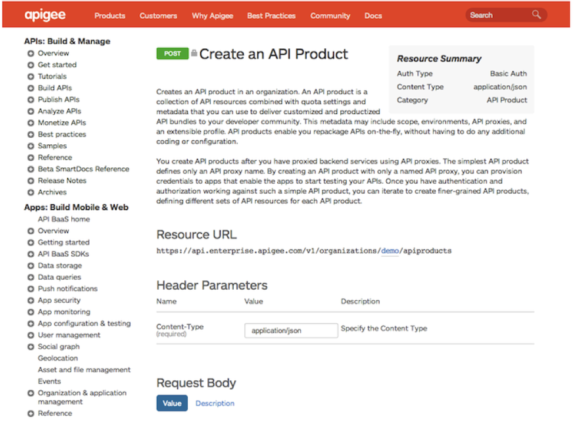 

There are Four key SmartDocs features:

1. **Method-level detail:** Every method of your API gets its own page of documentation. This gives you plenty of space to describe the behavior of that method in detail. Not only does that help provide necessary information to developers, the documentation itself is indexed, which brings SEO benefits to internal (portal) search results as well as external search results (Google ranking, for example).

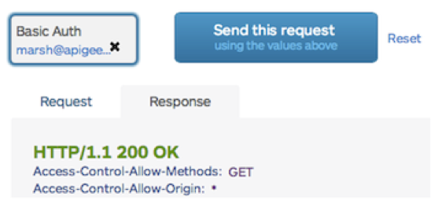

2. **Interactive requests:** Developers can send requests without leaving your docs. SmartDocs guides developers to build well-formed requests and to sign them with their  credentials. This helps you minimize a crucial adoption metric: time to first request. And because your writers can test their work in-situ, it should improve the accuracy of your documentation.

3. **Docs that learn:** SmartDocs remembers the values that each developer uses for subsequent requests. This makes SmartDocs a tool that gets better the more you use it, and it helps developers move faster.

4. **Easy to maintain:** You have complete control over the layout, interactions, and look and feel. Plus, in-line editing allows you to change what you can see, right from the generated docs!


##Objectives
After this lesson you will be able to configure SmartDocs for your developer portal. You will also be able to publish a new model for you existing APIs and render the documentation on your portal so it can be accessed by the developers. 

##Estimated Time: 45 mins

###Configure/Enable SmartDocs 
Configure/Enable SmartDocs in your portal In this section you will review the various configuration settings for SmartDocs and if not enabled already you will enable them for your developer portal instance.

- Login into the developer portal as an administrator. Click on Modules link on the top menu and enter the keyword “smart” on the filter text box. you should see something like this:

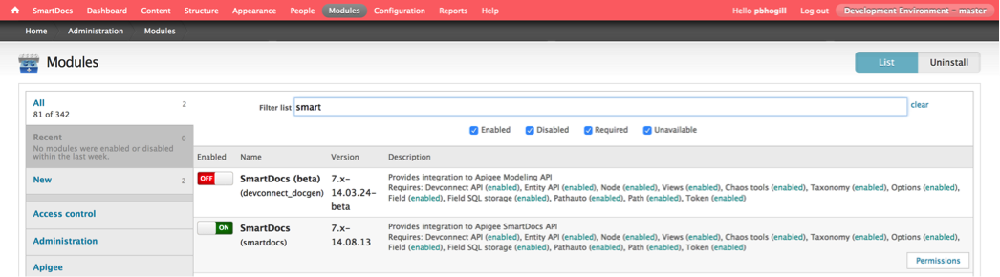 

If the SmartDocs (smartdocs) module enabled status is not “green”, go ahead and click on it to turn it on. Another way to know that the SmartDocs module is turned on is by seeing if the top-left menu item, after the home icon says `SmartDocs`

- Click on the `Permissions` button/link on the description column of the SmartDocs module, this will take you to the permissions page. Enter the keyword `smartdocs` in the filter box to search for the smartdocs permissions. You should see something like this:
		
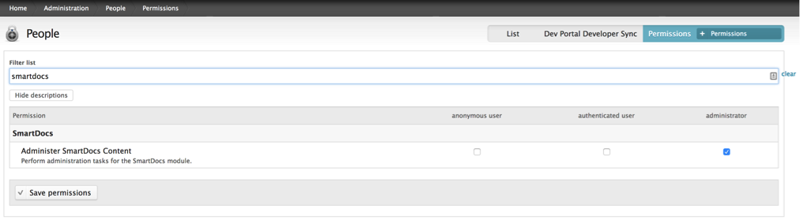 

Please note that currently the portal is configured so that SmartDocs content is only administerable by an Administrator. If required you can also set it so that any authenticated user is also able to administer it by checking the `authenticated user` checkbox and saving the permissions. It’s probably not a good idea to have anonymous users administering SmartDocs content.

- Select Configuration → Dev Portal Settings in the Drupal administration menu.

- Set the Connection Timeout and Request Timeout to 16 seconds. Save the configuration.

- Next, lets configure URL settings. Select Configuration → Search and metadata → URL aliases → Settings from the Drupal menu.

- Set the Maximum alias length and Maximum component length to 255. Expand Punctuation. For the Left curly bracket ({) and Right curly bracket (}) settings, select No action (do not replace). Finally save the configuration.

###How to document your APIs by using SmartDocs
How to document your APIs by using SmartDocs In this section you will review the steps/process to document your API. SmartDocs represents your APIs by using a model, where the model contains all the information about your APIs. The portal extracts information about your APIs from the model to render the documentation pages on the portal as Drupal nodes, where each Drupal node corresponds to a page of documentation on the portal. The general steps that you follow to use SmartDocs are:

- Configure the Drupal SmartDocs module on the portal.

- Create a SmartDocs model.

- Add APIs to the model from a WADL file, Swagger definition, or manually.

- Render the model as a collection of Drupal nodes. Each Drupal node contains information about a single API. For example, if a resource in your API supports both a POST and a PUT request, SmartDocs creates a separate Drupal node for the POST and PUT.

- Publish the Drupal nodes. Once published, your portal users can view and interact with your API.

- Edit the Drupal nodes, either before or after you publish them. You can edit the Drupal nodes by using the Drupal editor or by editing the original WADL file or Swagger definition.

- Enable SSL. Because SmartDocs can send authentication credentials to your backend as part of making a request to your APIs, you should enable SSL on your portal to ensure that those credentials are secure. 

###Creating a model
Creating a model In this section you will create an API model. A model contains all the information about the representation of your API. You can define multiple models on the portal to support different APIs, or group all of your APIs into a single model.

Each model specifies a unique name, called the machine readable name, that also defines the base URL of the generated Drupal nodes. The URL of each Drupal node is in the form:
```
http://<drupalBasePath>/<machineModelName>/apis/<httpMethod>/<resourcePath>
```
where:
	
- *drupalBasePath*: The base URL of your portal.
- *machineModelName*: The machine model name.
- *httpMethod*: The HTTP method of the API, such as: get, put, post, or delete.
- *resourcePath*: The resource path.

For example, if you specify the machine readable name as `myModel`, then the URL for the generated Drupal node for a GET request to a resource named `/books` is:
```
http://prod-myco.devportal.apigee.com/myModel/apis/get/books
```
- Select SmartDocs in the Drupal administration menu.

- Select Add a New Model at the top of the page. Enter the following fields:

 - *Display Name*: The model name that will be displayed across the site.
- *Machine Readable Name*: The internal identifier for the model that must be unique among all models.  The machine readable name must contain only lowercase letters, numbers, and underscores with no spaces.
 - *Description*: A description of the model.

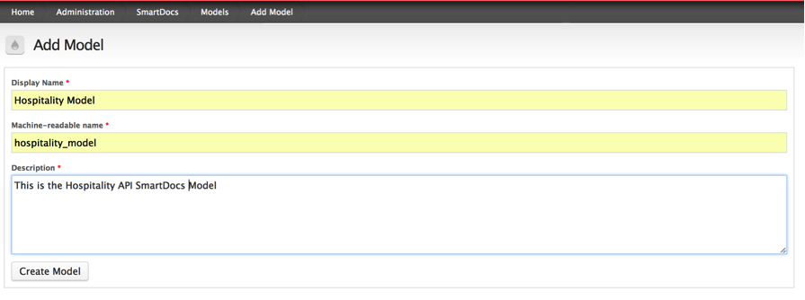 

- Select Create Model. You should see something like this:

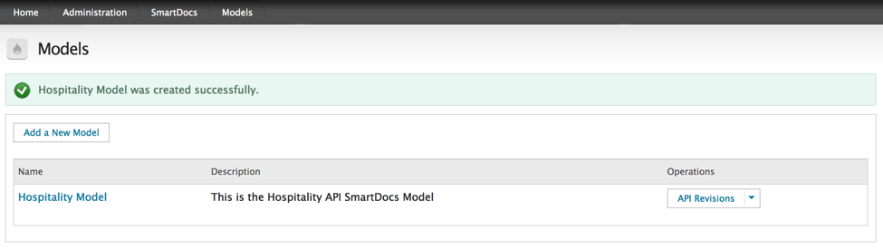  

- After you create the model, you are redirected to the Models page, which shows all SmartDocs models in alphabetical order. Click on the model name to go to its page. From there, you can:

 - Set the current API revision of the model
 - Add an API revision
 - Import a WADL file describing your API or specify the URL of a Swagger definition that describes your API.
 - Modify the model settings, including the style sheets used by the model.
 - Export the model to a file.
 - Delete the model.

###Creating a WADL file
In this section we will use a home-grown tool ([API Generator](https://github.com/mukundha/apigee-api-model-generator)) to generate a WADL file from the product definition in your Apigee Edge Org. (Ask your Conversely a WADL file can also be authored by hand; it has to comply with [Apigee Specs](http://apigee.com/docs/developer-services/content/wadl-reference). You will also need to install [Node.js](http://nodejs.org/) in your laptop for this section.

- You can [download or fork the api generator tool from here](https://github.com/mukundha/apigee-api-model-generator). Unzip the tool into a local directory. For eg: 
```
/Users/some_user/some_dir/APIModelGenerator 
```

- In the main folder `../APIModelGenerator` edit the `config.js` file so that it looks like this:

```javascript	
var config = {};
config.host = 'api.enterprise.apigee.com';
config.version = 'v1';
config.user = {your edge user id};
config.pass = {your edge password};
config.baseurl = 'http://{org}-{env}.apigee.net';
config.org= '{org}';
config.scheme = 'http' ;
config.apihost = '{org}-{env}.apigee.net' ;
config.port = '80';
config.apimodel ='hospitality_model' ;
config.apiproduct = 'Hospitality';
module.exports = config;
```

- Now run the following command from `../APIModelGenerator` folder
```
node updatedoc.js
``` 
You will see an output generated. If it ends with `all done` in the end, you have successfully run the tool and generated a WADL file.

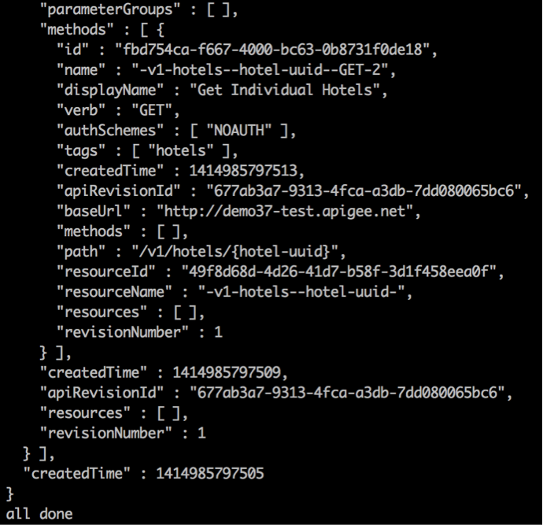

- Make sure that a WADL file is generated in the same directory. It should be named `{org}.WADL`

- The WADL should look similar to (Your org / env names will be different) :

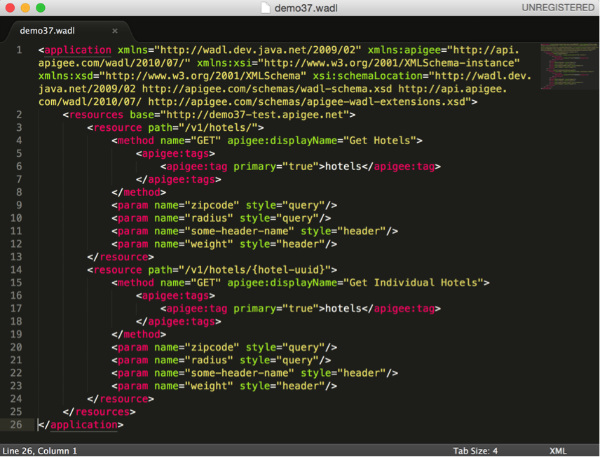 

- In case you run into any issues with the API Model Generator tool, [you can also use this WADL](./se_bootcamp_Hospitality_Product_WADL.xml) and customize it to match your org/environment/product configuration before you import it in the next step.

###Adding APIs to a model 
In this section we will review the various approaches to add APIs to a model. You can add APIs to a model by:

- Importing a WADL file containing the API definition
- Importing a Swagger definition
- Manually creating resources and methods

We will use the first method i.e importing a WADL file.  Every time you import a WADL file, you automatically create a new revision of the model. To understand how the other methods work, please review the [documentation](http://apigee.com/docs/developer-services/content/using-smartdocs-document-apis). (Adding APIs to a model section). 

- If not already logged in, login to your portal as a user with admin or content creation privileges.

- Select SmartDocs → Models in the Drupal administration menu.

- Select the `Hospitality Model`, this is the recenlty created model that you want to update.

- Under Operations, select `Import`.

- Select WADL File in the Choose Format dropdown on the SmartDocs import page.

- Select `Upload` in the WADL Options dropdown.

- Browse to the WADL file `../APIModelGenerator/{org}.WADL` and select Upload.

- After the  upload complete, select the link corresponding to the file name to see if there were any errors.

- Select the Import button to import it into the model.

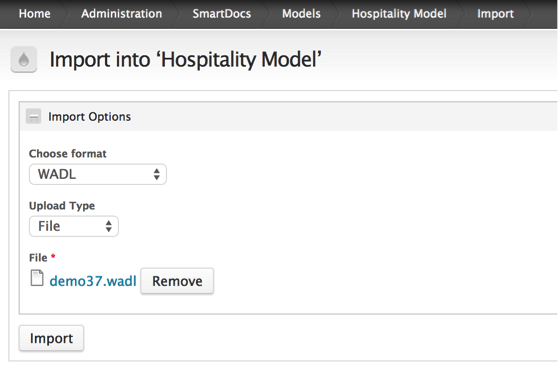 

- You are redirected to the model’s information page where you can now render the model.

###Rendering and Publishing a model 
After you add APIs to a model, you can render the model. Rendering converts the model's description of the API into Drupal nodes. When rendering completes, you will have a single Drupal node for each API, where each Drupal node corresponds to an HTML page.

- You should be on the `Hospitality Model` currently, if not navigate to it.

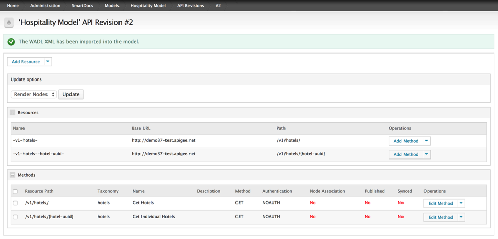 

- Select API Revisions under Operations.

- Select the revision you want to render. (You can only render nodes from a single revision of the model.)

- Select the methods to render.

- Select Render Nodes from the Update options dropdown.

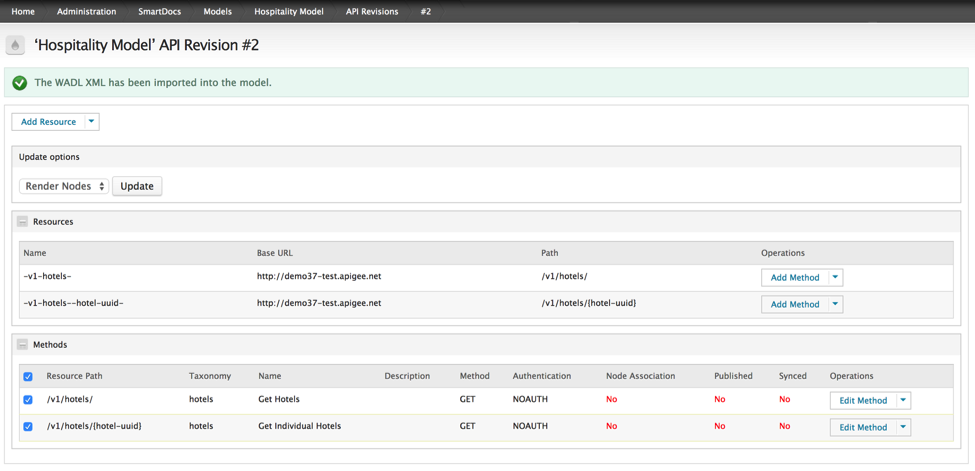
 
- Click Update.

- You are redirected to a confirmation page with the following options:

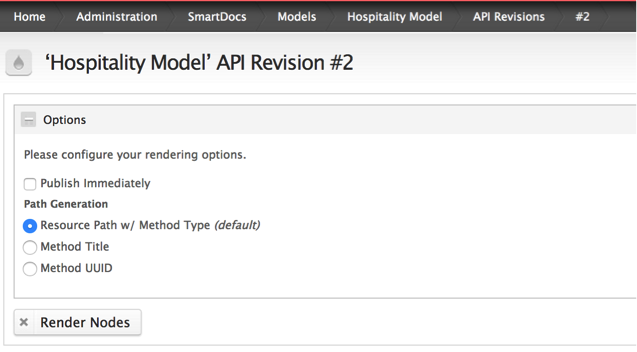 

- Select Render Nodes. A loading screen appears to view progress on your nodes being rendered. After the nodes have been rendered, the ID of the Drupal node for each API appears under the Node Association column of the model. 

- Click on the select all and use `Publish Node` for the selection and hit the `update` button. You will see a loading screen after which the rendered nodes should show as published. You will see a screen like this:

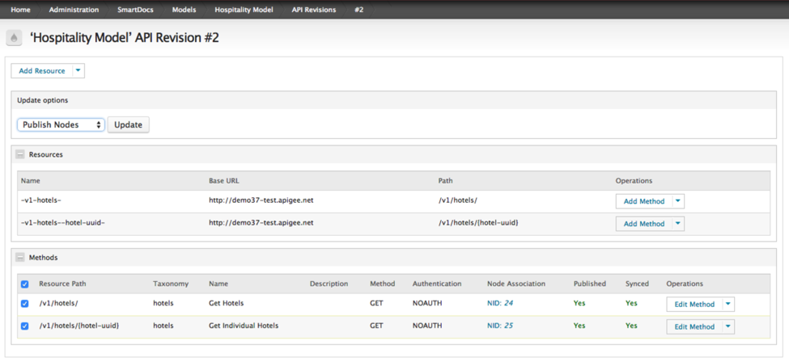 

- Now click on the Home button and navigate to the documentation page. You should see your published API documentation as follows:

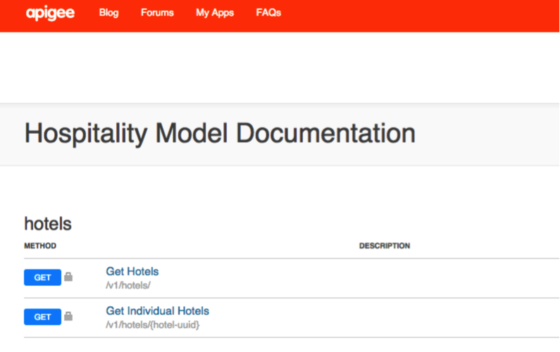 

Usually the generated model follows a naming convention for the smartdocs page that gets generated. 

```
http://{org}.devportal.apigee.com/hospitality_model/apis
```

If for whatever reason you don’t see your API documentation displayed on the documentation page you can add a redirect to the link above on the default documentation page.

##Summary
In this section you learned how to create interactive API documentation for your APIs. You created a WADL file for your API products, imported it into an API model and then eventually published the API documentation on the portal. This API documentation can be used by developers who are developing apps against your APIs to test them. For further information refer to the SmartDocs [documentation](http://apigee.com/docs/developer-services/content/using-smartdocs-document-apis).

