#Developer Services: Lesson 5 - Customize Blogs & Forums

##Overview
Apigee Edge provides you with a Developer Services portal that you can use to build and launch your own customized website to provide all of these services to your development community. Every Edge customer can create their own developer portal, either in the cloud or on-prem. 

In essence the developer portal is the primary channel of the entire developer onboarding experience. The developer portal is extremely flexible and provides a range of options from customizing forms, blogs, forums and and many other UI aspects as you previously saw. 

**Blog** support lets users create, edit, and delete blog posts. In addition, role-based permissions let you restrict blog actions to specific user types. There are 2 types of blog types supported within the developer portal:

- **Standard Blog** - This is based on the default Drupal Blog module and was used by previous releases of the portal.

- **Apigee Custom Blog** - This type provides custom view of posts, support for image, audio and video content types and “tumblr-style” editing toolbars.

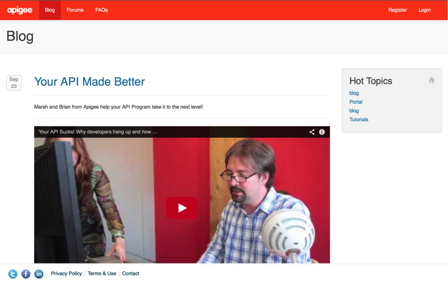 

**Forums** let users create threaded discussions with role-based moderation. You can add forums to the portal, group forums in a hierarchy, and configure user roles to control access to the forums. There are 2 types of forum types supported within the developer portal:

- **Drupal Forum** - This is the core forum module and is used by default in previous releases of the portal.

- **Advanced Drupal Forum** - This module adds additional features such as improved styling, quick search for active topics, unanswered topics and new topics. 

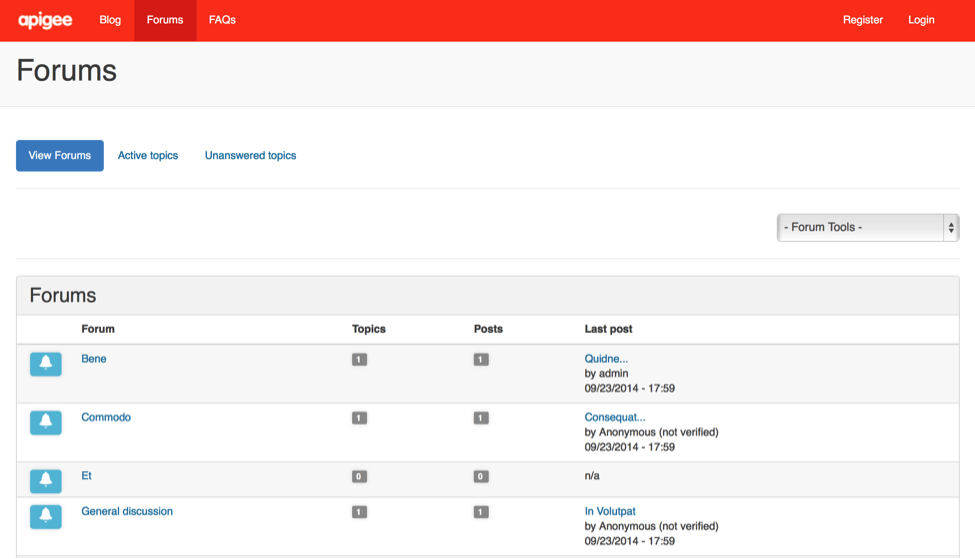

##Objectives
After this lesson you should be able to customize the OOTB blogs & forums capabilities. You should be able to check what blog & forum types are enabled, set permissions for blogs/forums, add/moderate blog comments and configure the display of the blog page. You should be able to  add forum entries,  re-order them and learn how to promote forum topics to the home page. 

##Estimated Time: 45 mins

###Blogs

The portal lets users with the necessary privileges create, edit, and delete blog posts. Blogs are made up of individual posts, which are time stamped and are viewed by date. Anyone, including anonymous users, can view the most recent blog entries by using the navigation link provided on the portal Home page.

Any user with the necessary privilege can comment on a blog post. Comments can appear as soon as they are entered, or you can configure the developer portal so that comments must be moderated before appearing. By default, anonymous users cannot post comments.

1. Log in to your portal as a user with admin or content creation privileges.

2. Select Modules in the Drupal menu. On the resulting page, scroll down to the `DevConnect` item.

3. Ensure that following three Apigee custom modules are enabled:
  - Devconnect Blog
  - Devconnct Content Creation Menu
  - devconnect blog content types

  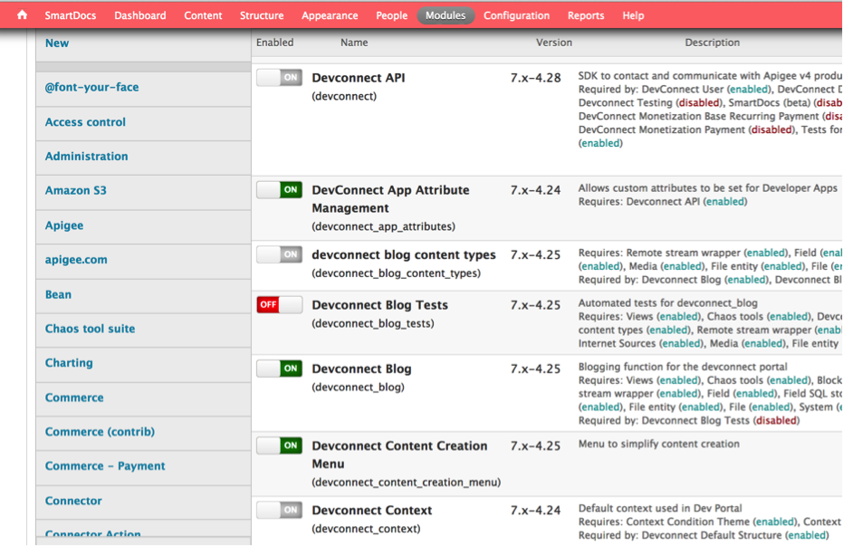 

4. Save the configuration.

 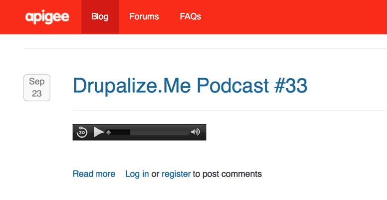
 
5. Next we will review and set/reset the permissions for blogs. Usually only authenticated users are allowed to post comments to blogs and as you can see above the portal mentions that you have to `Log in or register to post comments`. In the following steps you will make changes so un-authenticated or anonymous users can also post comments. (*Note that we are enabling that anonymous users can comment on your blog, this is just to give you an example of how to changes permissions. Your requirements in a real life could be different*)

6. Select `People` → `Permissions` link in the Drupal menu.

 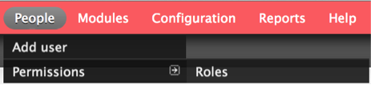 

7. Cick on the `Permissions` tab on the top right and scroll down to the Comment area of the page.

8. Under the Comment area, set the following permissions that control which users can add, view, edit, and approve comments. The permission set should looks like this:

 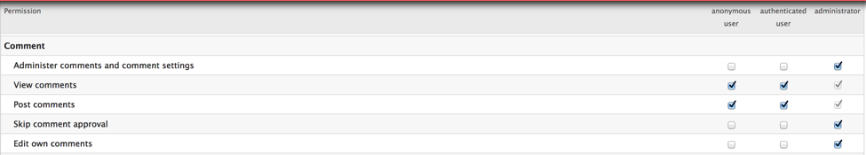 

9. Scroll down to the Node area of the page, set the permissions on the Blog entry set to look like this:
 
 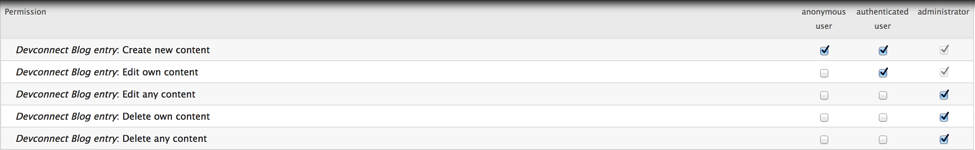

10. Scroll down the bottom of the screen and click on `Save Permissions`. Now go and flush all caches (You should know how to do this by now).

11. Logout from the portal as the admin user. Open a new browser window or tab, point to the portal URL, click on the `blog` link and make sure you are not logged in.

12. You should now be able to comments on blogs. See the `Add new comment` link enabled below. Once you click on it you should see a page which lets you add comments to this blog post. See the pictures below:

  

 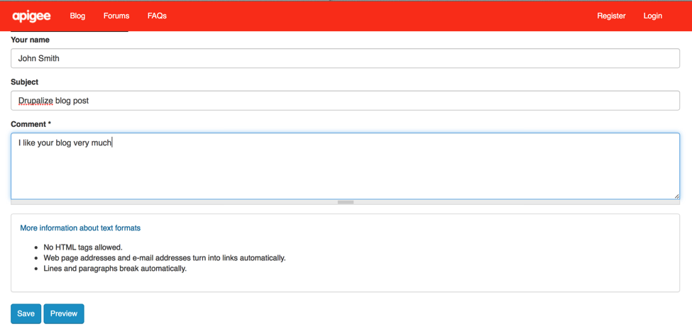	
 

13. Add the comments and you should see a message on the next page: `Your comment has been queued for review by site administrators and will be published after approval`. (*This process can also be automated if required by setting the right permissions*)

 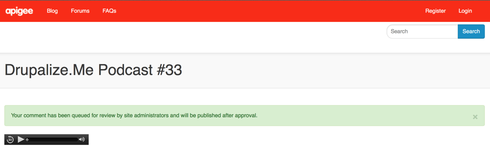 

14. Lets go approve these new comments. Log in to your portal as a user with admin or comment approval privileges.

15. Select `Content` → `Comments` in the Drupal administration menu.

 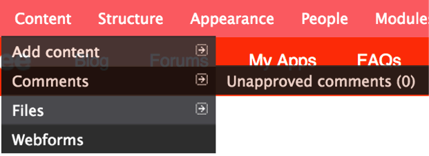 

16. Select the comment that was just entered. Click on `Publish` for the operation and click on the `Execute` button to publish the comments. You should see a series of pages like this:

 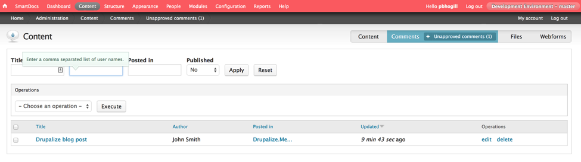 
 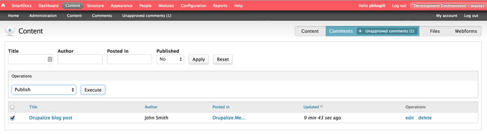
 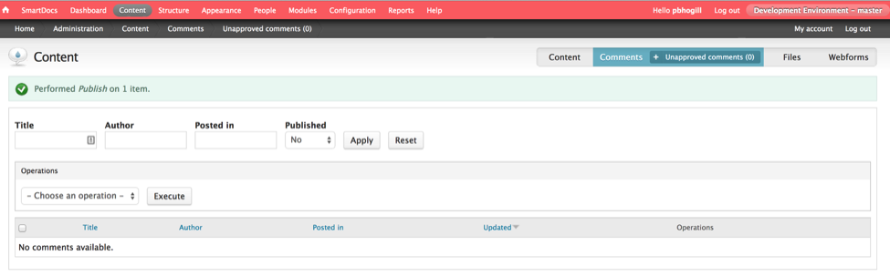 
 

17. Logout from the portal as the admin user. Open a new browser window or tab, point to the portal URL, click on the `blog` link and make sure you are not logged in.

18. Navigate to the blog post on which you commented and you should be able to see the most recent comments you made on the blog post.

 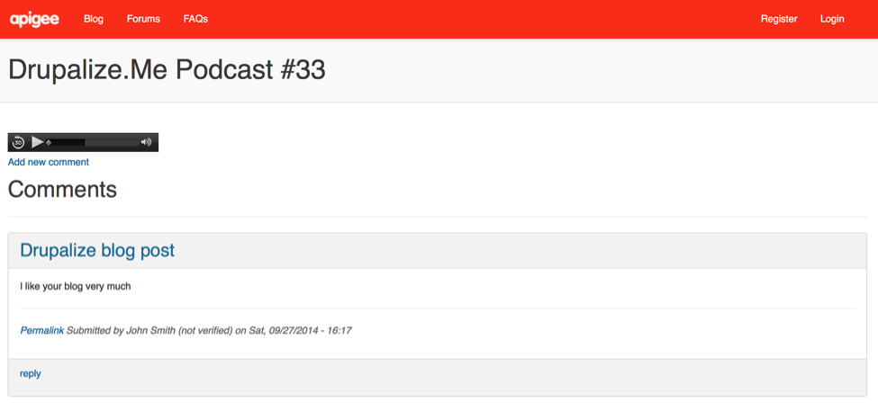 

19. The developer portal uses a Drupal view, called the Items tagged as blog content view, to control the display of blog entries on the Blog page. By default, blog entries are listed in descending order of creation date. In this section we will show you how you can change the blog display page.

20. Log in to your portal as a user with admin or content creation privileges. Select `Structure` → `Views` in the Drupal administration menu.

21. Select the `Edit link` in the row for the `Items tagged as blog content` view (Content) view. This displays the following page that you can use to configure the view:

 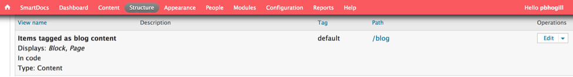 

22. On the following display configuration page you can make the necessary changes and save them.

 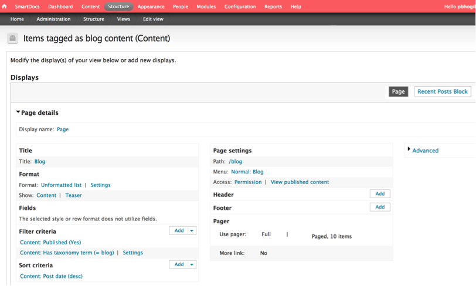 

###Forums 

Forums let users with the necessary privileges create threaded discussions with functionality similar to other message board systems. A topic is contained within a forum, and each forum can hold many topics. Topics can also have their own URLs.

Users post new topics to a forum. Each forum topic is comprised of an initial post, plus replies or comments. Depending on the user's privileges, the user can edit and delete their own posts, and edit and delete the posts of other users.

By default, anonymous users can view posts but cannot post replies. Only authenticated users with the necessary privilege can reply to a post. Replies appear as soon as they are entered, meaning they are not moderated.

Administrators set the permissions required to post, to edit exiting posts, and to delete posts. Administrators can also promote forum posts to the Forum Discussions area of the Home page.

1. Lets first determine what forum type (core or advanced forum) is enabled in your developer portal.

2. Log in to your portal as a user with admin or content creation privileges.

3. Select `Modules` in the Drupal menu.

4. Scroll to the bottom and on the left panel select `DevConnect`. Enter `forum` in the filter list at the top of the Modules page.

 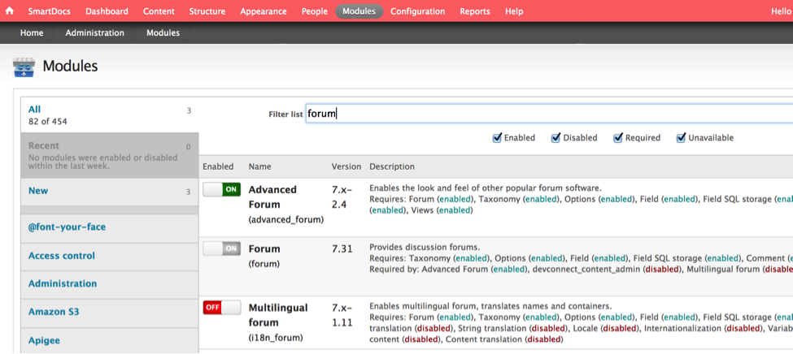 

5. If the `Advanced Forum` module is listed and is enabled, then you are using the Advanced Forum module. If Advanced Forum module is missing or disabled, and the Forum module is enabled, then you are using the core Forum module. If not enabled click on the button which says `Forum (advanced_forum)`, it should turn green which indicates that the Advanced Forum mode is on.

6. You can now make changes to the Advanced Forum configuration. Select `Configuration`` →  Content authoring` → `Advanced Forum` in the Drupal menu. 

 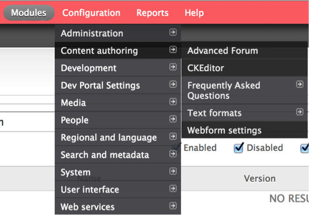 

7. The Advanced Forum page appears. Set the display options to your preference.

 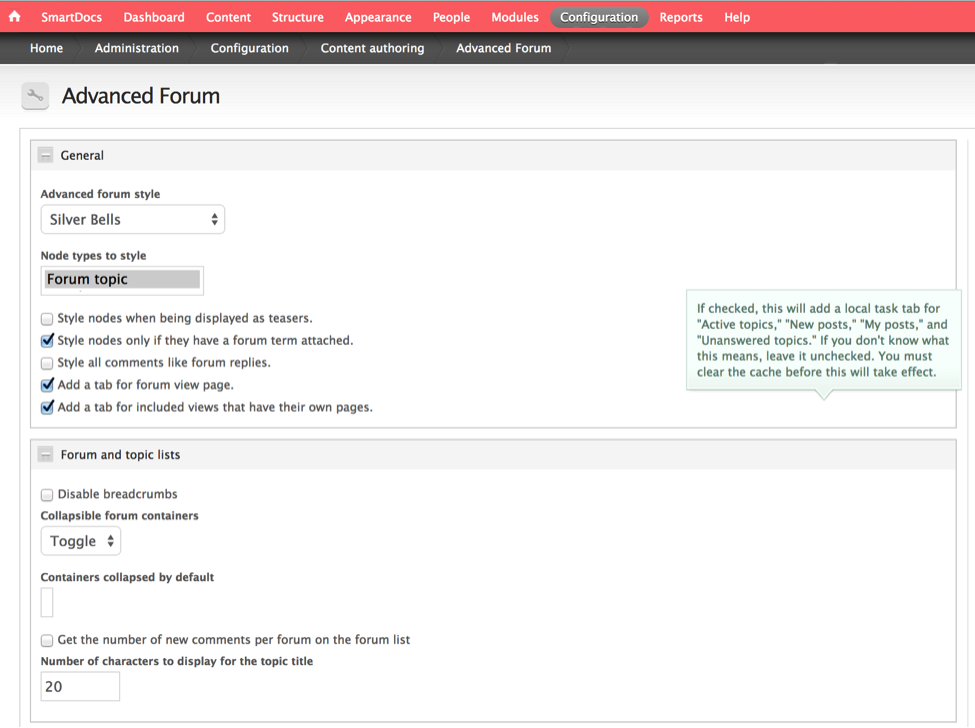 

8. Save the configuration.

 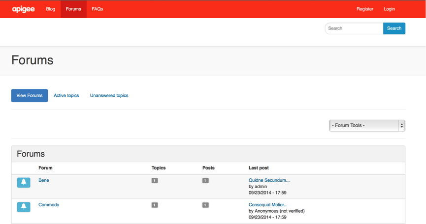 

9. Now lets add a new forum. By default, the developer portal comes with a single forum called General discussion. You can add additional forums, nest forums, and create forum containers which are groups of forums. A forum container gives you a way to create a collection of forums. However a container is not a forum itself, it simply defines a collection of forums.

10. Select `Structure` → `Forums` in the Drupal menu to see the list of current forums.

  

11. On this page, you can edit existing forums or rearrange the order that forums appear on the Forums page.

 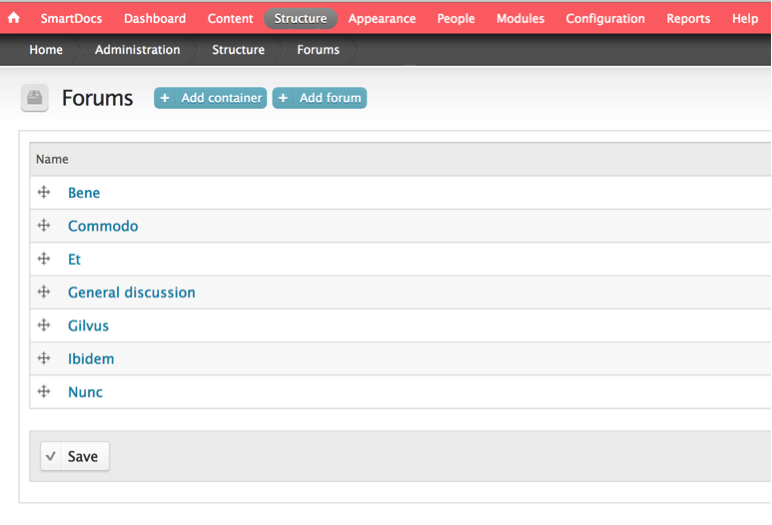 

12. Select `+Add forum`. Add information about the new forum, including its parent if you want to nest the forum. (*In this case we will make this a root level forum. You can also select an appropriate weight if you wish; Forums are displayed in ascending order by the weight.*)

 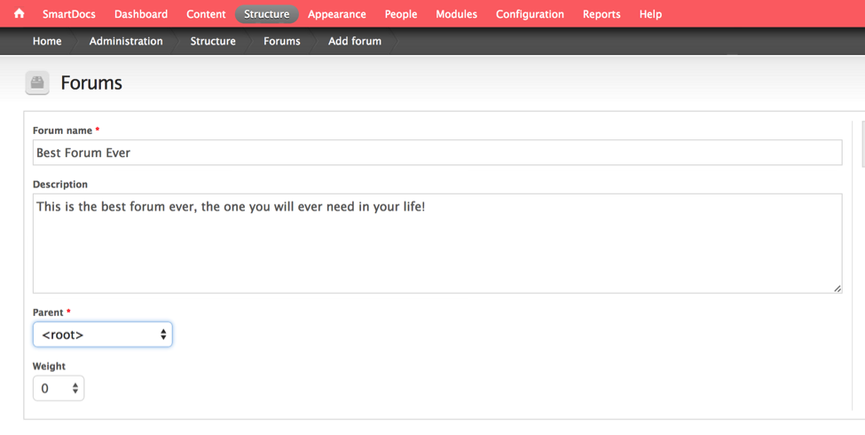
 
13. Select Save. It may not be a bad idea to `Flush All Caches` as well.

14. Log out of the portal and open a new browser window/tab, navigate to the `forums` link on the main portal. You should see the newly created forum entry in there

 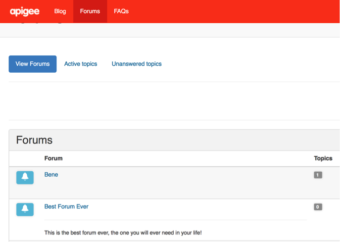 

 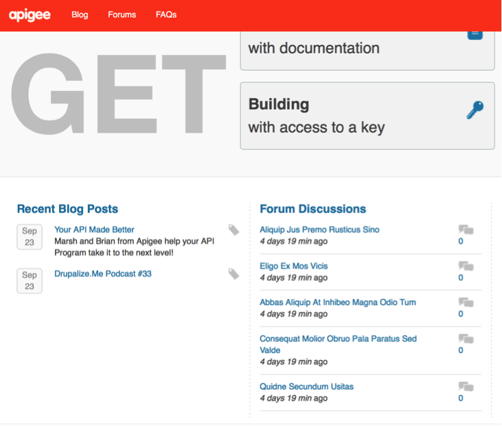 

15. In this section we will promote a forum topic to the top of the list in the forums section on the home page. See a snaphot of the home page above before we make any changes.

16. Log in to your portal as a user with admin or comment approval privileges. Select Content in the Drupal administration menu. Filter the content by selecting Forum topic in the Type dropdown box, and then selecting Apply.

 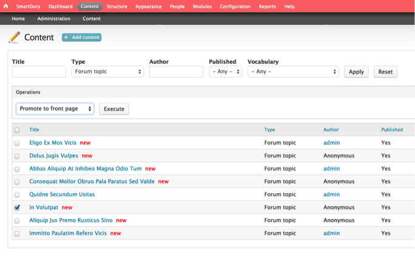
 
17. Only Forum topics appear in the content list. Select one or more forum topics (In Voluptat) to promote. In the Operations dropdown, select Promote to front page. Select Execute and you should see the selected topic move up to the top of the list.

   

18. Flush all caches. Log out and navigate to the home page of the developer portal. You should see the selected topic (In Voluptat) move up to the first in the list.

 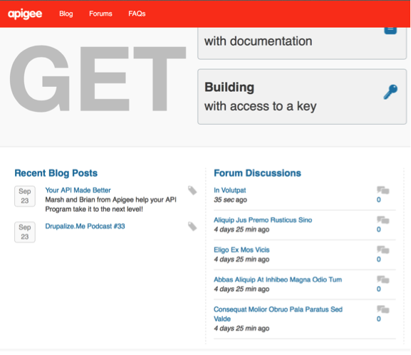 

##Summary
In this section you learned about what blogs/forums are, the different type we support in the developer portal. You also customized their look and feel, modify permissions and promote some entries. For further information refer to the [developer portal documentation](http://apigee.com/docs/developer-services/content/add-blog-and-forum-posts). 
