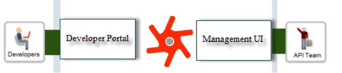
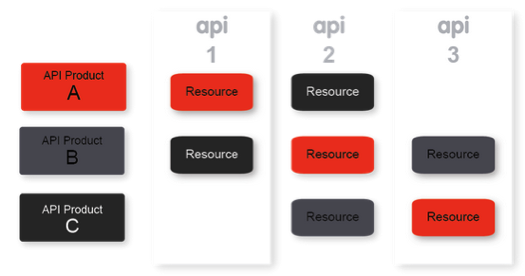
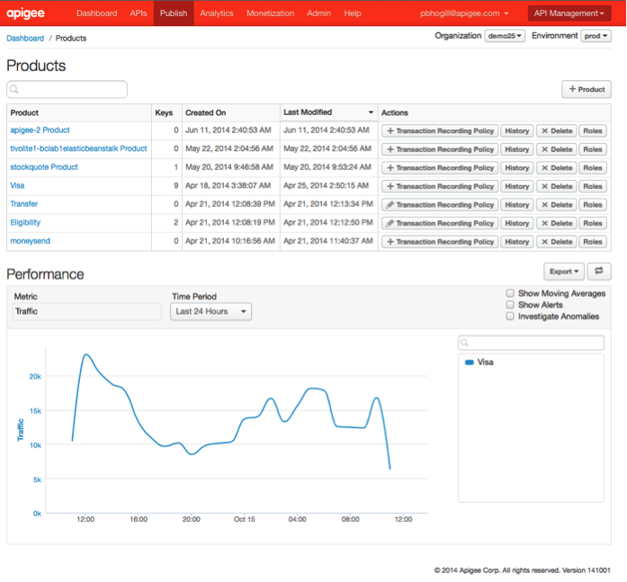
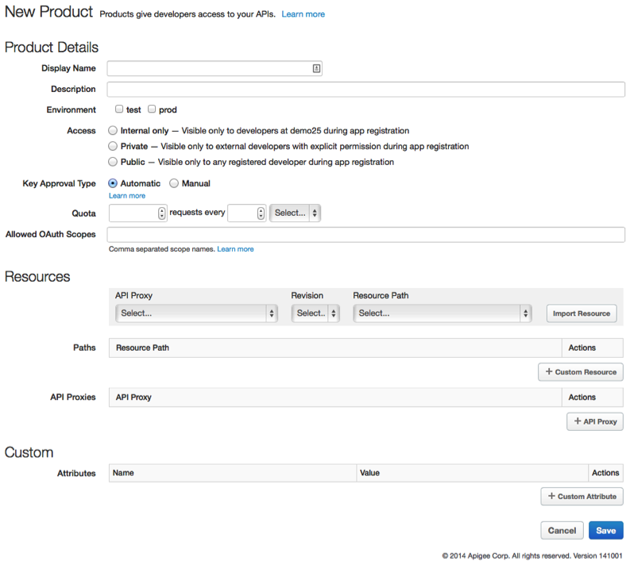
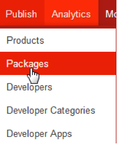
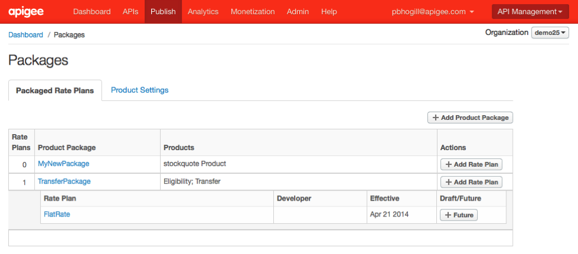
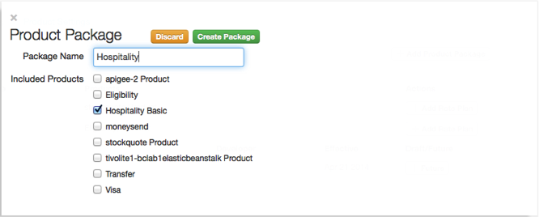
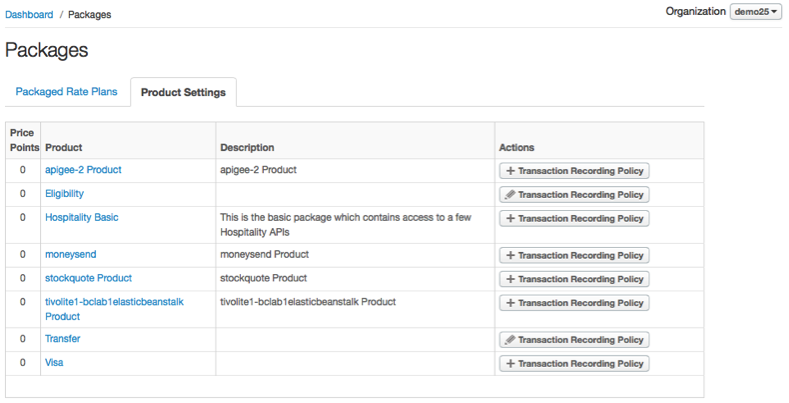
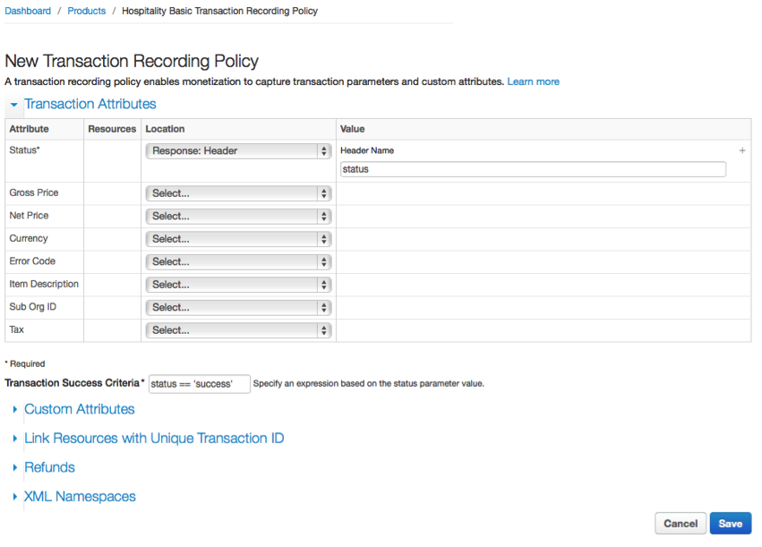
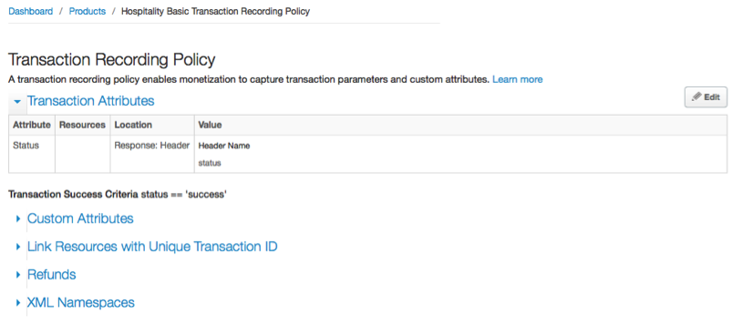

#Monetization Services: Lesson 1 - Setup Product Policies & Packages

##Overview
As an API provider, you need an easy-to-use and flexible way to monetize your APIs so that you can generate revenue for the use of those APIs. Monetization, a feature of Apigee Edge Developer Services, solves those requirements.

 Using monetization, you can create a variety of rate plans that charge developers for the use of your APIs bundled into packages. The solution offers an extensive degree of flexibility: you can create pre-paid plans, post-paid plans, fixed-fee plans, variable rate plans, "freemium" plans, plans tailored to specific developers, plans covering groups of developers, and more.

In addition, monetization includes reporting and billing facilities. For example, as an API provider, you can get summary or detailed reports on traffic to your API packages for which developers purchased a rate plan. You can also make adjustments to these records as necessary. And you can create billing documents (which include applicable taxes) for the use of your API packages and publish those documents to developers.

You can also set limits to help control and monitor the performance of your API packages and allow you to react accordingly, and you can set up automatic notifications for when those limits are approached or reached.

Monetization provides an API that is integrated into Edge API Services and a management user interface for API providers that is integrated into the Edge management UI. The management user interface calls the monetization API.

  

Monetization also provides a developer portal through Edge Developer Services. The developer portal includes monetization-related content that an API provider publishes for viewing by a developer, such as a catalog of available API packages and rate plans for each package. As an API provider, you can take advantage of the monetization features in the developer portal or integrate monetization features into your own developer portal.

  

Edge's monetization feature enables you to monetize your API products that are bundled into **packages**. In Edge, an [API product](http://apigee.com/docs/api-platform/content/terms-and-definitions#product_def) is a collection of [API resources](http://apigee.com/docs/api-platform/content/terms-and-definitions#respath_def) that are presented to developers as a bundle. An API resource is a RESTful architecture concept – it represents any network-accessible entity or functionality, for example, the Twitter timeline, Google Maps image tiles, or Facebook posts. If you want to monetize one or more resources, or see transaction records for those resources, you need to package them in an API product.

Think of API products as your product line available to developers. You can create different products to provide features for different use cases. So instead of just giving developers a list of resources, you can bundle specific resources together to create a product that solves a specific user need. For instance, you can create an API product that bundles a number of mapping resources to let developers easily add maps to their applications. The API resources bundled in an API product can come from one or more APIs, so you can mix and match resources to create specialized feature sets. 

  

An [API package](http://apigee.com/docs/api-platform/content/terms-and-definitions#package_def) (also called a monetization package) is a collection of API products that is presented to developers as a bundle, and typically associated with one or more rate plans for monetization. Think of API packages as the revenue generating parts of your product line available to developers.

  

Your API products and packages are kept in your organization, a container for all the objects (including APIs and developers) defined in your Edge account.

##Objectives
After this lesson you should be able to configure monetization, set product policies, & Create API packages.

##Estimated Time: 30 mins

###API Products 
In this section you will create two API products `Hospitality Basic` and `Hospitality Pro`. These products will form the basis of the rest of the lab.

- Login to the Apigee Edge Management User Interface (Management UI). On the top menu, click on the `Publish` → `Products` item and  you will see the API Products page (as below). When on that page click on the `+ Product` button on the top right.

  

- Define the API Products. You will do this two times one for the `Hospitality Basic` and one for `Hospitality Pro`. 

  

Enter the details of the API Products as follows and save them:

  - **Hospitality Basic**
  
    - Display Name: *Hospitality Basic*
	- Description: *This is the basic package which contains access to a few Hospitality APIs*
	- Environment: *test*
	- Access: *Public*
	- Key Approval Type: *Automatic*
	- Quota: *100 requests every 1 minute*
	- API Proxies: *hotels … *
  
  - **Hospitality Pro**
  
	- Display Name: *Hospitality Pro*
	- Description: *This is the pro package which contains access to all Hospitality APIs, Weather APIs and contains additional quota*
	- Environment: *test*
	- Access: *Public*
	- Key Approval Type: *Automatic*
	- Quota: *1000 requests every 1 minute*
	- API Proxies: *hotelspro …*

###API Packages 
An API package is a collection of API products that is presented to developers as a bundle, and typically associated with one or more rate plans for monetization. You can create multiple API packages. You decide which API products to include in which API package. You can even put the same API product or products in different packages and associate them with different rate plans. An API package does not become visible to developers until you publish a rate plan for the package (with a start date of the current date or a future date).

- In this section we will create an API package, `Hospitality` in which we will include one API Product `Hospitality Basic`.

- On the Publish tab, select Packages

  

- This opens the Product Package window. 

  

- Click on the `+ Add Product Package`. Add the details on the new package screen as follows:

  

 - Package Name: *Hospitality*
 - Included Products: *Hospitality Basic*

- At this point in time you have a package defined. Next we need to set the transaction recording policy for the created package. A transaction recording policy enables monetization to capture transaction parameters and custom attributes. Monetization needs this information to perform its monetization processing such as applying rate plans.add a rate plan to the package. (For example, if you set up a revenue share rate plan, a percentage of the revenue generated from each transaction involving your monetized API product is shared with the developer of the app issuing the request. The revenue share is based on the net or gross price of the transaction (you specify which one), that is, a percentage of the gross or net price of each transaction is used to determine the revenue share. Because of this, monetization needs to know the gross or net price of a transaction, as applicable. It gets the gross or net price from settings you make in the transaction recording policy.)

- Select the `Product Settings` tab right next to the “Packaged Rate Plans” and click on the `+ Transaction Recording Policy` button.

  

- On the following screen add details as follows:

  

In addition to specifying transaction attributes in the transaction recording policy, you can specify transaction success criteria — to determine when a transaction is successful (for charging purposes). 

- Click on `Save` and you should see a screen like this:

  

You can set a lot of other attributes, refer to [the full list](http://apigee.com/docs/monetization/content/create-transaction-recording-policy).

##Summary
In this lesson you learned how to create API Products, set product policies & create API packages. You also set a transaction recording policy on the package which gives you the ability to recognize the transactions that are going to be charged for monetization. In the next lesson we will be discussion different kinds of rate plans that can be attached to packages.
